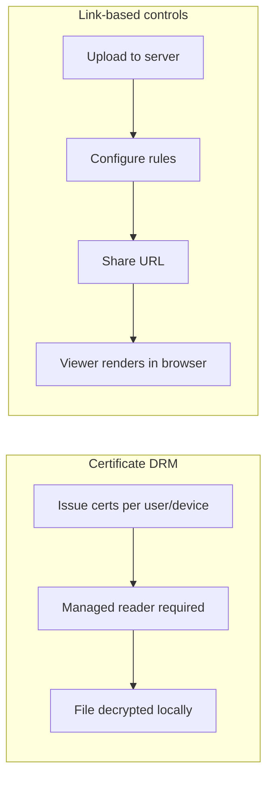

"DRM digital certificate" is a phrase that covers at least four different things depending on who is selling it: PKI certificates, device-bound licenses, signed PDF containers, or managed reader apps. Before you buy into any of them, it helps to understand what problem you're actually solving.

## Two fundamentally different models

### Certificate-based DRM

The document is **encrypted** and can only be opened with a **certificate** tied to a specific user or device. The reader application checks the certificate before decrypting.

**Strengths:**
- Strong identity binding (user + device)
- Works offline once authorized
- Meets strict compliance requirements (ITAR, HIPAA audit trails)

**Costs:**
- Certificate lifecycle management (issuance, renewal, revocation)
- Every recipient needs a managed reader app
- Onboarding friction: IT involvement, device registration
- Typical pricing: $5-20 per user/month for enterprise plans

### Link-based access controls

The document stays **on the server** and renders in a **browser-based viewer**. Access rules (view limits, expiration, verification) are enforced server-side.

**Strengths:**
- Zero install for recipients - just click a link
- Setup takes minutes, not days
- Easy to revoke: disable the link
- Works for one-off sharing and recurring workflows alike

**Costs:**
- Requires internet connection to view
- Cannot prevent all screen capture
- Less suitable for offline-heavy workflows

## Decision matrix

**Certificate DRM:**
- Setup: days to weeks; requires app install on recipient's device
- Offline viewing: yes
- Revocation: depends on cert infrastructure
- Audit: detailed, device-level
- Cost: $5–20/month per recipient
- Best for: regulated industries with strict compliance mandates

**Link-based controls (MaiPDF):**
- Setup: minutes; works in any browser, zero friction for recipients
- Offline viewing: no
- Revocation: instant (disable the link)
- Audit: IP, timestamp, email
- Cost: free to low
- Best for: most business sharing — proposals, training, client docs

## When to pick certificate DRM

You likely need certificate-based DRM if **all** of these are true:

1. Your industry has specific compliance mandates requiring device-bound access
2. Recipients are internal or long-term partners willing to install software
3. Offline access is a hard requirement
4. You have IT resources to manage certificate lifecycle

## When link-based controls are enough

For most teams, the real goal is simpler:

- **Cap opens** so a forwarded link can't be used indefinitely
- **Set expiration** so old links die automatically
- **Verify identity** so only the intended recipient can view
- **Deter leaks** with watermarks and a protected viewer

This covers proposals, contracts for review, training materials, hiring documents, and most client-facing sharing.

## A practical middle ground

Some teams use **both**: certificate DRM for a small set of highly classified documents, and link-based controls for everything else. This avoids forcing the heavy onboarding process on every recipient for every document.

| Document type | Recommended approach |
|--------------|---------------------|
| Classified IP, regulated data | Certificate DRM |
| Client proposals, sales decks | Link-based with email verification |
| Training materials | Link-based with view limits |
| Press embargoes | Link-based with expiration + watermark |
| Internal memos | Link-based (simplest settings) |
