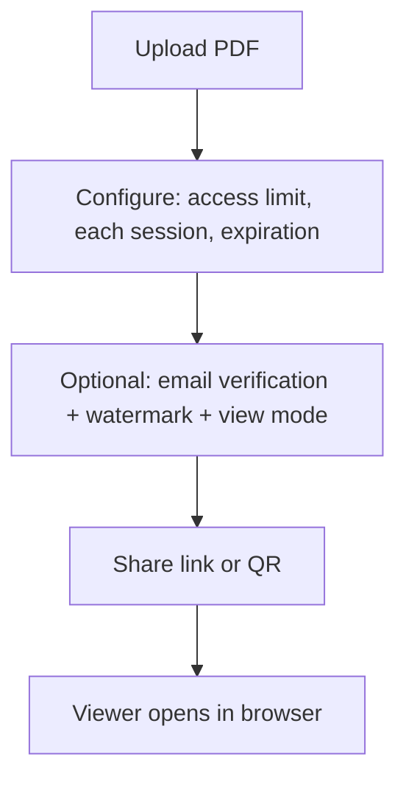

“DRM digital certificates” can mean different things depending on the vendor: PKI certificates, device certificates, signed containers, or managed readers.

If you’re trying to protect a PDF for clients, partners, or internal reviews, you may not need that complexity. In many cases, **link-based controls** solve the real problem faster.

## What certificate-based DRM is good at

- Strong identity binding (user/device)
- Central policy enforcement
- Compliance-heavy environments with strict audit requirements

## What it costs (in practice)

- onboarding and certificate lifecycle management
- heavier user experience (managed readers, device constraints)
- higher operational overhead

## A practical alternative: controlled sharing in a browser

For many teams, the goal is simpler:

- cap opens (**access limit**)
- time-box reading (**each session**)
- end access (**expiration**)
- restrict audience (**email verification**)
- deter leakage (**protected viewer + watermark**)

### Email verification (closest to “authorized recipients only”)

### Protected viewer (reduce casual copying)

## Which should you pick?

- **Pick certificate-based DRM** if you truly need device-bound identity and a managed enforcement stack.
- **Pick link-based controls** if you need a fast, low-friction way to control access for a specific sharing job (proposal, report, training material).

### Large access limits caveat

If **Access limit** is above **10,000**, behavior can trend toward an effectively public link and **access records may not be logged**.

---

**Related:** [PDF online DRM (complete guide)](/en/pdf-online-drm-complete-guide) · [Secure PDF links](/en/secure-pdf-links) · [MaiPDF complete workflow guide (with diagrams)](/en/maipdf-complete-workflow-guide-with-diagrams)

[Go to Blog Index](/blog)
