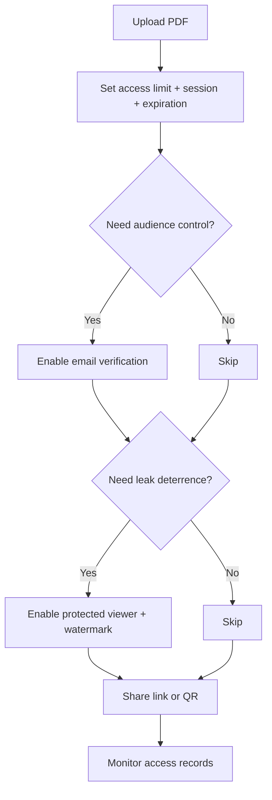

This is a hands-on walkthrough. No theory, no comparisons - just the steps to share a PDF with enforceable view limits and get access records back.

## Step 1: Upload your PDF

Sign in or go straight to the upload page. Drag-and-drop or click to select a file.

> **Tip:** If the PDF contains sensitive text, convert it to an image-based PDF first (MaiPDF offers a text-to-image converter). This prevents copy-paste even if someone bypasses the viewer.

## Step 2: Configure access rules

This is where you set the three core controls:

### Access limit (required)

Set the **total number of opens** allowed. Once the counter hits zero, the link stops working.

- Client proposal for one person? Set **3-5**.
- Team review of 8 people? Set **30-40** (allows re-reads).

### Session duration (recommended)

Cap how long each individual open lasts. After the timer runs out, the viewer closes. Useful for:

- Exam materials (60-minute window)
- Proposals you don't want studied for days

### Expiration (recommended)

Set a hard deadline. Even if opens remain, the link dies on this date. Combine with access limit for double protection.

## Step 3 (optional): Add email verification

If you need to restrict access to **specific people**, not just "anyone with the link," enable email verification. The recipient must enter their email and confirm a code before viewing.

This is the closest equivalent to "authorized recipients only" without requiring account creation.

## Step 4 (optional): Enable protected viewer + watermark

For stronger leak deterrence:

- **Protected viewer mode** removes the print and download buttons from the browser viewer.
- **Dynamic watermark** overlays the viewer's identity (email, IP, or timestamp) on every page.

Neither is foolproof against screenshots, but they raise the cost of leaking significantly.

## Step 5: Share the link (and QR code)

After configuration, you receive a **share link** and an auto-generated **QR code**. Use either one:

- **Link:** paste into email, Slack, WeChat, Telegram
- **QR code:** embed in a slide deck, print on a handout, or WeChat scan

## Step 6: Check access records

After sharing, you can view **who opened it and when** using the access-record page. Enter your reading code and modification code to see the log.

## Complete workflow at a glance

## Quick reference: recommended settings by scenario

| Scenario | Access limit | Session | Expiration | Extras |
|----------|-------------|---------|------------|--------|
| Client proposal | 5 | 30 min | 14 days | Email verification |
| Job application review | 10 | 60 min | 30 days | Watermark |
| Training material | 50 | 120 min | 90 days | Protected viewer |
| Press embargo | 20 | No limit | Release date | Email verification + watermark |
