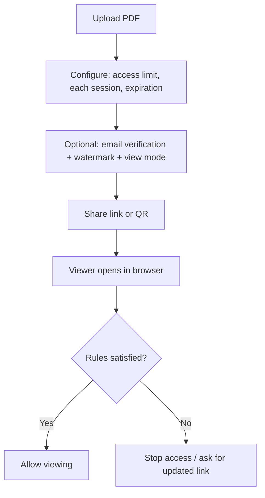

If you’re trying to “add DRM” to a PDF, most of the time you’re really trying to do one of these:

- **Cap how many times it can be opened**
- **Make it expire**
- **Restrict who can access it**

This guide shows a clean, link-based way to do that.

## Step 1: Upload

## Step 2: Configure view limits (and the two controls people forget)

Set:

- **Access limit**: total opens allowed
- **Each session**: time allowed per open
- **Expiration**: end access by date/days

### Optional: require email verification

If the audience must be specific, add verification so a forwarded link isn’t enough.

## Step 3: Share link + QR

## Access records (when you need accountability)

If you need proof of opening activity, use the access-record page and codes.

## Workflow diagram

## Notes for realistic expectations

- View limits are a **sharing control**, not a guarantee against screenshots.
- For better deterrence, use protected viewer modes and watermarking.

### Large access limits caveat

If **Access limit** is above **10,000**, behavior can trend toward an effectively public link and **access records may not be logged**.

---

**Related:** [How to generate secure PDF links for sharing](/en/secure-pdf-links) · [Host a PDF online for secure sharing](/en/host-pdf-online-secure-sharing-guide) · [PDF access control: view limits and expiration](/en/pdf-access-control-view-limits-expiration)
