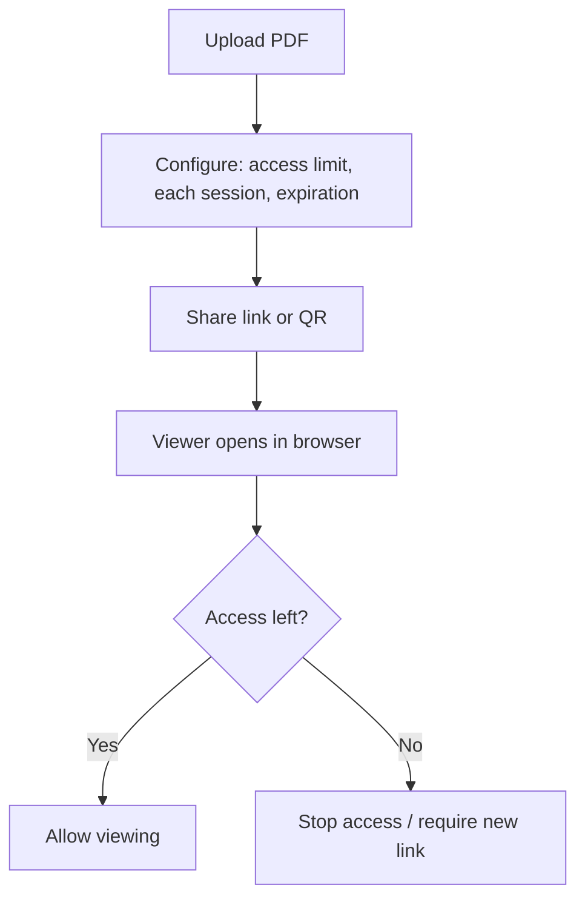

“PDF DRM” is often used as a shorthand for **controlled viewing**: you decide **who** can open a document, **how many times**, and **for how long**—instead of sending a copy that can be forwarded forever.

One of the most common DRM-style controls is a **view/open limit**. This guide explains the concept and shows a simple link-based workflow.

## What does “limit PDF views” mean?

It means the PDF becomes unavailable after it has been opened \(or viewed\) **X times**. The exact definition depends on the platform, but the intent is consistent:

- **Usage-based control**: the link expires because it was used, not because a date passed
- **Less oversharing**: forwarded links run out of opens instead of spreading endlessly

## How link-based DRM works (in practice)

Instead of editing the PDF file itself, you host it behind a controlled viewer and share a link/QR.

## Pair view limits with two other controls

View limits work best when combined with:

- **Each session**: cap how long a single open lasts (useful for proposals or exam windows)
- **Expiration**: end access automatically after a real deadline

This is closer to what people mean by “practical DRM”: not magic, just **enforceable sharing rules**.

## What this does (and does not) prevent

- **Good at**: reducing casual forwarding, preventing unlimited re-opens, making access time-boxed.
- **Not a guarantee**: it cannot stop screenshots or a phone camera.

If you need stronger deterrence, use a protected viewer mode and/or watermark:

## Large access limits caveat

If **Access limit** is above **10,000**, behavior can trend toward an effectively public link and **access records may not be logged**. Use a limit that matches your real audience.

---

**Related:** [View limits and expiration](/en/view-limits-and-expiration) · [Secure PDF links](/en/secure-pdf-links) · [MaiPDF complete workflow guide (with diagrams)](/en/maipdf-complete-workflow-guide-with-diagrams)
