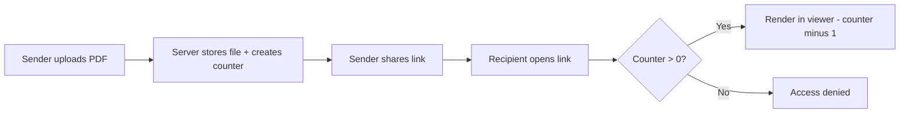

When people say "PDF DRM," they usually mean one thing: **stop the document from being opened by anyone, anytime, forever.** The most direct way to do that is a **view limit** - a server-side counter that ticks down every time someone opens the link.

This article explains the concept, how it works at the infrastructure level, and where it fits alongside other access controls.

## What a view limit actually is

A view limit is a **counter attached to a share link**. Each time a browser requests the document, the server checks the counter:

| Counter state | Result |
|---------------|--------|
| Remaining > 0 | Serve the PDF in a protected viewer; decrement counter |
| Remaining = 0 | Return an "access expired" page |

This is fundamentally different from password-protecting a PDF file. The file itself doesn't change - **the gate in front of it does.**

## Why server-side beats file-level encryption

Traditional PDF passwords travel with the file. Once someone has the password, they can share both endlessly. A view limit breaks this pattern:

- **The file never leaves the server** - it renders inside a browser-based viewer.
- **Forwarding the link doesn't help** once the counter hits zero.
- **No software to install** - the recipient just opens a URL.

## Three controls that work together

A view limit alone answers "how many times." Two companion settings answer "how long":

| Control | What it governs | Example |
|---------|----------------|---------|
| **Access limit** | Total opens across all recipients | 5 opens for a client proposal |
| **Session duration** | Time allowed per single open | 30 min per viewing session |
| **Expiration date** | Hard deadline regardless of opens left | Link dies after April 15 |

Using all three together means: "This document can be opened 5 times, each session lasts 30 minutes max, and the whole link expires on April 15" - no matter what.

## Threat model: what view limits solve and what they don't

**Effective against:**
- Casual forwarding - forwarded links run out of opens
- Forgotten access - links expire automatically
- Bulk scraping - each open costs a decrement

**Not effective against:**
- Screen capture or phone camera
- Manual re-typing of content

For deterrence beyond the counter, layer on a **protected viewer** (disables print/download) and **dynamic watermarks** (burn the viewer's identity into the rendered page).

## Choosing the right limit number

| Audience | Suggested limit | Rationale |
|----------|----------------|-----------|
| One specific person | 3-5 | Allows re-reads; stops forwarding |
| Small team (5-10) | 20-50 | Room for re-opens without being unlimited |
| Public preview | 500-2,000 | Broad reach but still capped |
| > 10,000 | Treat as public | Access records may not be logged at this scale |
