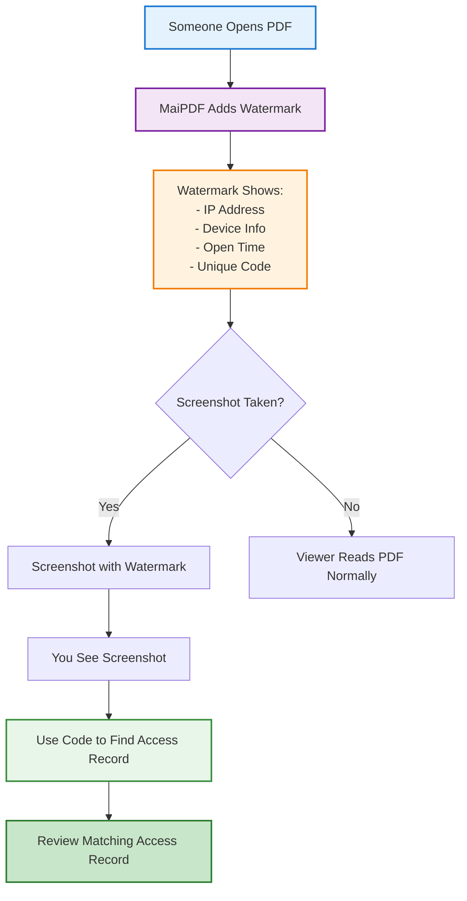

# Dynamic Watermarks on PDF: Practical Security & Leak Deterrence

  
Dynamic watermarks add viewer-specific details to a PDF at open time. The goal is <strong>deterrence + accountability</strong>: if a screenshot leaks, the watermark helps you match it to an access record.

  
<strong>How it works:</strong> When someone opens your shared PDF, the viewer shows a watermark (timestamp + basic device/network hints) and a short code. If a screenshot is leaked, you can use the code to look up the corresponding access record.

## What Are Dynamic Watermarks?

**Dynamic watermarks** are automatically generated overlays that appear on your PDF when someone views it. Unlike static watermarks (logos or text you add yourself), dynamic watermarks change for each viewer and show:

- **IP Address**: The viewer's IP address
- **Device Information**: Browser and device details
- **Access Time**: When the PDF was opened
- **Unique Code**: A code you can use to locate the matching access record

**Key point:** You don't customize what appears in the watermark. MaiPDF automatically generates it with viewer-specific information.

## How MaiPDF's Dynamic Watermarks Work

**The process:**
1. You enable dynamic watermarks when uploading your PDF
2. When someone opens the link, MaiPDF automatically adds a watermark with their viewing details
3. The watermark appears on every page they view
4. If they take a screenshot, the watermark is included
5. You can use the code to locate the matching access record

## Why Use Dynamic Watermarks?

  

    
🛡️

    

      <h4>Deter Leaks</h4>
      
Viewers know their information is visible, making them less likely to share without permission.

    

  

  

    
🔍

    

      <h4>Investigate Leaks</h4>
      
If a screenshot is shared, the watermark code helps you match it to an access record for investigation.

    

  

  

    
📊

    

      <h4>Accountability</h4>
      
Each open can be tied to an access record, which supports internal audits and safer sharing.

    

  

  

    
⚡

    

      <h4>No Setup Needed</h4>
      
Watermarks are automatically generated - just enable the feature when uploading.

    

  

## How to Enable Dynamic Watermarks

  

    
1

    

      <h3>Upload Your PDF</h3>
      
Go to MaiPDF.com and upload your PDF file (up to 100MB).

    

  

  
  

    
2

    

      <h3>Enable Watermarks</h3>
      
In the security settings, enable "Dynamic Watermarks". No customization needed - MaiPDF automatically generates them.

    

  

  
  

    
3

    

      <h3>Share Your Link</h3>
      
Get your shareable link or QR code and send it to viewers.

    

  

  
  

    
4

    

      <h3>Viewers See Watermarks</h3>
      
When someone opens your PDF, they'll see a watermark with their IP, device info, time, and a unique code.

    

  

## What Information Appears in Watermarks?

**MaiPDF automatically includes:**
- ✅ Viewer's IP address
- ✅ Device and browser information
- ✅ Access date and time
- ✅ Unique code to locate the matching access record

**You cannot customize:**
- ❌ Custom text or logos
- ❌ Email addresses (unless viewer provides via email verification)
- ❌ Phone numbers
- ❌ Company names

The watermark is automatically generated based on the viewer's actual access information.

## How to Use Watermark Codes (For Audit / Investigation)

If you see a screenshot of your PDF with a watermark:

1. **Note the watermark code** shown in the screenshot
2. **Open your file's access records / analytics**
3. **Enter the watermark code**
4. **Review the matching access record** (timestamp + device/network hints)

This helps you identify the source if a document is leaked.

## When to Use Dynamic Watermarks

  

    <h4>📄 Sensitive Documents</h4>
    
Contracts, proposals, or confidential materials where you need to track access.

  

  

    <h4>💰 Pricing Information</h4>
    
Price lists or quotes where you want to discourage unauthorized sharing.

  

  

    <h4>📊 Internal Reports</h4>
    
Company documents shared with specific people where accountability matters.

  

  

    <h4>🎓 Training Materials</h4>
    
Educational content where you want to track who accessed it.

  

## Limitations to Consider

  <h4>What Dynamic Watermarks Cannot Do:</h4>
  <ul>
    <li>❌ <strong>Cannot prevent screenshots:</strong> Watermarks appear in screenshots, but they don't block the screenshot itself</li>
    <li>❌ <strong>Cannot prevent screen recording:</strong> Screen recording software can still capture the PDF</li>
    <li>❌ <strong>Cannot customize content:</strong> You cannot add custom text, logos, or choose which fields appear</li>
    <li>❌ <strong>Cannot prevent printing:</strong> If download/print is enabled, watermarks may not appear on printed copies</li>
    <li>⚠️ <strong>IP addresses can change:</strong> Viewers using VPNs or different networks will show different IPs</li>
  </ul>

**What they do:** Watermarks make leaks traceable and act as a deterrent. They don't provide absolute protection, but they add accountability.

## Best Practices

  

    <h4>🔒 Combine with Other Controls</h4>
    
Use watermarks together with view limits, download blocking, and email verification for stronger protection.

  

  

    <h4>📝 Inform Viewers</h4>
    
Let viewers know watermarks are enabled. This transparency acts as an additional deterrent.

  

  

    <h4>🔍 Monitor Access</h4>
    
Regularly check your file's analytics to see who accessed it and when.

  

  

    <h4>💡 Save Watermark Codes</h4>
    
If you see a leaked screenshot, save the watermark code immediately for tracking.

  

## Frequently Asked Questions

  

    <h4>Can I customize what appears in the watermark?</h4>
    
No. MaiPDF automatically generates watermarks with access time, basic device/network information, and a code. You cannot add custom text or choose specific fields.

  

  
  

    <h4>Do watermarks prevent screenshots?</h4>
    
No. Watermarks appear in screenshots, but they don't block screenshot functionality. However, the watermark makes it possible to identify who took the screenshot.

  

  
  

    <h4>Can viewers remove the watermark?</h4>
    
Not when viewing through MaiPDF's browser viewer. The watermark is automatically rendered on each page. However, if they download or print the PDF (when allowed), the watermark may not be included.

  

  
  

    <h4>What if someone uses a VPN?</h4>
    
The watermark may show the VPN's IP address rather than the user's actual network. This is a limitation of IP-based signals. Device information and access time can still help for audits.

  

  
  

    <h4>How do I find out who viewed my PDF using the watermark code?</h4>
    
Use the watermark code inside your file's access records/analytics to locate the matching access record for that specific open.

  

  
  

    <h4>Are watermarks free?</h4>
    
Yes. Dynamic watermarks are included in MaiPDF's free service. No additional cost.

  

## Summary

Dynamic watermarks add viewer-specific signals (time + basic device/network hints + a short code) to your PDFs when they're viewed. They help deter leaks and support audits by making it easier to match leaked screenshots to access records. While they don't prevent screenshots or provide absolute security, they add accountability for sensitive document sharing.

