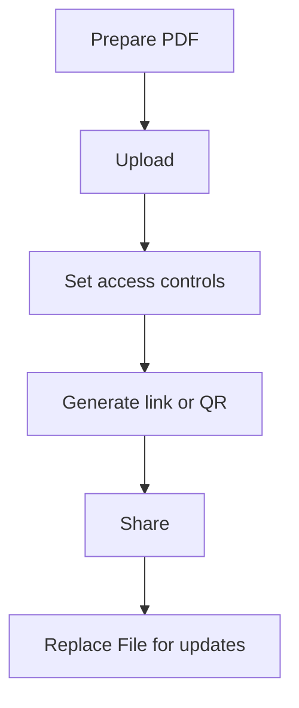

Email attachments and chat uploads create copies everywhere. In a team setting, that usually leads to **version confusion** and weak control.

MaiPDF is built for **sharing PDFs online via a link**. (For image sharing, use **Maiimg**.)

## A practical workflow

1. **Upload the PDF**
2. **Set access controls** (only if needed)
3. **Generate a link / QR**
4. **Share**
5. **Update via “Replace File”** (keep the same link)

> Note: we don’t assume an “expiration date” setting exists.

## Upload

## Access controls (optional)

## Share via link / QR

## Update without changing the link

When the content changes, **Replace File** helps you publish a new version while keeping the same share URL.

Reference: `https://sendpdfonline.com/article/replace-pdf-without-changing-link-zh`

