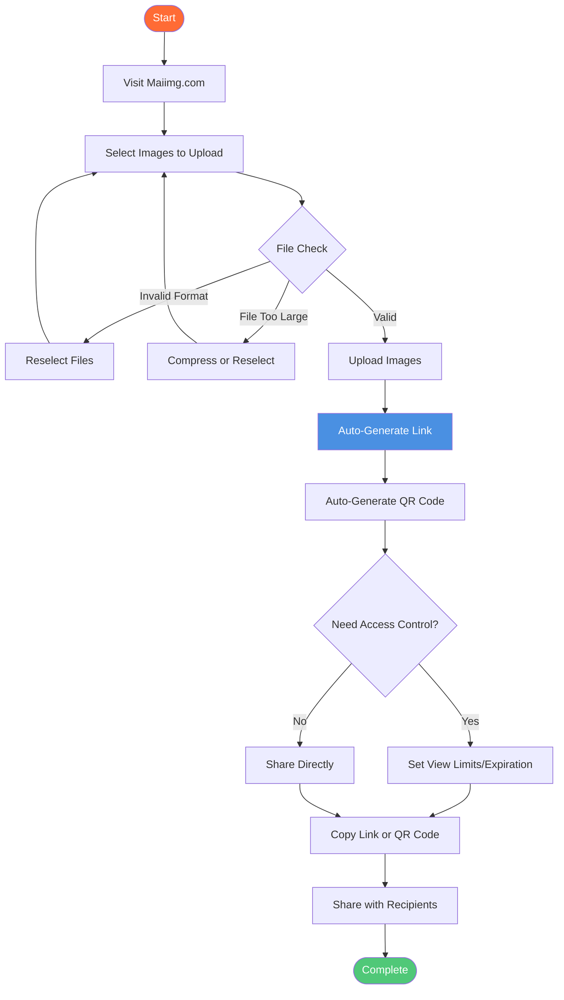

# Free Image Hosting: Complete Guide to Maiimg Image Hosting Service

  
Need <strong>free image hosting</strong>? Maiimg provides completely free image hosting with advanced features: upload up to 25 images at once, 50MB per image, access control, real-time tracking, and QR code generation. No registration required. This complete guide shows you everything about free image hosting with Maiimg.

## What is Free Image Hosting?

**Free image hosting** allows you to upload, store, and share images online without cost. Unlike traditional image hosts that require registration or have limited features, Maiimg offers professional image hosting completely free.

**Why Choose Maiimg for Free Image Hosting:**
- ✅ **Completely Free** - No hidden fees, no premium tiers
- ✅ **No Registration** - Upload immediately, zero barriers
- ✅ **Larger File Size** - 50MB per image (vs 32MB on other platforms)
- ✅ **Batch Upload** - Upload up to 25 images at once
- ✅ **Access Control** - Set view limits, expiration, download control
- ✅ **Real-Time Tracking** - See who viewed your images and when
- ✅ **QR Code Generation** - Auto-generate QR codes for easy sharing

## Free Image Hosting Features

### Upload & Storage

**Supported Formats:**
- 📸 PNG
- 🖼️ JPG/JPEG
- 🎭 GIF
- 🌐 WebP

**File Specifications:**
- ✅ **50MB per image** - Larger than most free hosts (32MB limit)
- ✅ **25 images per gallery** - Batch upload support
- ✅ **No total storage limit** - Upload as many galleries as needed
- ✅ **Instant upload** - No waiting, no approval

### Sharing Options

**Multiple Sharing Methods:**
- 🔗 **Direct Link** - Share unique URL
- 📱 **QR Code** - Auto-generated QR code
- 📧 **Email** - Send link via email
- 💬 **Messages** - Share on WhatsApp, Slack, Teams

**Embedding Options:**
- Direct image links
- Gallery links
- QR code images
- Mobile-friendly access

## Complete Workflow: Free Image Hosting

### Step-by-Step Process

### Step 1: Upload Images

**How to Upload:**
1. Visit [Maiimg.com](https://maiimg.com)
2. Drag and drop images or click to select
3. Select up to 25 images at once
4. Wait for upload to complete

**Upload Tips:**
- ✅ Ensure images are under 50MB each
- ✅ Use supported formats (PNG, JPG, GIF, WebP)
- ✅ Stable internet connection recommended
- ✅ Batch upload saves time

### Step 2: Get Sharing Links

**What You Get:**
- ✅ Unique sharing link
- ✅ QR code image
- ✅ Direct image links
- ✅ Gallery view link

**Link Features:**
- Secure HTTPS links
- Mobile-responsive
- Fast loading
- No ads

### Step 3: Configure Access (Optional)

**Access Control Options:**
- 🔢 **View Limits** - Set maximum opens (e.g., 100 views)
- ⏰ **Expiration** - Auto-expire after date
- ⬇️ **Download Control** - Allow or block downloads
- ⏱️ **Time Control** - Set accessible time periods

### Step 4: Share Your Images

**Sharing Methods:**
- 📧 Email the link
- 💬 Share via messaging apps
- 🌐 Embed in websites
- 📱 Print QR code for offline sharing

## Free Image Hosting vs Paid Services

### Comparison Table

| Feature | Free Image Hosts | Maiimg Free Hosting |
|---------|------------------|---------------------|
| **Registration** | Often required | ❌ No registration |
| **File Size** | 32MB max | ✅ 50MB per image |
| **Batch Upload** | Single upload | ✅ 25 images at once |
| **Access Control** | Limited or none | ✅ Full control |
| **Tracking** | Basic or none | ✅ Real-time tracking |
| **QR Codes** | Not available | ✅ Auto-generated |
| **Expiration** | Limited options | ✅ Flexible settings |
| **Download Control** | Not available | ✅ Enable/disable |
| **Cost** | Free with limits | ✅ Completely free |

### Why Maiimg is Better

**Advantages:**
- ✅ **Larger file size** - 50MB vs 32MB standard
- ✅ **Batch upload** - 25 images vs single upload
- ✅ **Access control** - Full control over who sees images
- ✅ **Tracking** - Real-time analytics
- ✅ **QR codes** - Easy mobile sharing
- ✅ **No ads** - Clean viewing experience
- ✅ **One-click disable** - Instant link control

## Use Cases for Free Image Hosting

### 1. Website Image Hosting

**Scenario:** Host images for your website or blog

**Benefits:**
- No server storage needed
- Fast CDN delivery
- Easy to update
- Free forever

**Setup:**
1. Upload images to Maiimg
2. Get direct image links
3. Embed in your website
4. Update anytime

### 2. Social Media Image Sharing

**Scenario:** Share product images or event photos

**Benefits:**
- Batch upload multiple images
- Generate QR codes for offline sharing
- Track engagement
- Control access

### 3. Portfolio Showcase

**Scenario:** Share design work or photography

**Benefits:**
- Professional gallery view
- Access control
- Track views
- Easy sharing

### 4. Event Photo Distribution

**Scenario:** Share event photos with attendees

**Benefits:**
- Upload 25 photos at once
- Set view limits
- Generate QR codes
- Track downloads

## Advanced Features

### Access Control

**View Limits:**
- Set maximum opens (e.g., 100 views)
- Link stops working after limit
- Control distribution

**Expiration:**
- Set expiration date
- Auto-disable after date
- Time-limited sharing

**Download Control:**
- Enable or disable downloads
- Protect your images
- Control distribution

### Tracking & Analytics

**What You Can Track:**
- 📊 Total views
- ⏰ View times
- 📱 Device information
- 📈 Access trends

**Benefits:**
- Understand engagement
- Identify popular images
- Track distribution
- Measure effectiveness

### QR Code Generation

**QR Code Features:**
- Auto-generated for each gallery
- Mobile-friendly
- Easy to print
- Perfect for offline sharing

**Use Cases:**
- Event materials
- Business cards
- Marketing materials
- Physical displays

## Best Practices

### 1. Optimize Images Before Upload

**Tips:**
- Compress large images
- Use appropriate formats
- Keep file sizes reasonable
- Ensure quality

### 2. Use Descriptive Names

**Good Practice:**
- Use clear file names
- Organize by category
- Include dates if relevant
- Keep consistent naming

### 3. Set Appropriate Access Controls

**For Public Images:**
- Minimal restrictions
- Easy access
- Long expiration

**For Private Images:**
- View limits
- Short expiration
- Download disabled

### 4. Monitor Your Images

**Regular Checks:**
- Review access records
- Check view counts
- Monitor trends
- Update as needed

## Common Questions

### Is Maiimg Really Free?

**Yes!** Maiimg is completely free with no hidden fees:
- ✅ No registration required
- ✅ No premium tiers
- ✅ All features free
- ✅ No usage limits

### What's the File Size Limit?

**50MB per image** - larger than most free image hosts:
- Standard free hosts: 32MB
- Maiimg: 50MB
- Supports high-quality images

### Can I Upload Multiple Images?

**Yes!** Batch upload up to 25 images:
- Select multiple files
- Upload at once
- Create gallery automatically
- Share single link

### How Long Do Images Stay Online?

**As long as you want:**
- No automatic deletion
- You control expiration
- One-click disable anytime
- Full control

### Can I Control Who Sees My Images?

**Yes!** Full access control:
- View limits
- Expiration dates
- Download control
- Time restrictions

## Conclusion: Free Image Hosting with Maiimg

Maiimg offers the best **free image hosting** experience with:
- ✅ 50MB per image (larger than competitors)
- ✅ Batch upload (25 images at once)
- ✅ Complete access control
- ✅ Real-time tracking
- ✅ QR code generation
- ✅ No registration required
- ✅ Completely free

**Ready to start free image hosting?**

Visit [Maiimg.com](https://maiimg.com) to upload your images, generate sharing links, and start sharing. No registration required, completely free.

  <h2 class="solution-title">🚀 Ready to Start?</h2>
  
Upload, share, and track your images with <strong>Maiimg</strong> - the smartest way to host images for free!

  <a href="https://maiimg.com" class="solution-button">Try Maiimg Now</a>

---

**Related Articles:**
- [Image Upload Without Account: Complete Guide](/blog/en/image-upload-without-account-maiimg-guide)
- [Image Embed Code Generator: How to Embed Images](/blog/en/image-embed-code-generator-maiimg-guide)
- [Auto Delete Images: Image Expiration Guide](/blog/en/auto-delete-images-expiration-guide)
