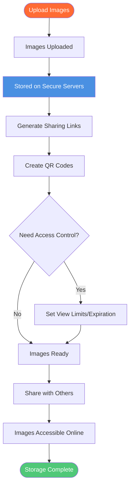

# Free Image Storage: Online Image Storage with Maiimg

  
Need <strong>free image storage</strong> for your images? Maiimg offers free online image storage with 50MB per image, unlimited galleries, access control, real-time tracking, and QR code generation. No registration required. This complete guide shows you everything about free image storage with Maiimg.

## What is Free Image Storage?

**Free image storage** allows you to store images online without cost, accessible from anywhere with internet connection. Unlike traditional cloud storage that requires accounts and has complex interfaces, Maiimg provides simple, free image storage.

**Why Choose Maiimg for Free Image Storage:**
- ✅ **Completely Free** - No hidden fees, no premium tiers
- ✅ **No Registration** - Store images immediately
- ✅ **50MB per Image** - Larger than most free storage (32MB limit)
- ✅ **Unlimited Galleries** - Create as many galleries as needed
- ✅ **Access Control** - Control who sees your images
- ✅ **Real-Time Tracking** - Monitor image access
- ✅ **QR Code Generation** - Easy sharing

## Free Image Storage Features

### Storage Specifications

**File Size:**
- ✅ **50MB per image** - Larger than competitors (32MB standard)
- ✅ **No total limit** - Upload unlimited galleries
- ✅ **Fast upload** - Quick processing
- ✅ **Reliable storage** - Secure servers

**Why 50MB vs 32MB Matters:**
- 📸 **Higher Quality** - Store high-resolution images
- 🖼️ **Better Detail** - Preserve image quality
- 📊 **Professional Use** - Suitable for professional work
- 🎨 **No Compression** - Maintain original quality

### Supported Formats

**Image Formats:**
- 📸 PNG - Best for graphics, transparency
- 🖼️ JPG/JPEG - Best for photos, smaller size
- 🎭 GIF - Best for animations
- 🌐 WebP - Modern format, excellent compression

**Format Benefits:**
- Multiple format support
- No conversion needed
- Original quality preserved
- Fast processing

### Storage Capacity

**Unlimited Storage:**
- ✅ No total storage limit
- ✅ Create unlimited galleries
- ✅ Upload as many images as needed
- ✅ No account required

**Comparison:**
- Traditional free storage: Often limited (5-15GB total)
- Maiimg: Unlimited galleries, no total limit
- Advantage: True unlimited storage

## How Free Image Storage Works

### Storage Process Flow

### Step 1: Upload Images

**Upload Process:**
1. Visit [Maiimg.com](https://maiimg.com)
2. Select images to upload
3. Upload up to 25 images at once
4. Wait for upload completion

**Upload Features:**
- Drag and drop interface
- Batch upload support
- Fast upload speed
- Progress indicators

### Step 2: Images Stored

**Storage Features:**
- Secure server storage
- CDN delivery
- Fast access
- Reliable hosting

**What Happens:**
- Images stored securely
- Links generated automatically
- QR codes created
- Ready to share

### Step 3: Access Your Images

**Access Methods:**
- Direct image links
- Gallery links
- QR codes
- Management interface

**Features:**
- Access from anywhere
- Mobile-friendly
- Fast loading
- Reliable access

## Free Image Storage vs Paid Storage

### Comparison Table

| Feature | Free Storage Services | Maiimg Free Storage |
|---------|----------------------|---------------------|
| **Registration** | Often required | ❌ No registration |
| **File Size** | 32MB max | ✅ 50MB per image |
| **Total Storage** | Limited (5-15GB) | ✅ Unlimited galleries |
| **Batch Upload** | Single upload | ✅ 25 images at once |
| **Access Control** | Limited or none | ✅ Full control |
| **Tracking** | Basic or none | ✅ Real-time tracking |
| **QR Codes** | Not available | ✅ Auto-generated |
| **Cost** | Free with limits | ✅ Completely free |

### Why Maiimg is Better

**Advantages:**
- ✅ **Larger file size** - 50MB vs 32MB standard
- ✅ **Unlimited storage** - No total limit
- ✅ **Batch upload** - 25 images vs single upload
- ✅ **Access control** - Full control over access
- ✅ **Tracking** - Real-time analytics
- ✅ **QR codes** - Easy mobile sharing
- ✅ **No ads** - Clean experience

## Use Cases for Free Image Storage

### 1. Website Image Hosting

**Scenario:** Store images for website

**Benefits:**
- Save server space
- Fast CDN delivery
- Easy to update
- Free forever

**Setup:**
1. Upload images to Maiimg
2. Get direct image links
3. Use in website
4. Update anytime

### 2. Portfolio Storage

**Scenario:** Store portfolio images

**Benefits:**
- Professional hosting
- Access control
- Track views
- Easy sharing

**Setup:**
1. Upload portfolio images
2. Create galleries
3. Set access controls
4. Share with clients

### 3. Backup Storage

**Scenario:** Backup important images

**Benefits:**
- Free backup
- Access from anywhere
- Secure storage
- Easy recovery

**Setup:**
1. Upload images
2. Store securely
3. Access anytime
4. Share when needed

### 4. Event Photo Storage

**Scenario:** Store event photos

**Benefits:**
- Batch upload
- Easy sharing
- Access control
- Track distribution

**Setup:**
1. Upload event photos
2. Generate QR codes
3. Share with attendees
4. Track access

## Advanced Storage Features

### Access Control

**Control Options:**
- 🔢 View limits - Set maximum opens
- ⏰ Expiration - Auto-expire after date
- ⬇️ Download control - Enable/disable
- ⏱️ Time control - Set accessible periods

**Benefits:**
- Privacy protection
- Controlled sharing
- Security
- Compliance

### Tracking & Analytics

**What You Can Track:**
- 📊 Total views
- ⏰ View times
- 📱 Device information
- 📈 Access trends

**Benefits:**
- Understand usage
- Track engagement
- Monitor access
- Measure effectiveness

### QR Code Generation

**QR Code Features:**
- Auto-generated for each gallery
- Mobile-friendly
- Easy to print
- Perfect for offline sharing

**Use Cases:**
- Event materials
- Business cards
- Marketing materials
- Physical displays

## Best Practices

### 1. Organize Your Images

**Tips:**
- Use descriptive file names
- Group related images
- Create themed galleries
- Keep organized

### 2. Set Appropriate Controls

**For Public Images:**
- Minimal restrictions
- Easy access
- Long expiration

**For Private Images:**
- View limits
- Short expiration
- Download disabled

### 3. Regular Backups

**Best Practice:**
- Keep local copies
- Regular uploads
- Multiple galleries
- Organized storage

### 4. Monitor Usage

**Regular Checks:**
- Review access records
- Check view counts
- Monitor trends
- Update settings

## Common Questions

### Is Storage Really Free?

**Yes!** Completely free:
- ✅ No registration required
- ✅ No premium tiers
- ✅ All features free
- ✅ No usage limits

### What's the File Size Limit?

**50MB per image:**
- Standard free storage: 32MB
- Maiimg: 50MB
- Supports high-quality images
- Better than competitors

### Is There a Total Storage Limit?

**No!** Unlimited storage:
- Create unlimited galleries
- Upload as many images as needed
- No total limit
- True unlimited

### How Long Are Images Stored?

**As long as you want:**
- No automatic deletion
- You control expiration
- One-click delete
- Full control

### Can I Control Access?

**Yes!** Full access control:
- View limits
- Expiration dates
- Download control
- Time restrictions

## Conclusion: Free Image Storage

Maiimg offers the best **free image storage** with:
- ✅ 50MB per image (larger than competitors)
- ✅ Unlimited galleries (no total limit)
- ✅ Batch upload (25 images at once)
- ✅ Complete access control
- ✅ Real-time tracking
- ✅ QR code generation
- ✅ No registration required
- ✅ Completely free

**Ready to start free image storage?**

Visit [Maiimg.com](https://maiimg.com) to upload your images and start storing them online. No registration required, completely free, unlimited storage.

  <h2 class="solution-title">🚀 Ready to Start?</h2>
  
Experience the power of <strong>Maiimg</strong> - Upload, share, and track your images with complete control!

  <a href="https://maiimg.com" class="solution-button">Try Maiimg Now</a>

---

**Related Articles:**
- [Free Image Hosting: Complete Guide](/blog/en/free-image-hosting-maiimg-complete-guide)
- [Image Upload Without Account: Complete Guide](/blog/en/image-upload-without-account-maiimg-guide)
- [Image Hosting API: Free Image Upload API](/blog/en/image-hosting-api-free-image-upload-api)
