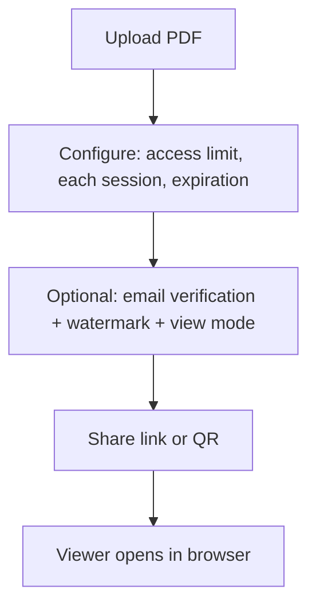

People search for “free online PDF DRM” when they want control without installing enterprise software. In practice, most workflows need **enforceable sharing rules**, not a complex DRM stack.

Here’s what a practical, link-based approach can do—and what it can’t.

## What “online DRM” usually means (in everyday terms)

- **Limit opens** (view caps)
- **Limit time** (per session)
- **Expire access** (by date/days)
- **Restrict audience** (email verification)
- **Deter leaks** (watermark + protected viewer)

## A simple workflow you can actually use

```mermaid
flowchart TB
  A[Upload PDF] --> B["Configure: access limit, each session, expiration"]
  B --> C["Optional: email verification + watermark + view mode"]
  C --> D["Share link or QR"]
  D --> E[Viewer opens in browser]
```

### Optional: email verification

Use this when the link must work only for specific recipients.

## What “free” doesn’t magically solve

Even with strong viewer controls, you generally cannot guarantee:

- zero screenshots
- zero re-sharing of what someone can see

Think of online DRM as **risk reduction**: you can reduce casual leakage and keep access time-boxed, but you can’t turn a document into something impossible to copy.

## Large access limits caveat

If **Access limit** is above **10,000**, behavior can trend toward an effectively public link and **access records may not be logged**.

---

**Related:** [How to generate secure PDF links for sharing](/en/secure-pdf-links) · [PDF access control: view limits and expiration](/en/pdf-access-control-view-limits-expiration) · [Watermark protection basics](/en/watermark-protection-basics)

[Go to Blog Index](/blog)
