# Free Online DRM for PDF: Protect PDFs Without Software

## What is Online DRM for PDF?

**Traditional DRM:** Expensive software you install on your computer. Complex, costs hundreds of dollars per month.

**Online DRM (MaiPDF):** Free browser-based PDF viewer with protection features. No software install, no cost, works like a PDF reader with extra controls.

  
<strong>The Problem:</strong> Traditional DRM software is expensive ($500+/month) and requires installation.

  
<strong>The Solution:</strong> MaiPDF is a free online DRM alternative. Upload your PDF, it opens in a secure browser viewer with DRM-like controls. No software, no cost, no registration.

## 🔐 Free Online DRM vs Traditional DRM

  

    <h4>❌ Traditional DRM Software</h4>
    <ul>
      <li>Costs $500-2000/month</li>
      <li>Requires software installation</li>
      <li>Complex setup (days/weeks)</li>
      <li>Viewers need special readers</li>
    </ul>
    
Examples: Adobe RMS, FileOpen, Locklizard

  

  

    <h4>✅ Online DRM (MaiPDF)</h4>
    <ul>
      <li>100% Free</li>
      <li>Browser-based (no install)</li>
      <li>Setup in 2 minutes</li>
      <li>Viewers just click link</li>
    </ul>
    
Works like a PDF reader with controls

  

## 📤 How MaiPDF Works

**Think of MaiPDF as an online PDF reader with access controls:**

- You upload PDF → It opens in MaiPDF's browser-based viewer
- Viewers see the PDF like a normal PDF reader
- But you control: download button, view limits, watermarks, etc.

```mermaid
flowchart LR
    A[📄 Your PDF File] --> B[☁️ Upload]
    B --> C{Add Controls?}
    C -->|Yes| D[⚙️ Set Options]
    C -->|No| E[🔗 Get Link]
    D --> E
    E --> F[📱 Get QR Code]
    F --> G[📤 Share]
    G --> H[📊 Track Access]
    
    style A fill:#e3f2fd,stroke:#1976d2,stroke-width:2px
    style B fill:#f3e5f5,stroke:#7b1fa2,stroke-width:2px
    style D fill:#fff3e0,stroke:#f57c00,stroke-width:2px
    style E fill:#e8f5e9,stroke:#388e3c,stroke-width:2px
    style F fill:#fce4ec,stroke:#c2185b,stroke-width:2px
    style H fill:#e0f2f1,stroke:#00897b,stroke-width:2px
```

**Time needed:** 2 minutes for upload → configure → share

## 🎯 What's Included (Free)

  

    
☁️

    <h4>PDF Hosting</h4>
    
Up to 100MB per file

    
Files stored on Cloudflare R2

  

  

    
🔗

    <h4>Shareable Link</h4>
    
Clean URL instantly

    
maipdf.com/file/abc@pdf

  

  

    
📱

    <h4>QR Code</h4>
    
Auto-generated

    
For print materials

  

  

    
👀

    <h4>View Limits</h4>
    
Set max opens

    
1, 3, 5, 10, 50, or ∞

  

  

    
🚫

    <h4>Disable Download</h4>
    
View-only mode

    
Blocks download button

  

  

    
🔍

    <h4>Watermark Tracking</h4>
    
Dynamic watermarks

    
Enter watermark code to see viewer info

  

## 🔒 Optional Access Controls

**You can add (all optional):**

  

    1
    

      <strong>View Limit</strong>
      
Stop link from working after X opens

    

  

  

    2
    

      <strong>Disable Download & Print</strong>
      
Blocks download button and print option

    

  

  

    3
    

      <strong>Dynamic Watermarks</strong>
      
Auto-generated watermarks showing viewer's IP, device info, and open time. Each watermark has a unique code - enter it on the site to see who viewed.

    

  

  

    4
    

      <strong>Password Support</strong>
      
If your PDF already has a password set, MaiPDF's viewer will prompt for it (just like opening the PDF normally)

    

  

  

    5
    

      <strong>Email Verification</strong>
      
Require email before viewing

    

  

**Or skip all settings and just share - your choice.**

### 🔍 How Watermark Tracking Works

**Each watermark contains:**

  
<strong>Example:</strong> You see a screenshot with watermark code "A3X9K7"

  
→ Go to MaiPDF watermark lookup

  
→ Enter "A3X9K7"

  
→ See: Opened by IP 192.168.1.1 on Jan 19, 2026 at 3:45 PM from Chrome/Windows

## 🆚 MaiPDF vs Other Hosting Options

  <table>
    <thead>
      <tr>
        <th>Feature</th>
        <th>Google Drive</th>
        <th>WeTransfer</th>
        <th>MaiPDF</th>
      </tr>
    </thead>
    <tbody>
      <tr>
        <td><strong>Free Storage</strong></td>
        <td>✅ 15GB total</td>
        <td>✅ 2GB/transfer</td>
        <td>⚠️ 100MB per file</td>
      </tr>
      <tr>
        <td><strong>File Organization</strong></td>
        <td>✅ Folders, search</td>
        <td>⚠️ Basic</td>
        <td>❌ No folders, no search</td>
      </tr>
      <tr>
        <td><strong>Registration</strong></td>
        <td>❌ Google account required</td>
        <td>❌ Email required</td>
        <td>✅ None needed</td>
      </tr>
      <tr>
        <td><strong>QR Code</strong></td>
        <td>❌ No</td>
        <td>❌ No</td>
        <td>✅ Automatic</td>
      </tr>
      <tr>
        <td><strong>View Limits</strong></td>
        <td>❌ No</td>
        <td>❌ No</td>
        <td>✅ Yes</td>
      </tr>
      <tr>
        <td><strong>Download Control</strong></td>
        <td>⚠️ Limited</td>
        <td>❌ No</td>
        <td>✅ Yes (blocks basic downloads)</td>
      </tr>
      <tr>
        <td><strong>Access Tracking</strong></td>
        <td>✅ View history</td>
        <td>❌ No</td>
        <td>✅ View count & IPs</td>
      </tr>
      <tr>
        <td><strong>Long-term Storage</strong></td>
        <td>✅ Yes</td>
        <td>⚠️ 7 days (free)</td>
        <td>❌ Not designed for archival</td>
      </tr>
      <tr>
        <td><strong>Large Files</strong></td>
        <td>✅ Up to 750GB</td>
        <td>✅ Up to 2GB (free)</td>
        <td>❌ Max 100MB per file</td>
      </tr>
      <tr>
        <td><strong>Team Collaboration</strong></td>
        <td>✅ Real-time editing</td>
        <td>❌ No</td>
        <td>❌ View-only, no editing</td>
      </tr>
      <tr>
        <td><strong>Prevent Screenshots</strong></td>
        <td>❌ No</td>
        <td>❌ No</td>
        <td>❌ Cannot prevent</td>
      </tr>
      <tr>
        <td><strong>Best For</strong></td>
        <td>Storage, collaboration</td>
        <td>Large file transfers</td>
        <td>Quick PDF sharing with controls</td>
      </tr>
    </tbody>
  </table>

**Honest assessment:** 
- **Google Drive:** Better for permanent storage, file organization, and team collaboration
- **WeTransfer:** Better for transferring large files (over 100MB) temporarily
- **MaiPDF:** Better for quick PDF sharing when you need QR codes, view limits, or basic download blocking. Not suitable for large files, long-term storage, or team editing.

## 🛠️ How to Set It Up

  

    
1

    

      <h4>Go to MaiPDF.com</h4>
      
No account needed - just open the site

    

  

  

    
2

    

      <h4>Upload PDF</h4>
      
Drag and drop your file (max 100MB)

    

  

  

    
3

    

      <h4>Add Controls (Optional)</h4>
      
Set view limits, disable downloads, etc. - or skip entirely

    

  

  

    
4

    

      <h4>Get Link & QR</h4>
      
Copy link or download QR code

      
    

  

  

    
5

    

      <h4>Share It</h4>
      
Send link via email/message, or print QR code

    

  

## 📝 Common Use Cases

  

    <h4>📊 Business Reports</h4>
    
<strong>Need:</strong> Share quarterly report with board

    
<strong>Setup:</strong> View limit 10, disable download

    
<strong>Result:</strong> Board can read it, can't forward copies

  

  

    <h4>📚 Course Materials</h4>
    
<strong>Need:</strong> Share lecture slides with class

    
<strong>Setup:</strong> QR code on screen, no limits

    
<strong>Result:</strong> Students scan and access easily

  

  

    <h4>📄 Client Proposals</h4>
    
<strong>Need:</strong> Send pricing to potential client

    
<strong>Setup:</strong> View limit 5, tracking enabled

    
<strong>Result:</strong> Know if client opened it

  

  

    <h4>🎫 Event Programs</h4>
    
<strong>Need:</strong> Share conference schedule

    
<strong>Setup:</strong> QR on badges, unlimited views

    
<strong>Result:</strong> Attendees scan badge to view

  

## 🔄 Replace PDF After Sharing

**Made a mistake? No problem.**

**How it works:**
1. You get a "control code" when you upload
2. Use that code to access the replacement portal
3. Upload new PDF - same link, updated content
4. No need to send new links to everyone

## ⚠️ Online DRM vs Software DRM: What's the Difference?

**Honest comparison:**

  

    <h4>💻 Software DRM (Traditional)</h4>
    
Strongest protection, highest cost

    

      
✅ Prevents screenshots (sometimes)

      
✅ Detects screen recording

      
✅ Offline viewing (encrypted)

      
❌ Costs $500+/month

      
❌ Requires special software

      
❌ Complex setup

    

  

  

    <h4>🌐 Online DRM (MaiPDF)</h4>
    
Good protection, zero cost

    

      
⚠️ Can't prevent screenshots

      
⚠️ Can't prevent screen recording

      
❌ Needs internet to view

      
✅ Completely free

      
✅ No software needed

      
✅ Works in any browser

    

  

  
<strong>Bottom Line:</strong> Online DRM (like MaiPDF) gives you 70-80% of the protection at 0% of the cost. Perfect for small businesses, teachers, freelancers who can't afford traditional DRM.

## 💡 When to Use MaiPDF

  

    <h4>✅ Use MaiPDF When:</h4>
    <ul>
      <li>You need quick PDF sharing with no account</li>
      <li>You want QR codes for print materials</li>
      <li>You need view limits or tracking</li>
      <li>You want to block casual downloading</li>
      <li>File is under 100MB</li>
      <li>You need free solution</li>
    </ul>
  

  

    <h4>❌ Use Something Else When:</h4>
    <ul>
      <li>Need permanent archival storage → Use Google Drive</li>
      <li>Need team collaboration → Use Dropbox</li>
      <li>Need military-grade security → Use paid DRM</li>
      <li>Need to share files over 100MB → Use WeTransfer</li>
      <li>Need real-time editing → Use Google Docs</li>
    </ul>
  

## ❓ FAQ: Free Online DRM for PDF

  

    <h4>Is online DRM for PDF really free?</h4>
    
Yes. MaiPDF is 100% free with no hidden costs. Upload PDFs up to 100MB, unlimited files.

  

  

    <h4>Do viewers need to install software?</h4>
    
No. It works in any browser - Chrome, Safari, Firefox, Edge. Just click the link and view.

  

  

    <h4>How is online DRM different from traditional DRM?</h4>
    
Traditional DRM requires expensive software ($500+/month). Online DRM works in browsers, is free, but can't prevent screenshots. Good enough for most use cases.

  

  

    <h4>Can online DRM prevent screenshots?</h4>
    
No. But it adds watermarks showing who viewed (IP, device, time). If someone screenshots, you can trace them using the watermark code.

  

  

    <h4>What file size limit?</h4>
    
100MB per PDF. Most documents are well under this limit.

  

  

    <h4>Do I need to register an account?</h4>
    
No. Upload and share immediately. No email, no login, no account.

  

  

    <h4>How do watermarks work?</h4>
    
Each viewer gets a unique watermark showing their IP, device, and access time. The watermark includes a code (like "A3X9K7"). Enter that code on MaiPDF to see who viewed.

  

  

    <h4>Can I delete PDFs after sharing?</h4>
    
Yes. Use your control code to access the management portal and delete. The shared link stops working immediately.

  

---

**Bottom Line:** Free online DRM for PDF is a practical alternative to expensive DRM software. MaiPDF offers this for free - upload, protect, share. Perfect for small businesses, teachers, and anyone who needs basic PDF protection without the cost.

