# Share PDF Online Free: Host and Share PDFs with Links and QR Codes

  
Need to <strong>share a PDF online</strong> quickly? Upload your PDF, get a shareable link and QR code instantly. No registration, no account needed. Perfect for sharing documents, presentations, or files with clients, students, or colleagues.

  
<strong>MaiPDF</strong> offers free PDF hosting with optional access controls like view limits, download blocking, and watermarks. Upload up to 100MB per file, share via link or QR code.

## How to Share PDF Online: Quick Guide

**Simple process:**

```mermaid
flowchart LR
    A[📄 Your PDF] --> B[☁️ Upload to MaiPDF]
    B --> C[🔗 Get Link]
    C --> D[📱 Get QR Code]
    D --> E[📤 Share]
    E --> F{Optional}
    F -->|Set View Limit| G[👀 Track Views]
    F -->|Just Share| H[✅ Done]
    
    style A fill:#e3f2fd,stroke:#1976d2,stroke-width:2px
    style B fill:#f3e5f5,stroke:#7b1fa2,stroke-width:2px
    style C fill:#e8f5e9,stroke:#388e3c,stroke-width:2px
    style D fill:#fff3e0,stroke:#f57c00,stroke-width:2px
    style E fill:#fce4ec,stroke:#c2185b,stroke-width:2px
```

## What You Get: Free PDF Hosting Features

  

    
☁️

    

      <h4>PDF Hosting</h4>
      
Upload PDFs up to 100MB

      
Files stored securely on Cloudflare R2

    

  

  

    
🔗

    

      <h4>Shareable Link</h4>
      
Get a clean, short link instantly

      
Example: maipdf.com/file/abc123@pdf

    

  

  

    
📱

    

      <h4>QR Code</h4>
      
Automatic QR code generation

      
Perfect for flyers and presentations

    

  

  

    
🚫

    

      <h4>No Registration</h4>
      
Upload and share immediately

      
No account, no login, no credit card

    

  

  

    
👀

    

      <h4>View Limits (Optional)</h4>
      
Set how many times PDF can be opened

      
Great for controlling access

    

  

  

    
📊

    

      <h4>Basic Tracking</h4>
      
See total views and visitor IDs

      
Know who accessed your files

    

  

## 🔒 Optional Security Settings

**You can add (all optional):**

  

    ✓
    

      <strong>View Limit:</strong> Limit to 1, 3, 5, 10, or 50 opens
    

  

  

    ✓
    

      <strong>Password Protection:</strong> Require password to open PDF
    

  

  

    ✓
    

      <strong>Disable Download:</strong> View-only mode (blocks download button)
    

  

  

    ✓
    

      <strong>Watermarks:</strong> Add dynamic watermarks showing viewer info
    

  

  

    ✓
    

      <strong>Email Verification:</strong> Require email before viewing
    

  

**Or just upload and share - security is completely optional.**

## Free PDF Hosting Comparison: MaiPDF vs Google Drive vs Dropbox

  <table>
    <thead>
      <tr>
        <th>Feature</th>
        <th>Google Drive</th>
        <th>Dropbox</th>
        <th>MaiPDF</th>
      </tr>
    </thead>
    <tbody>
      <tr>
        <td><strong>Free Storage</strong></td>
        <td>✅ 15GB total</td>
        <td>✅ 2GB total</td>
        <td>⚠️ 100MB per file</td>
      </tr>
      <tr>
        <td><strong>File Organization</strong></td>
        <td>✅ Folders, search</td>
        <td>✅ Folders, search</td>
        <td>❌ No folders, no search</td>
      </tr>
      <tr>
        <td><strong>Share Link</strong></td>
        <td>✅ Yes</td>
        <td>✅ Yes</td>
        <td>✅ Yes</td>
      </tr>
      <tr>
        <td><strong>QR Code</strong></td>
        <td>❌ No (manual)</td>
        <td>❌ No (manual)</td>
        <td>✅ Automatic</td>
      </tr>
      <tr>
        <td><strong>View Limit</strong></td>
        <td>❌ No</td>
        <td>❌ No</td>
        <td>✅ Yes</td>
      </tr>
      <tr>
        <td><strong>No Registration</strong></td>
        <td>❌ Needs Google account</td>
        <td>❌ Needs Dropbox account</td>
        <td>✅ None needed</td>
      </tr>
      <tr>
        <td><strong>Disable Downloads</strong></td>
        <td>⚠️ Limited</td>
        <td>❌ No</td>
        <td>✅ Yes (blocks basic downloads)</td>
      </tr>
      <tr>
        <td><strong>Watermarks</strong></td>
        <td>❌ No</td>
        <td>❌ No</td>
        <td>✅ Yes (dynamic)</td>
      </tr>
      <tr>
        <td><strong>Long-term Storage</strong></td>
        <td>✅ Yes</td>
        <td>✅ Yes</td>
        <td>⚠️ Not designed for archival</td>
      </tr>
      <tr>
        <td><strong>Team Collaboration</strong></td>
        <td>✅ Real-time editing</td>
        <td>✅ File sharing</td>
        <td>❌ View-only, no editing</td>
      </tr>
      <tr>
        <td><strong>Version History</strong></td>
        <td>✅ Yes</td>
        <td>✅ Yes</td>
        <td>❌ No</td>
      </tr>
      <tr>
        <td><strong>Best For</strong></td>
        <td>Storage, collaboration</td>
        <td>Team file sharing</td>
        <td>Quick PDF sharing with controls</td>
      </tr>
    </tbody>
  </table>

**Honest assessment:** 
- **Google Drive & Dropbox:** Better for long-term storage, file organization, and team collaboration
- **MaiPDF:** Better for quick, one-time PDF sharing when you need QR codes, view limits, or basic access controls. Not a replacement for cloud storage.

## How to Share PDF Online: Step-by-Step Guide

  

    
1

    

      <h4>Visit MaiPDF.com</h4>
      
No registration, no login - just go to the site

    

  

  

    
2

    

      <h4>Upload Your PDF</h4>
      
Drag and drop or click to select (up to 100MB)

    

  

  

    
3

    

      <h4>Configure (Optional)</h4>
      
Set view limits, password, watermarks - or skip this step entirely

      
    

  

  

    
4

    

      <h4>Get Link & QR Code</h4>
      
Copy the link or download the QR code

      
    

  

  

    
5

    

      <h4>Share</h4>
      
Send via email, message, or use QR code on print materials

    

  

## When to Use Free PDF Hosting: Common Use Cases

  

    <h4>📊 Business Presentations</h4>
    
<strong>Scenario:</strong> Share slides with meeting attendees

    
<strong>How:</strong> Upload PDF, get link, send via email

  

  

    <h4>📄 Client Proposals</h4>
    
<strong>Scenario:</strong> Send proposal to potential client

    
<strong>How:</strong> Set view limit to 5, track if they opened it

  

  

    <h4>📚 Teaching Materials</h4>
    
<strong>Scenario:</strong> Share handouts with students

    
<strong>How:</strong> Display QR code on screen, students scan and access

  

  

    <h4>📋 Event Programs</h4>
    
<strong>Scenario:</strong> Event schedule for conference

    
<strong>How:</strong> Print QR code on posters, attendees scan to view

  

## ⚠️ Limitations

**What MaiPDF is NOT:**

  <ul>
    <li>❌ Not for long-term archival storage (better: Google Drive, Dropbox)</li>
    <li>❌ Not for team collaboration with editing (better: Google Docs)</li>
    <li>❌ Not for large-scale file management (better: dedicated cloud storage)</li>
    <li>❌ Can't prevent screenshots or screen recording</li>
  </ul>

**What MaiPDF IS good for:**

  <ul>
    <li>✅ Quick, temporary PDF sharing</li>
    <li>✅ When you need QR codes</li>
    <li>✅ When you want view limits or tracking</li>
    <li>✅ When you don't want to create accounts</li>
    <li>✅ One-time or short-term document distribution</li>
  </ul>

## 💡 Tips for Best Results

  

    <h4>📝 For Business Use</h4>
    <ul>
      <li>Use view limits for proposals</li>
      <li>Enable watermarks for sensitive docs</li>
      <li>Check tracking to see if clients opened files</li>
    </ul>
  

  

    <h4>🎓 For Teaching</h4>
    <ul>
      <li>Use QR codes for in-class handouts</li>
      <li>Set view limits for exam materials</li>
      <li>Disable downloads for copyrighted content</li>
    </ul>
  

  

    <h4>🎉 For Events</h4>
    <ul>
      <li>Print QR codes on posters/programs</li>
      <li>No view limits needed - let everyone access</li>
      <li>Check tracking to see engagement</li>
    </ul>
  

  

    <h4>💼 For Quick Sharing</h4>
    <ul>
      <li>Skip all optional settings</li>
      <li>Just upload, get link, share</li>
      <li>Takes less than 1 minute</li>
    </ul>
  

## ❓ Frequently Asked Questions: Share PDF Online

  

    <h4>How do I share a PDF online for free?</h4>
    
Upload your PDF to MaiPDF (no registration needed), get a shareable link and QR code instantly. You can share the link via email, message, or use the QR code on print materials.

  

  
  

    <h4>What's the best free site to share PDF online?</h4>
    
For quick PDF sharing with QR codes and access controls, MaiPDF is a good option. For long-term storage and collaboration, Google Drive or Dropbox may be better suited.

  

  
  

    <h4>Can I share PDF online without creating an account?</h4>
    
Yes. MaiPDF allows you to upload and share PDFs without registration. Just visit the site, upload your file, and get a link immediately.

  

  
  

    <h4>What's the file size limit for sharing PDFs online?</h4>
    
MaiPDF supports PDFs up to 100MB per file. For larger files, consider using Google Drive (15GB free) or Dropbox (2GB free).

  

  
  

    <h4>Can I limit how many times someone can view my shared PDF?</h4>
    
Yes. MaiPDF allows you to set view limits (1, 3, 5, 10, or 50 opens). Once the limit is reached, the link expires.

  

  
  

    <h4>How do I share a PDF online with a QR code?</h4>
    
Upload your PDF to MaiPDF, and a QR code is automatically generated. Download the QR code image and use it on posters, flyers, or presentations. Anyone who scans it will access your PDF.

  

  
  

    <h4>Can I prevent people from downloading my shared PDF?</h4>
    
MaiPDF can block the download button in the browser viewer, but it cannot prevent screenshots or screen recording. For stronger protection, consider offline DRM solutions.

  

  
  

    <h4>Is it safe to share PDFs online?</h4>
    
MaiPDF stores files securely on Cloudflare R2. You can add optional security features like passwords, view limits, and watermarks. However, always be cautious when sharing sensitive information online.

  

  
  

    <h4>Can I track who viewed my shared PDF?</h4>
    
Yes. MaiPDF provides basic tracking including total views and visitor IDs. This helps you know if recipients opened your file.

  

  
  

    <h4>What's the difference between sharing PDFs on MaiPDF vs Google Drive?</h4>
    
MaiPDF is better for quick sharing with QR codes and access controls (view limits, watermarks). Google Drive is better for long-term storage, file organization, and team collaboration with editing capabilities.

  

---

**Bottom Line:** MaiPDF is a simple, free tool for hosting and sharing PDFs when you need QR codes or basic access controls. Not a replacement for cloud storage, but great for quick document distribution.

