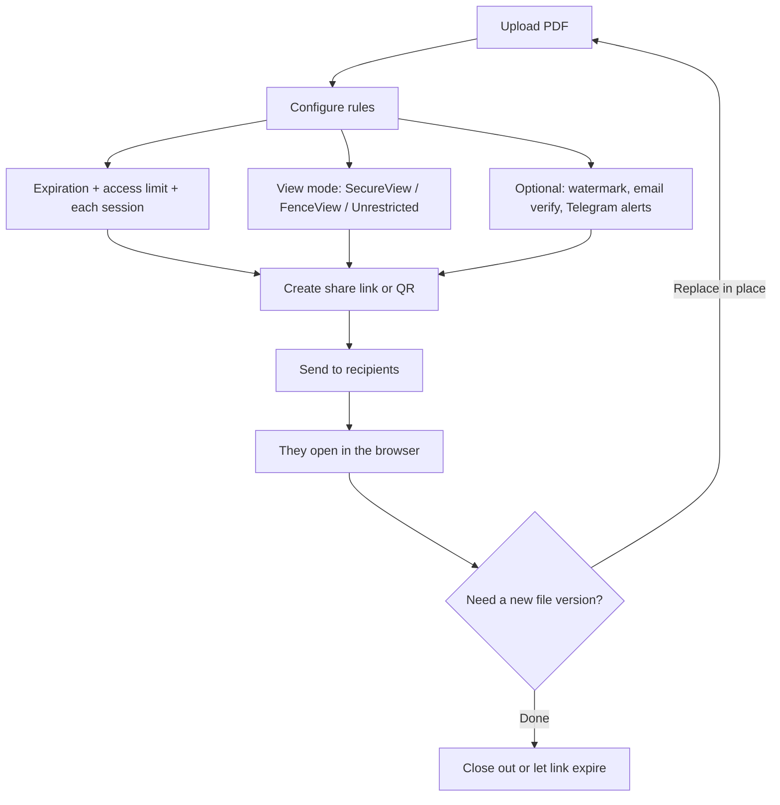

“Hosting” a PDF usually means more than dropping a file into a public folder. For contracts, coursework, reports, or client delivery, you want a **link that opens fast**, works on phones, and **honors limits** you set. Email attachments and generic cloud folders often fail that test; a flow built for PDF sharing does not.

[MaiPDF](https://maipdf.com/pdf/maipdf2026.html) follows **Upload → Configure → Share**: upload the file, set **expiration**, **access limit**, and **each-session reading time**, choose **SecureView**, **FenceView**, or **Unrestricted**, and optionally add **dynamic watermark**, **email verification**, or **Telegram read alerts** when you need a tighter audience or proof of open.

## Upload your PDF

That is the real starting point: one file in, one controlled link out—not a maze of folders and permissions.

## Configure access before you share

On the **Configure** screen, set **Access limit**, **Each session**, and **Expiration**; turn on **Telegram** or **email verification** when the file matters; pick a viewing mode and watermark if your risk level needs it.

### Flow: host, lock down, deliver

## Share: link and QR

After you create the secure link, recipients get a normal URL (and you can share a QR code for in-person or print use).

**Large access limits:** If **Access limit** is above **10,000**, behavior trends toward a very open public link. Use a limit that matches your real audience.

Pick controls to match risk: internal drafts might only need expiry and a view cap; sensitive PDFs warrant verification, watermark, and a stricter viewing mode.

---

**Related:** [Transform PDFs into shareable links in 3 steps](/en/transform-pdfs-shareable-links-3-steps) · [PDF attachment vs link in email](/en/pdf-attachment-vs-link-email-best-practices) · [Disable printing on shared PDFs](/en/pdf-disable-printing-protection-guide)
