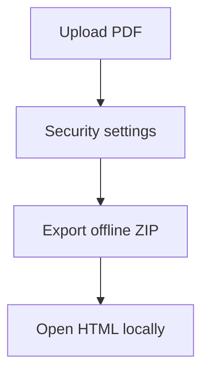

Sometimes you need to share a PDF in environments where online viewing is inconvenient (restricted networks, training rooms, internal distribution). One approach is to export an **offline package** that can be opened locally.

## Simple flow

1. **Upload the PDF**
2. **Configure security options** (if needed)
3. **Export an offline package (ZIP)**
4. **Open the included HTML file locally**

## Upload

## Export the ZIP package

## Open it locally

Unzip the file, then open the included HTML file in a browser.

## Optional: security settings

