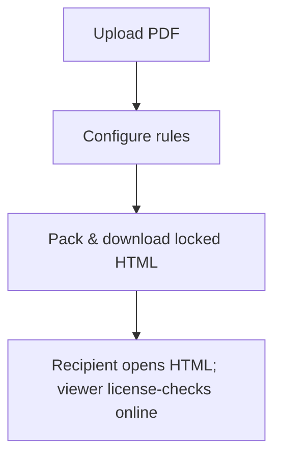

Sometimes you need to put a PDF directly in someone's hands instead of behind a link — restricted networks, training rooms, internal distribution. One approach is to pack the PDF as a **locked HTML file**: a single self-contained file the recipient can save and open in their browser. The viewer does a one-shot online license check at open time, so this is portable, not literally offline.

## Simple flow

1. **Upload the PDF**
2. **Configure rules** (open count, expiry, optional watermarks)
3. **Pack &amp; download** — you get a single self-contained HTML file (delivered as a thin ZIP wrapper)
4. **The recipient opens the HTML in a browser** — the viewer validates the license online, then renders the PDF

```mermaid
flowchart TD
  A[Upload PDF] --> B[Configure rules]
  B --> C[Pack & download locked HTML]
  C --> D[Recipient opens HTML; viewer license-checks online]
```

## Upload

## Download the locked HTML

## Open it

Save the file (unzip the wrapper if your OS does not auto-extract), then double-click the HTML to open it in a browser. Internet is required at open time for the license check.

## Optional: rule settings

