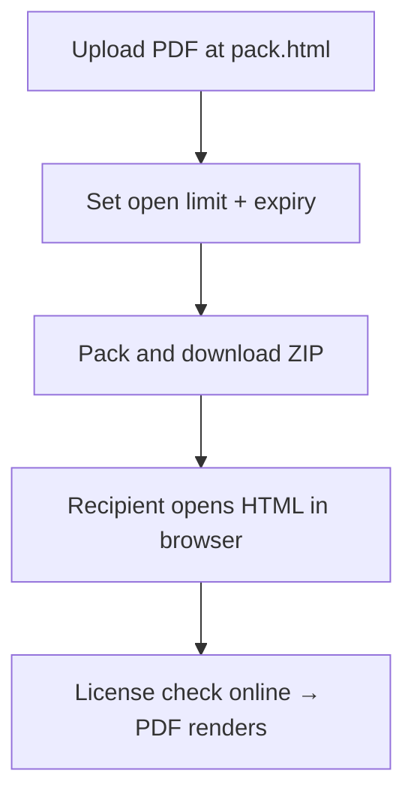

Sometimes you need to put a PDF **directly in someone's hands** — email attachment, USB, internal file share — instead of behind a hosted link. **Secure Share** at [pack.html](https://drm.maipdf.com/pack.html) packs the PDF into a locked HTML file inside a ZIP. The recipient opens it in a browser; the viewer does a one-shot online license check.

This is **pack.html only** (PDF → encrypt → webpack HTML → ZIP). For `.maipdf` and **prevent screenshot**, use the [desktop app guide](/blog/en/prevent-screenshot-pdf-drm-native-app).

```mermaid
flowchart TD
  A[Upload PDF at pack.html] --> B[Set open limit + expiry]
  B --> C[Pack and download ZIP]
  C --> D[Recipient opens HTML in browser]
  D --> E[License check online → PDF renders]
```

## Step 1 — Upload the PDF

Open [drm.maipdf.com/pack.html](https://drm.maipdf.com/pack.html). Drag a PDF onto the upload zone (max 65 MB). The file stays in your browser until you click **Pack & Download**.

## Step 2 — Configure rules

Set **max opens**, **expiration**, and optionally enable **watermark**. That is the full pack-time control set for web HTML.

Typical starting points:

- Internal review (5 people): `10` opens, `7` day expiry
- One-off contractor: `5` opens, expiry = contract end date
- Open training deck: `50` opens, `30` day expiry

## Step 3 — Pack and download

The tool encrypts the PDF (AES-GCM-256, split key) and returns a self-contained HTML file in a ZIP wrapper.

**Save immediately from the result page:**

- **License ID**
- **Modification Code** (26 chars — your admin password for this license)

## Step 4 — Recipient opens the HTML

They unzip if needed, double-click the HTML, click **Open · Unlock**. Internet is required at that moment.

## After packing

- **Extend or revoke** at [drm.maipdf.com/manage](https://drm.maipdf.com/manage) with License ID + Modification Code, or via the dashboard if you packed signed in.
- **Full detail** (testing, failure modes, security limits): [complete guide](/blog/en/how-to-create-offline-pdf-package-complete-guide)

  
<strong>Try it:</strong> <a href="https://drm.maipdf.com/pack.html">pack.html</a> — drop a PDF, click <em>Pack &amp; Download</em>. No signup required for anonymous packs.

