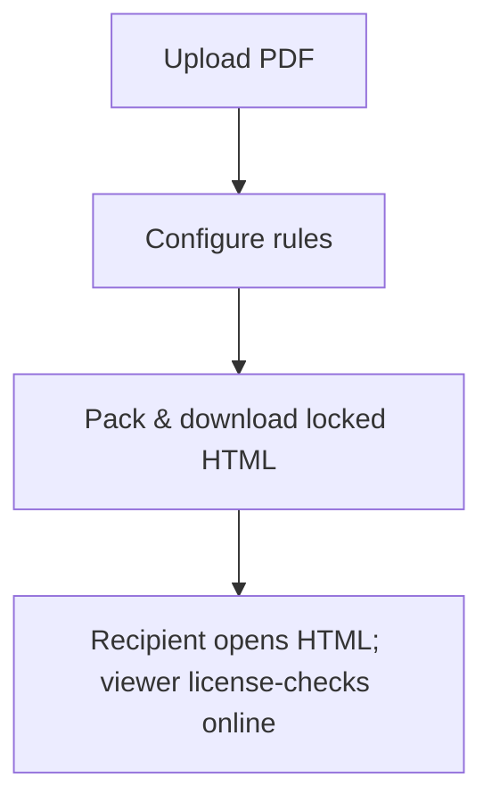

  
Sometimes you need to put a PDF <em>directly in someone's hands</em> instead of behind a link — restricted networks, training rooms, internal distribution. The answer is to pack the PDF as a <strong>locked HTML file</strong>: one self-contained file the recipient saves and opens in their browser. The viewer does a one-shot online license check at open time, so this is portable, not literally air-gapped.

## At a glance

```mermaid
flowchart TD
  A[Upload PDF] --> B[Configure rules]
  B --> C[Pack & download locked HTML]
  C --> D[Recipient opens HTML; viewer license-checks online]
```

## Four steps

  

    
1

    <h3>Upload the PDF</h3>
    
Drag a PDF onto the upload zone. The file stays in your browser until you click <em>Pack</em>.

    
  

  

    
2

    <h3>Configure rules</h3>
    
Set open count, expiry, and optionally toggle a per-page watermark. That is the full set of pack-time settings.

    
  

  

    
3

    <h3>Pack &amp; download</h3>
    
The server encrypts the PDF and returns a single self-contained HTML file (delivered as a thin ZIP wrapper). Save the License ID + Modification Code shown next to the download.

    
  

  

    
4

    <h3>Recipient opens the HTML</h3>
    
They unzip the wrapper if needed, then double-click the HTML. The viewer hits the licensing endpoint once to validate, and renders the PDF. Internet is required at open time.

    
  

  
<strong>Try it:</strong> open <a href="https://drm.maipdf.com/">drm.maipdf.com</a>, drop a PDF, click <em>Pack &amp; Download</em>. No signup required.

