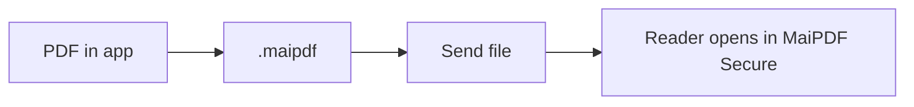

  
Put a PDF in someone's hands with license rules — not a naked attachment. **Default (2026):** pack as <code>.maipdf</code> in the native app. **Fallback:** web HTML at <a href="https://drm.maipdf.com/pack.html">drm.maipdf.com/pack.html</a>.

## App path

```mermaid
flowchart LR
  A[PDF in app] --> B[.maipdf]
  B --> C[Send file]
  C --> D[Reader opens in MaiPDF Secure]
```

| Step | Action |
|---|---|
| 1 | Install from [drm.maipdf.com](https://drm.maipdf.com/) |
| 2 | Pack with rules (expiry, opens, emails, devices) |
| 3 | Send `.maipdf` |
| 4 | Manage licenses in app or dashboard |

## Web HTML path (no install)

| Step | Action |
|---|---|
| 1 | Upload at [pack.html](https://drm.maipdf.com/pack.html) |
| 2 | Download locked HTML + save License ID / Modification Code |
| 3 | Recipient opens in browser (network required at unlock) |

## Limits (both paths)

- License check needs internet at open.
- Web HTML: no OS-level screenshot block.
- Neither stops a second camera at the screen.

---

**Related:** [Complete sharing models](/blog/en/online-vs-offline-pdf-security)
