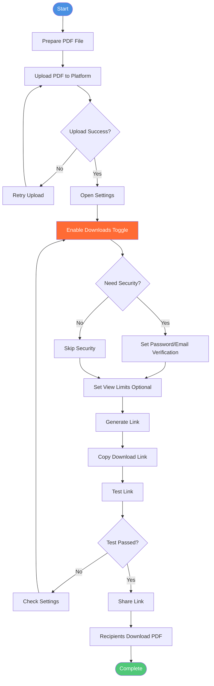
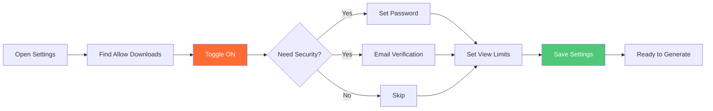
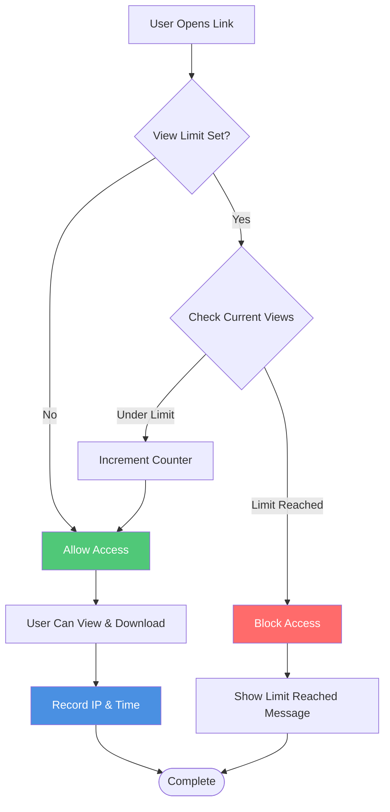
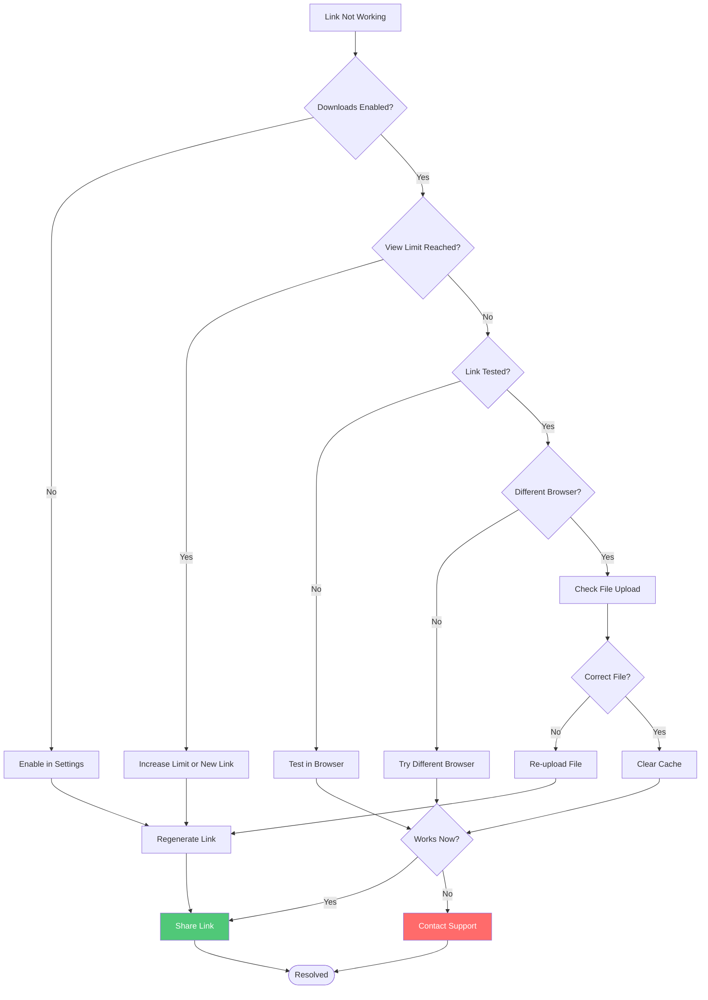

# How to Make a Download Link for a PDF: Complete Step-by-Step Guide

  
Need to know <strong>how to make a download link for a PDF</strong>? This simple guide shows you how to create downloadable PDF links in just a few steps.

## Complete Workflow: Creating Download Links

### Step-by-Step Process Flow

## Why Use Download Links? 📥

**Benefits:**
- ✅ **Easy sharing** - Share via email, messages, or websites
- ✅ **No size limits** - Bypass email attachment restrictions
- ✅ **Access control** - Control who can download
- ✅ **Tracking** - Monitor download activity
- ✅ **QR codes** - Easy mobile access

**Common Uses:**
- 📄 Sharing documents with clients
- 👥 Distributing resources to teams
- 🌐 Website downloads
- 📊 Reports and presentations

## Step 1: Prepare Your PDF 📋

**Before uploading, check:**
- ✅ File is a valid PDF
- ✅ File name is clear (e.g., "Report_2025.pdf")
- ✅ Content is correct
- ✅ File size is reasonable

## Step 2: Upload Your PDF 📤

**How to upload:**
1. **Click "Upload PDF"** button
2. **Select your file** from computer
3. **Wait for upload** to complete

**Or drag and drop** the PDF file directly

**Tips:**
- ✅ Ensure stable internet connection
- ✅ Wait for upload confirmation

## Step 3: Enable Downloads ⚙️

**⭐ CRITICAL STEP:** Enable downloads in settings

### Settings Configuration Flow

**How to enable:**
1. **Find "Allow Downloads"** option
2. **Toggle it ON** ⭐
3. **Save settings**

**Why this matters:**
- ⚠️ Default is often view-only
- ⚠️ Must enable downloads explicitly
- ⚠️ Without this, link won't download

**Optional security (for sensitive files):**
- 🔒 Password protection
- 📧 Email verification
- 🔢 View limits (e.g., set to 100 opens)

## Step 4: Generate Link 🔗

**Simple process:**
1. **Click "Generate Link"** button
2. **Copy the link** that appears
3. **Link is ready** to share!

**What you get:**
- ✅ Unique download link
- ✅ QR code (for mobile)
- ✅ Secure HTTPS link

## Step 5: Test Your Link ✅

**Always test before sharing:**
- 📱 Open link in browser
- ⬇️ Verify download works
- 📄 Check downloaded file

**Quick test checklist:**
- ✅ Link opens correctly
- ✅ Download starts automatically
- ✅ File downloads completely
- ✅ PDF opens properly

## Step 6: Share Your Link 📤

**2 ways to share:**

### 1️⃣ Direct Link
- 📧 **Email** - Copy and paste link
- 💬 **Messages** - WhatsApp, Slack, Teams
- 🌐 **Website** - Add as button or text

### 2️⃣ QR Code

**Perfect for:**
- 📱 Mobile users
- 🖨️ Printed materials
- 🎪 Events and conferences
- 📄 Marketing materials

**How to use:**
1. Download QR code image
2. Add to documents or print
3. Recipients scan to access the link

## Advanced Features (Optional) 🚀

### Access Control 🔒
- 📧 **Email verification** - Require email before download
- 🔑 **Password** - Set download password

### View Limits 📊
- 🔢 **Total view limits** - Set maximum opens (e.g., 100)
  - Link stops working after limit reached
  - Example: Set to 100, stops at 101st open
  - Control document distribution
  - **Important:** When viewing, users can download without download restrictions

### View Limit Flow

### Tracking 📈
- 🌐 **Track IP addresses** - See which IP viewed the document
- ⏱️ **Monitor access times** - Track when document was viewed
- 📊 **View records** - Complete viewing history

## Best Practices ⭐

### 1. Always Enable Downloads
- ✅ Check setting before generating link
- ✅ Test link before sharing
- ✅ Tell recipients it's a download link

### 2. Use Good File Names
**Good examples:**
- ✅ "Product_Catalog_2025.pdf"
- ✅ "Q4_Report_2025.pdf"
- ✅ "User_Guide_v2.pdf"

**Bad examples:**
- ❌ "document1.pdf"
- ❌ "file_final_v3.pdf"

### 3. Set Security Based on File Type

**Public documents:**
- Minimal restrictions
- Easy access

**Sensitive documents:**
- 🔒 Password required
- 📧 Email verification
- 🔢 View limits set

**Confidential documents:**
- 🔒 Strong access control
- 🔢 Strict view limits (e.g., 10-20 opens)
- 📊 Full tracking

### 4. Provide Clear Instructions
**When sharing, include:**
- What the file is
- File name and size
- That it's a download link

**Example:**
> "Here's the Q4 report. Click the link to download (5.2 MB)."

## Common Mistakes ❌

### Mistake 1: Forgetting to Enable Downloads
**Problem:** Link created but downloads disabled
**Solution:** ✅ Always check download setting first

### Mistake 2: Not Testing
**Problem:** Broken or non-functional links
**Solution:** ✅ Always test before sharing

### Mistake 3: Weak Security
**Problem:** Public links for confidential files
**Solution:** ✅ Enable access control for sensitive files

### Mistake 4: Poor File Names
**Problem:** Generic names like "document1.pdf"
**Solution:** ✅ Use descriptive, clear names

## Troubleshooting 🔧

### Troubleshooting Flow

### Link Doesn't Download
**Check:**
- ✅ Downloads enabled in settings?
- ✅ Try different browser
- ✅ View limit reached?
- ✅ Regenerate link

### Download Button Missing
**Check:**
- ✅ Settings saved?
- ✅ Refresh page
- ✅ Download enabled?

### Wrong File Downloads
**Check:**
- ✅ Correct PDF uploaded?
- ✅ Clear browser cache
- ✅ Re-upload file

## Download vs View-Only Links 📊

### Download Links ⬇️
- ✅ Recipients can save PDF
- ✅ Offline access
- ✅ Can share further

**Best for:** Documents people need to keep

### View-Only Links 👁️
- ✅ Online viewing only
- ✅ Better security
- ✅ Easier tracking

**Best for:** Confidential or time-sensitive documents

## Quick Summary 📝

**5 steps to create download link:**
1. 📤 **Upload** your PDF
2. ⚙️ **Enable downloads** in settings ⭐
3. 🔗 **Generate** link
4. ✅ **Test** the link
5. 📤 **Share** with others

**Key reminder:**
- ⭐ **Always enable downloads** before generating link
- ⭐ **Test every link** before sharing
- ⭐ **Use security** for sensitive files

## Conclusion 🎯

Creating download links for PDFs is easy! Just remember to:
- ✅ Enable downloads in settings
- ✅ Test before sharing
- ✅ Use good file names
- ✅ Set security when needed

**Ready to create your download link?**

MaiPDF offers free PDF sharing with download links. Upload, enable downloads, generate link, and share. No registration required.

---

**Related Articles:**
- [How to Upload PDF and Generate Secure Link](/blog/en/how-to-upload-pdf-and-generate-secure-link)
- [PDF Sharing Settings Configuration](/blog/en/pdf-sharing-settings-configuration-complete-guide)
- [How to Share PDF Online Securely](/blog/en/how-to-share-pdf-online-securely-complete-guide)
