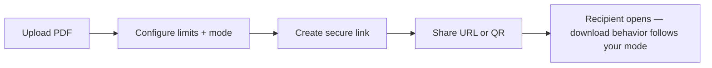

When people need **their own copy** of a PDF, a single share link beats giant attachments: you control **expiry**, **how many opens**, and whether the experience is **download-friendly** or locked down to on-screen reading. On [MaiPDF](https://maipdf.com/pdf/maipdf2026.html) the path is **Upload → Configure → Share**.

## 1) Upload the PDF

Start from the upload entry (sign in if you use account features, or upload as your workflow allows).

## 2) Configure so “download” matches what you mean

On **Configure**, set **access limit**, **each session**, and **expiration**. Add **email verification** or **Telegram read alerts** when the audience should be narrow or auditable.

**Viewing mode** is what usually separates *“they can grab a normal PDF file”* from *“they mostly read inside the viewer”*. For an intentional **file handoff**, bias toward what your policy allows on the page—often **Unrestricted** when downloads should feel straightforward; use **SecureView** / **FenceView** when you need stricter on-screen behavior (see the on-page help and [how to control downloads](/en/control-pdf-downloads-permissions)).

### Short workflow

```mermaid
flowchart LR
  A[Upload PDF] --> B[Configure limits + mode]
  B --> C[Create secure link]
  C --> D[Share URL or QR]
  D --> E[Recipient opens — download behavior follows your mode]
```

**Large access limits:** If **Access limit** is above **10,000**, MaiPDF treats the link as broadly open and turns off access logging, Telegram alerts, and dynamic watermark—use a realistic cap for real projects.

## 3) Share and test once

Send the link (or QR) by email, chat, or your site. Open it once in a **private/incognito** window and confirm both **desktop and mobile** behave the way you expect before you broadcast it.

## Presets (practical starting points)

| Scenario | Bias |
|---------|------|
| **Public resource** (manual, press kit) | Longer or optional expiry, higher access limit, mode that allows easy file access if policy allows |
| **Client handoff** | Medium access limit, expiry in days or weeks, verification if the file is sensitive |
| **Tight control** | Low access limit, short expiry, stricter viewing mode, optional **dynamic watermark** |

## Before you send

- File is the final version (name it clearly for recipients).
- Link tested on mobile and desktop.
- Team knows who keeps the **read/modify** codes if you use link management on the account side.

**Takeaway:** A “download link” is still a **governed** link—expiry and limits keep the handoff fromliving forever in the wild. For view-only sharing, tighten mode and limits instead of optimizing for download.

---

**Related:** [Control PDF downloads and permissions](/en/control-pdf-downloads-permissions) · [Transform PDFs into shareable links in 3 steps](/en/transform-pdfs-shareable-links-3-steps) · [Instant PDF link generation](/en/instant-pdf-link-generation)
