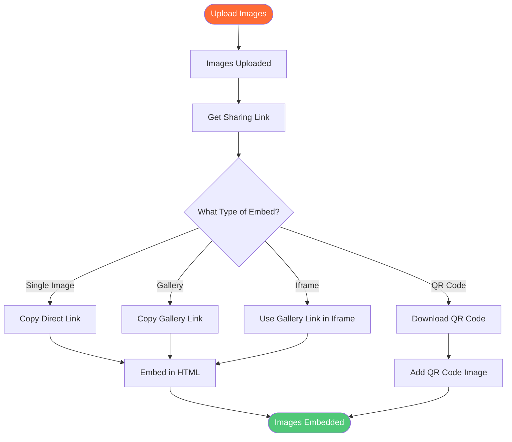

# Image Embed Code Generator: How to Embed Images with Maiimg

<div class="intro-panel">
  <p>Need to <strong>generate image embed code</strong> for your website? Maiimg provides direct image links, HTML embed codes, gallery links, and QR codes. Embed images in websites, blogs, forums, and social media. This complete guide shows you how to use Maiimg as an image embed code generator.</p>
</div>


## What is Image Embed Code?

**Image embed code** allows you to display images hosted on external servers in your website, blog, or forum. Instead of uploading images directly to your server, you can use embed codes to link to images hosted on Maiimg.

**Benefits of Using Embed Codes:**
- ✅ **Save Server Space** - No need to store images on your server
- ✅ **Fast Loading** - CDN delivery for faster page loads
- ✅ **Easy Updates** - Update images without changing website code
- ✅ **Bandwidth Savings** - Reduce your server bandwidth usage
- ✅ **Professional Hosting** - Reliable image hosting service

## Types of Embed Codes Available

### 1. Direct Image Links

**Use Case:** Embed single images in HTML

**Format:**
```html

```

**Features:**
- Direct image URL
- Works in any HTML page
- Fast loading
- Mobile-responsive

### 2. Gallery Links

**Use Case:** Share entire image galleries

**Format:**
```html
<a href="https://maiimg.com/gallery/xxxxx">View Gallery</a>
```

**Features:**
- Professional gallery view
- Multiple images
- Access control
- Tracking enabled

### 3. QR Code Images

**Use Case:** Offline sharing and mobile access

**Format:**
```html

```

**Features:**
- Auto-generated QR codes
- Mobile-friendly
- Easy to print
- Perfect for offline sharing

### 4. Iframe Embedding

**Use Case:** Embed galleries in websites

**Format:**
```html
<iframe src="https://maiimg.com/gallery/xxxxx" width="100%" height="600"></iframe>
```

**Features:**
- Full gallery view
- Responsive design
- Access control maintained
- Tracking enabled

## How to Generate Embed Codes

### Complete Process Flow



### Step 1: Upload Your Images

**Upload Process:**
1. Visit [Maiimg.com](https://maiimg.com)
2. Upload images (up to 25 at once)
3. Wait for upload completion
4. Get sharing links automatically

**Supported Formats:**
- 📸 PNG
- 🖼️ JPG/JPEG
- 🎭 GIF
- 🌐 WebP

**File Size:**
- ✅ Up to 50MB per image
- ✅ No total limit

### Step 2: Get Your Embed Codes

**Available Codes:**
- **Direct Image Links** - For single images
- **Gallery Links** - For multiple images
- **QR Codes** - For mobile/offline sharing
- **HTML Snippets** - Ready-to-use code

### Step 3: Copy and Use

**How to Use:**
1. Copy the embed code
2. Paste into your website/blog
3. Images display automatically
4. Update anytime

## Embedding in Different Platforms

### WordPress Blog

**Method 1: Direct Link**
```html

```

**Method 2: Gallery Link**
```html
<a href="https://maiimg.com/gallery/xxxxx" target="_blank">View Image Gallery</a>
```

**Method 3: Iframe**
```html
<iframe src="https://maiimg.com/gallery/xxxxx" width="100%" height="600" frameborder="0"></iframe>
```

### HTML Websites

**Basic Image Embed:**
```html

```

**Responsive Image:**
```html

```

**Gallery Embed:**
```html
<div class="gallery">
  <iframe src="https://maiimg.com/gallery/xxxxx" width="100%" height="600"></iframe>
</div>
```

### Forums (BBCode)

**Single Image:**
```
[img]https://maiimg.com/image/xxxxx.jpg[/img]
```

**Linked Image:**
```
[url=https://maiimg.com/gallery/xxxxx][img]https://maiimg.com/image/xxxxx.jpg[/img][/url]
```

### Markdown (GitHub, Reddit, etc.)

**Single Image:**
```markdown

```

**Linked Image:**
```markdown
[](https://maiimg.com/gallery/xxxxx)
```

## Advanced Embedding Features

### Access Control with Embedding

**View Limits:**
- Set maximum opens
- Control who sees images
- Prevent unlimited access

**Expiration:**
- Set expiration date
- Auto-disable after date
- Time-limited embedding

**Download Control:**
- Enable/disable downloads
- Protect your images
- Control distribution

### Tracking Embedded Images

**What You Can Track:**
- 📊 Total views
- ⏰ View times
- 📱 Device information
- 📈 Access trends

**Benefits:**
- Understand engagement
- Track website traffic
- Measure effectiveness
- Optimize content

## Best Practices

### 1. Optimize Images Before Upload

**Tips:**
- Compress large images
- Use appropriate formats
- Keep file sizes reasonable
- Ensure quality

### 2. Use Responsive Images

**HTML:**
```html

```

**Benefits:**
- Mobile-friendly
- Fast loading
- Better UX
- SEO-friendly

### 3. Add Alt Text

**Always Include:**
```html

```

**Benefits:**
- SEO improvement
- Accessibility
- Better UX
- Image context

### 4. Use Appropriate Sizes

**Tips:**
- Set width/height attributes
- Use CSS for styling
- Maintain aspect ratio
- Optimize for page speed

## Comparison: Maiimg vs Other Embed Code Generators

### Maiimg Embed Code Generator

**Advantages:**
- ✅ **50MB per image** - Larger than competitors
- ✅ **Batch upload** - 25 images at once
- ✅ **Access control** - View limits, expiration
- ✅ **Tracking** - Real-time analytics
- ✅ **QR codes** - Auto-generated
- ✅ **No registration** - Upload immediately
- ✅ **Completely free** - No cost

### Traditional Embed Code Services

**Limitations:**
- ❌ Smaller file sizes (32MB)
- ❌ Single image upload
- ❌ Limited access control
- ❌ Basic tracking
- ❌ No QR codes
- ❌ Registration often required
- ❌ May have fees

## Use Cases

### 1. Blog Image Hosting

**Scenario:** Host images for blog posts

**Process:**
1. Upload images to Maiimg
2. Get direct image links
3. Embed in blog posts
4. Update anytime

**Benefits:**
- Save server space
- Fast loading
- Easy updates
- Professional hosting

### 2. Portfolio Website

**Scenario:** Showcase work in portfolio

**Process:**
1. Upload portfolio images
2. Create galleries
3. Embed in website
4. Track views

**Benefits:**
- Professional presentation
- Access control
- View tracking
- Easy sharing

### 3. E-commerce Product Images

**Scenario:** Host product images

**Process:**
1. Upload product photos
2. Get direct links
3. Embed in product pages
4. Control access

**Benefits:**
- Fast page loads
- Easy updates
- Access control
- Analytics

### 4. Forum Image Sharing

**Scenario:** Share images in forums

**Process:**
1. Upload images
2. Get BBCode
3. Paste in forum
4. Images display

**Benefits:**
- Easy sharing
- No forum storage needed
- Fast loading
- Professional hosting

## Common Questions

### How Do I Get Embed Codes?

**Simple Process:**
1. Upload images to Maiimg
2. Get sharing links automatically
3. Copy links for embedding
4. Use in your website/blog

### Can I Embed Galleries?

**Yes!** Multiple embedding options:
- Gallery links
- Iframe embedding
- QR codes
- Direct image links

### Do Embed Codes Expire?

**You Control Expiration:**
- Set expiration dates
- One-click disable
- Auto-expire after date
- Full control

### Can I Track Embedded Images?

**Yes!** Full tracking available:
- View count
- Access times
- Device info
- Complete analytics

### Are Embed Codes Free?

**Yes!** Completely free:
- No registration required
- No hidden fees
- All features free
- Unlimited use

## Conclusion: Image Embed Code Generator

Maiimg provides the best **image embed code generator** with:
- ✅ Direct image links
- ✅ Gallery links
- ✅ QR codes
- ✅ HTML snippets
- ✅ BBCode support
- ✅ Access control
- ✅ Real-time tracking
- ✅ Completely free
- ✅ No registration

**Ready to generate embed codes?**

Visit [Maiimg.com](https://maiimg.com) to upload images and get embed codes instantly. No registration required, completely free.

---

**Related Articles:**
- [Free Image Hosting: Complete Guide](/blog/en/free-image-hosting-maiimg-complete-guide)
- [Image Upload Without Account: Complete Guide](/blog/en/image-upload-without-account-maiimg-guide)
- [Auto Delete Images: Image Expiration Guide](/blog/en/auto-delete-images-expiration-guide)
