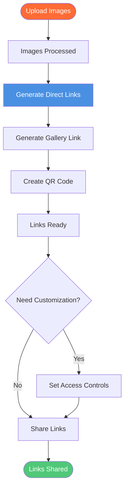

# Image Link Generator: Free Image URL Generator with Maiimg

<div class="intro-panel">
  <p>Need to <strong>generate image links</strong> quickly? Maiimg provides a free image link generator to create direct image URLs, gallery links, and QR codes instantly. Upload images and get shareable links immediately. No registration required. This complete guide shows you how to use Maiimg as an image link generator.</p>
</div>


## What is Image Link Generator?

**Image link generator** is a tool that creates shareable URLs for images uploaded online. Instead of sharing large image files, you can share a simple link that others can click to view the image.

**Benefits of Image Link Generator:**
- ✅ **Easy Sharing** - Share links instead of files
- ✅ **No File Size Limits** - Bypass email restrictions
- ✅ **Fast Access** - Quick loading via CDN
- ✅ **Mobile Friendly** - Works on all devices
- ✅ **Professional** - Clean, branded links

## How Image Link Generator Works

### Link Generation Process



### Step 1: Upload Images

**Upload Process:**
1. Visit [Maiimg.com](https://maiimg.com)
2. Select images to upload
3. Upload up to 25 images at once
4. Wait for processing

**Supported Formats:**
- 📸 PNG
- 🖼️ JPG/JPEG
- 🎭 GIF
- 🌐 WebP

**File Size:**
- ✅ Up to 50MB per image
- ✅ Fast processing

### Step 2: Get Generated Links

**Types of Links Generated:**
- 🔗 **Direct Image Links** - Individual image URLs
- 📁 **Gallery Links** - Gallery view URLs
- 📱 **QR Codes** - QR code images
- 🔗 **Sharing Links** - Shareable gallery links

**Link Features:**
- Secure HTTPS
- Mobile-responsive
- Fast loading
- Professional appearance

### Step 3: Use Your Links

**Link Usage:**
- Share via email
- Post on social media
- Embed in websites
- Print QR codes

## Types of Generated Links

### 1. Direct Image Links

**Format:**
```
https://maiimg.com/image/xxxxx.jpg
```

**Use Cases:**
- Embed in websites
- Share single images
- Use in HTML
- Direct access

**Features:**
- Direct image URL
- Fast loading
- Mobile-friendly
- No redirects

### 2. Gallery Links

**Format:**
```
https://maiimg.com/gallery/xxxxx
```

**Use Cases:**
- Share multiple images
- Professional galleries
- Portfolio showcase
- Event photos

**Features:**
- Professional gallery view
- Multiple images
- Access control
- Tracking enabled

### 3. QR Code Links

**Format:**
```
https://maiimg.com/qr/xxxxx.png
```

**Use Cases:**
- Offline sharing
- Mobile access
- Event materials
- Physical displays

**Features:**
- Auto-generated
- Mobile-friendly
- Easy to print
- Perfect for offline

### 4. Sharing Links

**Format:**
```
https://maiimg.com/share/xxxxx
```

**Use Cases:**
- Quick sharing
- Social media
- Messaging apps
- Email sharing

**Features:**
- Short, clean URLs
- Easy to share
- Mobile-optimized
- Fast access

## Image Link Generator Features

### Instant Generation

**Speed:**
- ✅ Links generated immediately
- ✅ No waiting time
- ✅ Instant access
- ✅ Fast processing

**Process:**
1. Upload images
2. Links generated automatically
3. Ready to use immediately
4. No approval needed

### Batch Link Generation

**Multiple Links:**
- Upload up to 25 images
- Get links for all images
- Gallery link included
- QR code generated

**Benefits:**
- Time saving
- Efficient process
- Bulk operations
- Professional results

### Access Control

**Link Customization:**
- 🔢 View limits
- ⏰ Expiration dates
- ⬇️ Download control
- ⏱️ Time restrictions

**Benefits:**
- Privacy protection
- Controlled sharing
- Security
- Compliance

## Comparison: Image Link Generators

### Maiimg Image Link Generator

**Advantages:**
- ✅ **50MB per image** - Larger than competitors
- ✅ **Batch generation** - 25 images at once
- ✅ **Multiple link types** - Direct, gallery, QR
- ✅ **Access control** - Full customization
- ✅ **Tracking** - Real-time analytics
- ✅ **No registration** - Use immediately
- ✅ **Completely free** - No cost

**Features:**
- Instant generation
- Multiple formats
- QR codes
- Professional links

### Traditional Link Generators

**Limitations:**
- ❌ Smaller file sizes (32MB)
- ❌ Single image upload
- ❌ Limited link types
- ❌ Basic features
- ❌ Registration often required
- ❌ May have fees

## Use Cases

### 1. Quick Image Sharing

**Scenario:** Share images quickly

**Process:**
1. Upload images
2. Get links instantly
3. Share via message
4. Recipients view images

**Benefits:**
- Fast sharing
- No file size limits
- Easy access
- Mobile-friendly

### 2. Website Image Hosting

**Scenario:** Host images for website

**Process:**
1. Upload images
2. Get direct links
3. Embed in website
4. Fast loading

**Benefits:**
- Save server space
- Fast CDN delivery
- Easy updates
- Professional hosting

### 3. Social Media Sharing

**Scenario:** Share images on social media

**Process:**
1. Upload images
2. Get sharing links
3. Post on social media
4. Track engagement

**Benefits:**
- Easy sharing
- Professional links
- Track views
- Mobile-optimized

### 4. Event Photo Distribution

**Scenario:** Share event photos

**Process:**
1. Upload event photos
2. Generate QR codes
3. Display QR codes
4. Attendees scan to view

**Benefits:**
- Easy distribution
- Offline sharing
- Professional presentation
- Track access

## Best Practices

### 1. Organize Before Upload

**Tips:**
- Use descriptive file names
- Group related images
- Check file sizes
- Verify formats

### 2. Use Appropriate Link Types

**For Single Images:**
- Use direct image links
- Embed in websites
- Share individually

**For Multiple Images:**
- Use gallery links
- Professional presentation
- Better organization

**For Offline Sharing:**
- Use QR codes
- Print materials
- Physical displays

### 3. Set Access Controls

**For Public Images:**
- Minimal restrictions
- Easy access
- Long expiration

**For Private Images:**
- View limits
- Short expiration
- Download disabled

### 4. Monitor Link Usage

**Regular Checks:**
- Review access records
- Check view counts
- Monitor trends
- Update settings

## Common Questions

### How Fast Are Links Generated?

**Instant:**
- Links generated immediately
- No waiting time
- Ready to use
- Fast processing

### Can I Generate Multiple Links?

**Yes!** Batch generation:
- Upload up to 25 images
- Get links for all
- Gallery link included
- QR code generated

### What's the File Size Limit?

**50MB per image:**
- Larger than most generators
- Supports high-quality images
- Better than competitors
- Professional use

### Are Links Permanent?

**You Control:**
- Set expiration dates
- One-click disable
- Permanent or temporary
- Full control

### Can I Customize Links?

**Yes!** Full customization:
- View limits
- Expiration dates
- Download control
- Time restrictions

## Conclusion: Image Link Generator

Maiimg provides the best **image link generator** with:
- ✅ Instant link generation
- ✅ 50MB per image
- ✅ Batch generation (25 images)
- ✅ Multiple link types
- ✅ Access control
- ✅ Real-time tracking
- ✅ QR code generation
- ✅ No registration required
- ✅ Completely free

**Ready to generate image links?**

Visit [Maiimg.com](https://maiimg.com) to upload images and generate links instantly. No registration required, completely free, professional links.

---

**Related Articles:**
- [Free Image Hosting: Complete Guide](/blog/en/free-image-hosting-maiimg-complete-guide)
- [Image Upload Without Account: Complete Guide](/blog/en/image-upload-without-account-maiimg-guide)
- [Image Embed Code Generator: How to Embed Images](/blog/en/image-embed-code-generator-maiimg-guide)
