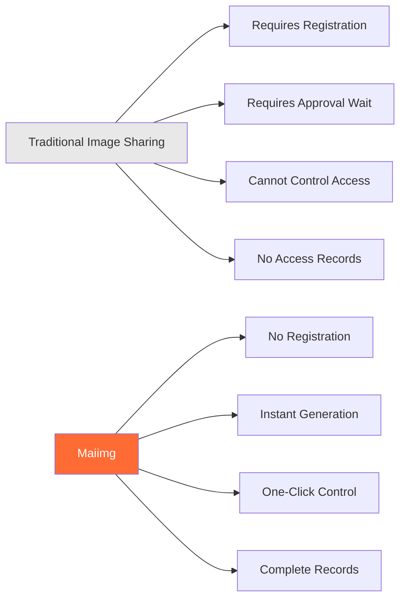
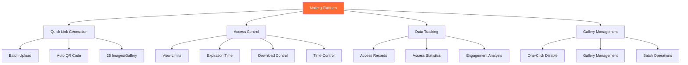
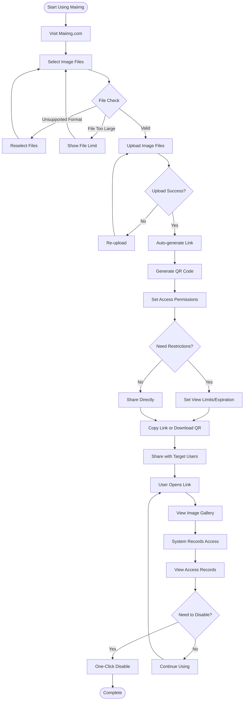
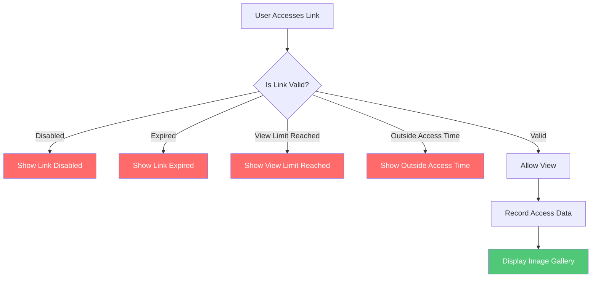
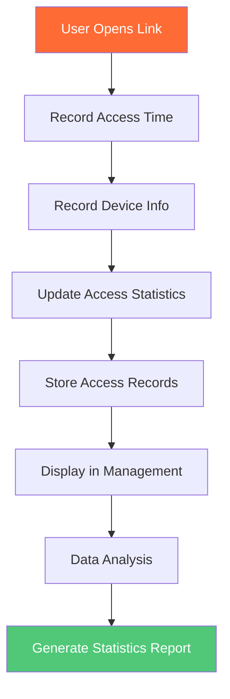
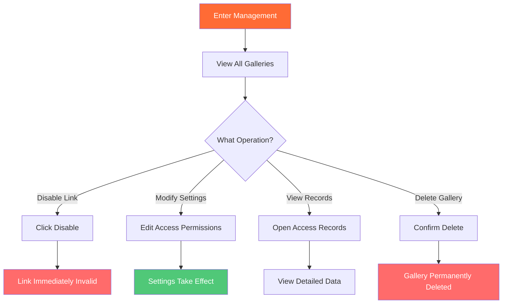
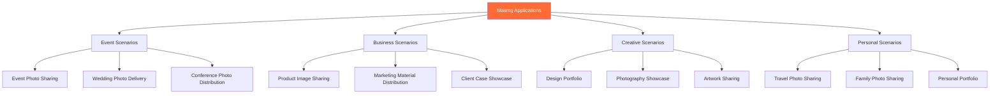
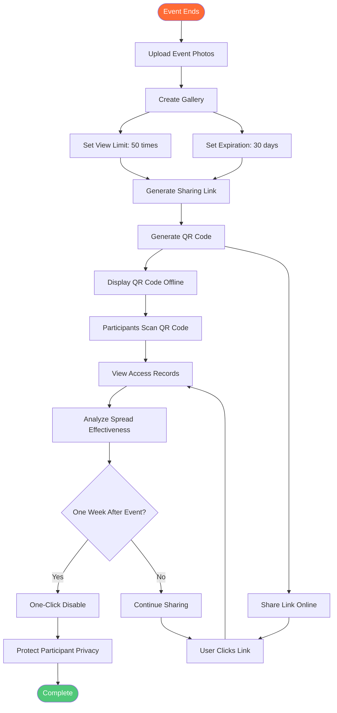
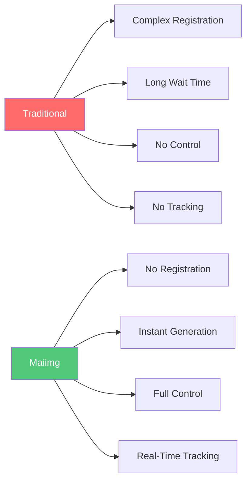
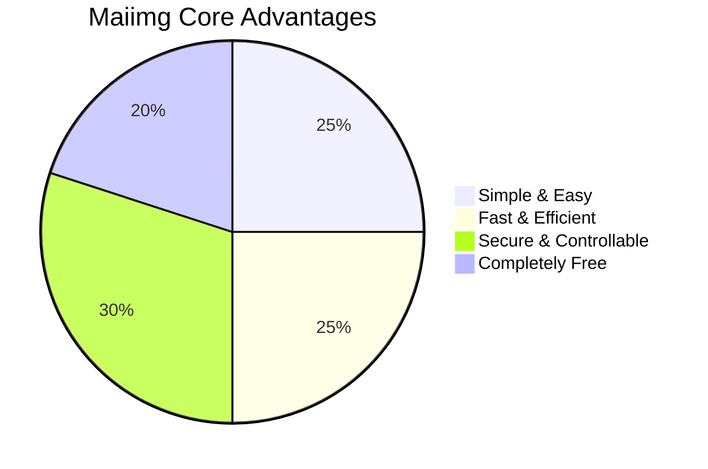

# Maiimg Complete Introduction: Professional Image Sharing Platform Made Simple and Secure

  
<strong>Maiimg</strong> is a professional online image sharing platform that allows you to quickly generate sharing links without registration, control access permissions anytime, and track image views in real-time. Whether it's event photos, product images, or design works, Maiimg makes image sharing simple, secure, and controllable.

## What is Maiimg?

### Platform Positioning

Maiimg is an **online image sharing and management platform** focused on providing simple, secure, and controllable image sharing solutions.

**Core Features:**
- ✅ **No Registration Required** - Use immediately, zero barriers
- ✅ **Instant Generation** - Generate links immediately after upload
- ✅ **Completely Free** - All basic features are free
- ✅ **Professional Security** - Access control, data tracking, batch management

### Maiimg vs Traditional Methods

## Core Features Overview

### Feature Architecture

## Complete Usage Workflow

### Complete Flow from Upload to Share

### Three Steps to Get Started

**Step 1: Upload Images**
- Visit Maiimg.com
- Drag & drop or select image files
- Supports batch upload (up to 25 images/gallery)

**Step 2: Generate Link**
- Auto-generate sharing link
- Auto-generate QR code
- Set access permissions

**Step 3: Share & Use**
- Copy link to share
- Or download QR code to share
- View access records in real-time

## Core Features Explained

### Feature 1: Quick Link Generation

**Features:**
- ⚡ Instant generation (generate immediately after upload)
- 🔗 Auto-generate unique link
- 📱 Auto-generate QR code
- 📦 Supports batch upload (up to 25 images/gallery)

**Flowchart:**

### Feature 2: Access Control

**Control Options:**

| Control | Description | Use Case |
|---------|-------------|----------|
| View Limits | Limit number of times gallery can be opened | Event photos, limited sharing |
| Expiration Time | Set automatic link expiration | Temporary sharing, event materials |
| Download Control | Allow or prohibit image download | Copyright protection, prevent distribution |
| Time Control | Set accessible time periods | Limited-time events, scheduled release |

**Access Control Flowchart:**

### Feature 3: Data Tracking

**Tracking Content:**
- 📊 Total open count
- ⏰ Time of each open
- 📱 Device information
- 📈 Access trend analysis
- 🎯 Image engagement data

**Data Tracking Flowchart:**

### Feature 4: Gallery Management

**Management Features:**
- 🚫 One-click disable link
- 📝 Modify access settings
- 📊 View management interface
- 🗑️ Delete gallery

**Gallery Management Flowchart:**

## Application Scenarios

### Scenario Categories

### Typical Application Scenario Flow

**Scenario: Event Photo Sharing**

## Feature Comparison

### Maiimg vs Traditional Methods

| Comparison | Traditional Image Sharing | Maiimg |
|------------|--------------------------|--------|
| **Registration** | ❌ Requires account | ✅ No registration |
| **Link Generation** | ❌ Requires approval wait | ✅ Instant generation |
| **Access Control** | ❌ Cannot control | ✅ Full control (count, time, download) |
| **Access Tracking** | ❌ No records | ✅ Complete records (time, device, statistics) |
| **Link Management** | ❌ Can only delete | ✅ One-click disable, settings modification |
| **Batch Upload** | ❌ Single upload | ✅ Batch upload (25 images/gallery) |
| **Cost** | 💰 May charge | ✅ Completely free |
| **Operation Complexity** | 📋 Complex steps | ✅ Simple and intuitive |

### Feature Advantage Comparison

## Advantages Summary

### Core Advantages

**1. Simple & Easy**
- No registration, use immediately
- Three steps: Upload → Generate → Share
- Clean interface, intuitive operation

**2. Fast & Efficient**
- Instant link generation
- Auto-generate QR code
- Supports batch upload (up to 25 images/gallery)

**3. Secure & Controllable**
- Complete access control
- Real-time access tracking
- One-click disable link
- Flexible permission settings

**4. Completely Free**
- All basic features free
- No hidden fees
- No usage limits

### Advantages Chart

## Quick Start

### Three Steps to Get Started

**Start Now:**
1. Visit [Maiimg.com](https://maiimg.com)
2. Drag & drop image files to upload area
3. Copy generated link or download QR code
4. Share with target users

## Summary

Maiimg is a **professional, simple, secure, and free** image sharing platform that makes image sharing easy through these core features:

- ⚡ **Quick Generation** - Instant link generation, no waiting
- 🔒 **Secure Control** - Complete access control and permission management
- 📊 **Data Tracking** - Real-time access records and analytics
- 🎯 **Simple to Use** - No registration, three steps to share
- 💰 **Completely Free** - All basic features free to use

Whether you're an event organizer, photographer, designer, or individual user, Maiimg provides professional image sharing solutions.

**Start Using Now:** [Visit Maiimg.com](https://maiimg.com)

