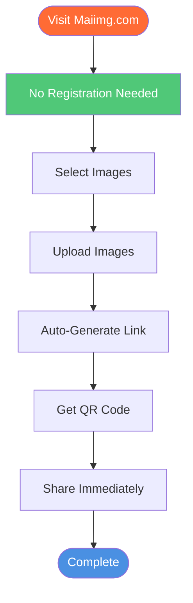

# Image Upload Without Account: Upload Images Instantly with Maiimg

  
Need to <strong>upload images without account</strong>? Maiimg lets you upload images instantly without registration, no email required, no signup needed. Upload up to 25 images at once, 50MB each, generate sharing links immediately. This guide shows you how to upload images without account registration.

## Why Upload Images Without Account?

**Benefits of No-Account Upload:**
- ✅ **Instant Access** - Start uploading immediately
- ✅ **No Email Required** - No signup process
- ✅ **Privacy Friendly** - No personal information needed
- ✅ **Time Saving** - Skip registration steps
- ✅ **Completely Free** - No account, no cost

**Common Use Cases:**
- Quick image sharing
- Temporary image hosting
- One-time image uploads
- Privacy-conscious users
- Event photo sharing

## How to Upload Images Without Account

### Complete Upload Process

### Step 1: Visit Maiimg.com

**Getting Started:**
1. Open browser
2. Go to [Maiimg.com](https://maiimg.com)
3. **No registration required**
4. **No account creation needed**
5. Start uploading immediately

**What You See:**
- Clean upload interface
- Drag and drop area
- File selection button
- No signup prompts

### Step 2: Select Your Images

**Upload Options:**
- **Drag and Drop** - Drag images to upload area
- **Click to Select** - Click button to browse files
- **Batch Selection** - Select up to 25 images at once

**Supported Formats:**
- 📸 PNG
- 🖼️ JPG/JPEG
- 🎭 GIF
- 🌐 WebP

**File Size:**
- ✅ Up to 50MB per image
- ✅ No total limit
- ✅ Fast upload speed

### Step 3: Upload Images

**Upload Process:**
1. Images upload automatically
2. Progress indicator shows
3. Wait for completion
4. Links generated instantly

**What Happens:**
- Files uploaded securely
- Links generated automatically
- QR codes created
- Ready to share

### Step 4: Get Your Links

**What You Receive:**
- ✅ **Sharing Link** - Unique URL for gallery
- ✅ **QR Code** - Auto-generated QR code image
- ✅ **Direct Links** - Individual image links
- ✅ **Gallery View** - Professional gallery interface

**No Account Needed:**
- Links work immediately
- No login required
- Share right away
- Full functionality

## Features Available Without Account

### All Core Features Free

**Upload Features:**
- ✅ Batch upload (25 images)
- ✅ 50MB per image
- ✅ Multiple formats
- ✅ Fast upload

**Sharing Features:**
- ✅ Direct links
- ✅ QR codes
- ✅ Gallery view
- ✅ Mobile-friendly

**Control Features:**
- ✅ View limits
- ✅ Expiration dates
- ✅ Download control
- ✅ Time restrictions

**Tracking Features:**
- ✅ View count
- ✅ Access times
- ✅ Device info
- ✅ Analytics

**Management Features:**
- ✅ One-click disable
- ✅ Settings modification
- ✅ Link regeneration
- ✅ Gallery deletion

## Comparison: With vs Without Account

### Upload Without Account (Maiimg)

**Advantages:**
- ✅ **Instant Start** - Upload immediately
- ✅ **No Barriers** - No registration process
- ✅ **Privacy** - No personal info required
- ✅ **Speed** - Skip signup steps
- ✅ **Free** - No account, no cost

**Features:**
- All core features available
- Full access control
- Complete tracking
- QR code generation

### Upload With Account (Traditional Hosts)

**Disadvantages:**
- ❌ Registration required
- ❌ Email verification needed
- ❌ Time-consuming signup
- ❌ Personal information required
- ❌ Account management needed

**Limitations:**
- Often slower process
- More steps required
- Privacy concerns
- Account maintenance

## Use Cases: Upload Without Account

### 1. Quick Image Sharing

**Scenario:** Share images quickly with friends

**Process:**
1. Visit Maiimg.com
2. Upload images (no account)
3. Get link immediately
4. Share via message

**Benefits:**
- Fast and simple
- No registration
- Instant sharing
- Privacy-friendly

### 2. Event Photo Distribution

**Scenario:** Share event photos with attendees

**Process:**
1. Upload event photos
2. Generate QR code
3. Display QR code at event
4. Attendees scan to view

**Benefits:**
- No account needed for uploader
- No account needed for viewers
- Easy access
- Professional presentation

### 3. Temporary Image Hosting

**Scenario:** Host images temporarily for projects

**Process:**
1. Upload images
2. Set expiration date
3. Share with team
4. Auto-delete after expiration

**Benefits:**
- No permanent account
- Time-limited access
- Automatic cleanup
- Privacy protection

### 4. Privacy-Conscious Sharing

**Scenario:** Share images without revealing identity

**Process:**
1. Upload without account
2. No personal info required
3. Share anonymously
4. Control access

**Benefits:**
- Complete privacy
- No tracking
- Anonymous sharing
- Full control

## Advanced Features Without Account

### Access Control

**View Limits:**
- Set maximum opens
- Control distribution
- Prevent unlimited sharing

**Expiration:**
- Set expiration date
- Auto-disable links
- Time-limited access

**Download Control:**
- Enable/disable downloads
- Protect images
- Control distribution

### Tracking & Analytics

**Available Tracking:**
- View count
- Access times
- Device information
- Access trends

**Benefits:**
- Understand engagement
- Track distribution
- Monitor usage
- Measure effectiveness

### QR Code Generation

**QR Code Features:**
- Auto-generated
- Mobile-friendly
- Easy to print
- Perfect for offline sharing

## Best Practices

### 1. Organize Before Upload

**Tips:**
- Name files clearly
- Group related images
- Check file sizes
- Verify formats

### 2. Set Appropriate Controls

**For Public Images:**
- Minimal restrictions
- Long expiration
- Easy access

**For Private Images:**
- View limits
- Short expiration
- Download disabled

### 3. Save Your Links

**Important:**
- Copy links immediately
- Save QR codes
- Bookmark management page
- Keep track of galleries

### 4. Monitor Usage

**Regular Checks:**
- Review access records
- Check view counts
- Monitor trends
- Update settings

## Common Questions

### Do I Need an Account to Upload?

**No!** Maiimg allows upload without account:
- ✅ No registration required
- ✅ No email needed
- ✅ No signup process
- ✅ Upload immediately

### Can I Upload Multiple Images?

**Yes!** Batch upload up to 25 images:
- Select multiple files
- Upload at once
- Create gallery
- Share single link

### What's the File Size Limit?

**50MB per image:**
- Larger than most free hosts
- Supports high-quality images
- No total storage limit
- Fast upload speed

### How Long Do Images Stay Online?

**As long as you want:**
- No automatic deletion
- You control expiration
- One-click disable
- Full control

### Can I Track Who Views My Images?

**Yes!** Full tracking available:
- View count
- Access times
- Device info
- Complete analytics

## Conclusion: Upload Images Without Account

Maiimg makes it easy to **upload images without account**:
- ✅ No registration required
- ✅ No email needed
- ✅ Instant upload
- ✅ All features available
- ✅ Completely free
- ✅ Full control
- ✅ Real-time tracking

**Ready to upload images without account?**

Visit [Maiimg.com](https://maiimg.com) to start uploading immediately. No registration, no account, no barriers. Upload, share, and control your images instantly.

---

**Related Articles:**
- [Free Image Hosting: Complete Guide](/blog/en/free-image-hosting-maiimg-complete-guide)
- [Image Embed Code Generator: How to Embed Images](/blog/en/image-embed-code-generator-maiimg-guide)
- [Auto Delete Images: Image Expiration Guide](/blog/en/auto-delete-images-expiration-guide)
