# Maiimg: Simple Image Sharing with QR Codes

  
<strong>What is Maiimg?</strong> A free platform for sharing images with built-in QR codes and open statistics.

  
<strong>Who made it?</strong> The same team behind MaiPDF. Same idea, but for images instead of PDFs.

## 📤 What You Can Do

**Simple workflow:**

```mermaid
flowchart LR
    A[📁 Select Images] --> B[☁️ Upload]
    B --> C[⚙️ Set Options]
    C --> D[🔗 Get Link & QR]
    D --> E[📤 Share]
    E --> F[📊 View Records]
    
    style A fill:#e3f2fd,stroke:#1976d2,stroke-width:2px
    style B fill:#f3e5f5,stroke:#7b1fa2,stroke-width:2px
    style C fill:#fff3e0,stroke:#f57c00,stroke-width:2px
    style D fill:#e8f5e9,stroke:#388e3c,stroke-width:2px
    style E fill:#fce4ec,stroke:#c2185b,stroke-width:2px
    style F fill:#e0f2f1,stroke:#00897b,stroke-width:2px
```

  

    
📦

    

      <h4>Upload 25 Images at Once</h4>
      
Supports PNG, JPG, JPEG, GIF, WebP (up to 50MB each)

    

  

  

    
📱

    

      <h4>Automatic QR Code</h4>
      
Every gallery gets a QR code automatically - perfect for print materials or events

    

  

  

    
🔗

    

      <h4>Shareable Link</h4>
      
Get a clean link to copy and paste anywhere

    

  

  

    
👀

    

      <h4>View Limits (Optional)</h4>
      
Set how many times the gallery can be opened

    

  

  

    
⏱️

    

      <h4>Time Control (Optional)</h4>
      
Set viewing duration in seconds

    

  

  

    
📊

    

      <h4>Open Statistics</h4>
      
See total opens and basic activity information

    

  

## 🔒 Security Settings

**What you can control:**

  

    👁️
    

      <strong>View Limit:</strong> Set to 1, 5, 10, 50, or unlimited views
    

  

  

    ⏱️
    

      <strong>Time Control:</strong> Each viewer can see images for X seconds only
    

  

  

    📝
    

      <strong>Description:</strong> Add context to your gallery (optional)
    

  

  

    🗑️
    

      <strong>Delete Anytime:</strong> Remove gallery from dashboard - links stop working immediately
    

  

## 📊 Open Statistics Dashboard

**What you can see:**

  

    <h4>📈 Total Opens</h4>
    
How many times your gallery was opened

  

  

    <h4>🕐 Access Times</h4>
    
When your gallery was accessed

  

  

    <h4>🔑 Access Code</h4>
    
Your unique code to check open statistics

  

  

    <h4>🗑️ Delete Button</h4>
    
One-click delete from dashboard

  

## 🎯 Who Should Use Maiimg?

  

    <h4>🎨 Photographers & Artists</h4>
    
<strong>Use case:</strong> Share portfolio with clients

      
<strong>Benefits:</strong> Set view limit to 10, review open statistics to see engagement

  

  

    <h4>🏢 Small Businesses</h4>
    
<strong>Use case:</strong> Send product catalog to wholesale buyers

      
<strong>Benefits:</strong> Use QR code on business cards, monitor engagement

  

  

    <h4>👨‍🏫 Teachers</h4>
    
<strong>Use case:</strong> Share reference images for art class

    
<strong>Benefits:</strong> Set time limit, prevent permanent saves

  

  

    <h4>🎉 Event Organizers</h4>
    
<strong>Use case:</strong> Share event photos quickly

    
<strong>Benefits:</strong> QR code on screen, attendees scan and view

  

## 🆚 Maiimg vs Traditional Image Hosts

  

    <h4>❌ Traditional Image Hosts</h4>
    <ul>
      <li>Images uploaded = permanent link</li>
      <li>No control after sharing</li>
      <li>Can't delete once shared</li>
      <li>No open statistics</li>
      <li>No QR codes</li>
    </ul>
  

  

    <h4>✅ Maiimg</h4>
    <ul>
      <li>You control access settings</li>
      <li>Can change settings anytime</li>
      <li>Delete button in dashboard</li>
      <li>See total views & access times</li>
      <li>Automatic QR codes</li>
    </ul>
  

## ⚠️ What It Can't Do

**Be realistic:**

  
⌠Can't prevent screenshots

  
⌠Can't prevent phone camera photos

  
⌠Can't stop screen recording

  
⌠No "unique visitor" identification (just total opens)

  
⌠No notification alerts when someone views

**What it DOES do well:**

  
✅ Makes sharing super easy (QR code!)

  
✅ Gives you basic open statistics

  
✅ Lets you delete galleries anytime

  
✅ Completely free to use

## 📱 QR Code Feature Explained

**Why QR codes are useful:**

  

    📄
    

      <strong>Print Materials</strong>
      
Add QR code to business cards, flyers, posters

    

  

  

    🎤
    

      <strong>Presentations</strong>
      
Display QR code on screen, audience scans to view images

    

  

  

    🎉
    

      <strong>Events</strong>
      
Wedding photos, conference materials - scan and view

    

  

  

    🛍️
    

      <strong>Retail</strong>
      
Product catalog in store - customers scan to see full gallery

    

  

---

**Bottom Line:** Maiimg is a straightforward, free tool for sharing images when you want basic open statistics and QR codes. Not enterprise-level, but perfect for everyday use.

