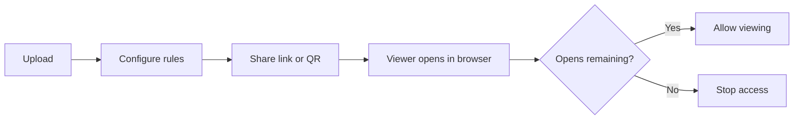

If you share a PDF as an attachment, you lose control the moment it leaves your inbox. A more practical “DRM-style” approach is to share a **link** and enforce rules at the viewer.

This article focuses on the simplest and most useful control: **limit how many times the PDF can be opened**.

## What you’re controlling

- **Access limit**: total opens allowed for the link
- **Each session**: how long one open lasts
- **Expiration**: when the link stops working by date/days

## The workflow (Upload → Configure → Share)

```mermaid
flowchart LR
  A[Upload] --> B["Configure rules"]
  B --> C["Share link or QR"]
  C --> D[Viewer opens in browser]
  D --> E{"Opens remaining?"}
  E -->|Yes| F[Allow viewing]
  E -->|No| G[Stop access]
```

## When view limits are useful

- **Proposals**: keep a review window tight
- **Hiring**: share a resume or portfolio without unlimited forwarding
- **Training**: distribute materials without leaving permanent copies in email threads

## Realistic limitations

View limits reduce casual oversharing, but they do not stop:

- screenshots
- screen recording
- re-typing content

For better deterrence, use a protected viewer and watermark.

## Large access limits caveat

If **Access limit** is above **10,000**, behavior can trend toward an effectively public link and **access records may not be logged**.

---

**Related:** [Secure PDF links](/en/secure-pdf-links) · [View limits and expiration](/en/view-limits-and-expiration) · [Prevent PDF downloads (view-only)](/en/prevent-pdf-downloads-view-only)

[Go to Blog Index](/blog)
