# How to Limit PDF Views: Control Document Access

  
<strong>The Problem:</strong> You share a PDF with someone, and suddenly it's been opened 50 times or forwarded to people you don't know.

  
<strong>The Solution:</strong> Limit how many times the PDF can be opened. After 3 views (or whatever you set), it stops working.

**Real Example:** A teacher shares an exam PDF set to 1 view. Students can open it once during test time. If someone tries to open it again later to share answers, it won't work.

## What Does "Limit PDF Views" Actually Mean?

Simple: You set a number (like 3, 5, or 10). After the PDF is opened that many times, it stops working.

### When This Is Useful

  

    <h3>🎓 Teachers</h3>
    
<strong>Problem:</strong> Students screenshot exams and share them

    
<strong>Solution:</strong> Set to 1 view during test time only

  

  

    <h3>💼 Sales Teams</h3>
    
<strong>Problem:</strong> Proposals get forwarded to competitors

    
<strong>Solution:</strong> Limit to 5 views, track who opens it

  

  

    <h3>📄 Legal Documents</h3>
    
<strong>Problem:</strong> Contracts shouldn't be shared widely

    
<strong>Solution:</strong> Allow 2-3 views for review, then expire

  

  

    <h3>🎨 Portfolio Previews</h3>
    
<strong>Problem:</strong> Don't want work samples circulating forever

    
<strong>Solution:</strong> Set 10 views for client review period

  

## How Does It Work?

Instead of emailing the actual PDF file, you:

```mermaid
flowchart LR
    A[📄 Your PDF] --> B[🌐 Upload to Cloud]
    B --> C[⚙️ Set View Limit]
    C --> D[🔗 Get Special Link]
    D --> E[📧 Share Link]
    E --> F{Someone Opens Link}
    F --> G[Counter: 1/3]
    F --> H[Counter: 2/3]
    F --> I[Counter: 3/3]
    I --> J[🚫 Link Expires]
    
    style A fill:#e3f2fd,stroke:#1976d2,stroke-width:2px
    style C fill:#fff3e0,stroke:#f57c00,stroke-width:2px
    style D fill:#e8f5e9,stroke:#388e3c,stroke-width:2px
    style J fill:#ffebee,stroke:#d32f2f,stroke-width:2px
```

**Why this works:** The PDF lives on a server you control. Each time someone clicks the link, the counter goes up. When it hits the limit, the server stops showing the file.

  💡
  

    <strong>Key Point:</strong> You're not sending the actual PDF file—you're sending a link that tracks views. The PDF stays on the server where you control access.
  

## How to Set It Up (Step by Step)

**Using a tool like MaiPDF:**

  

    

      
1

      

    

    

      <h3>Upload Your PDF</h3>
      
Drag and drop your file to the platform

    

  

  

    

      
2

      

    

    

      <h3>Set View Limit</h3>
      
Choose: 1, 3, 5, 10, 50 views (or unlimited)

      
    

  

  

    

      
3

      

    

    

      <h3>Get Your Link</h3>
      
Copy the special link and QR code

      
    

  

  

    

      
4

    

    

      <h3>Share & Monitor</h3>
      
Send the link, watch the view counter in real-time

      
    

  

  

    ✓
    <h4>That's It!</h4>
  

  
From uploading your PDF to sharing the link takes about <strong>2 minutes</strong>. No software installation, no complicated setup—just upload, configure, and share.

## Extra Security: Email Verification

**Scenario:** You set 3 views, but you don't want just anyone with the link to use them up.

**Solution:** Require email verification.

  🎯
  

    <strong>Key Benefit:</strong> Even if someone forwards your link, only people with verified emails can open it. Plus, you'll know exactly who viewed it and when.
  

## What You Can Track

When someone opens your PDF, you see:

  

    
📊

    

      <h4>View Count</h4>
      
"Opened 2 out of 5 allowed views"

    

  

  

    
📧

    

      <h4>Email (if required)</h4>
      
"john@company.com opened it"

    

  

  

    
🌍

    

      <h4>Location</h4>
      
IP address and general location

    

  

  💼
  

    <strong>Real Example:</strong> A sales manager sees that a client opened the proposal 3 times yesterday. Perfect timing to follow up with a call!
  

## Limitations to Understand

  

    <h3>⚖️ Be Realistic About View Limits</h3>
    
They're useful but not perfect. Here's what you need to know:

  

  

    

      <h4>✅ What It Does Well</h4>
      <ul>
        <li>Stops casual over-sharing</li>
        <li>Prevents link from working after X opens</li>
        <li>Shows you who's viewing and when</li>
        <li>Good for time-sensitive materials</li>
        <li>Simple to set up and use</li>
      </ul>
    

    

      <h4>❌ What It Can't Do</h4>
      <ul>
        <li>Can't prevent screenshots</li>
        <li>Can't stop screen recording</li>
        <li>Won't stop text copying (unless disabled)</li>
        <li>Not military-grade security</li>
        <li>More deterrent than fortress</li>
      </ul>
    

  

  

    <strong>👥 Best for:</strong> Teachers, sales teams, consultants, small businesses—anyone who needs practical control without enterprise complexity.
  

---

**Bottom Line:** View limits give you basic control over PDF access without needing complicated DRM software. Perfect for everyday use when you want to track and limit document sharing.

