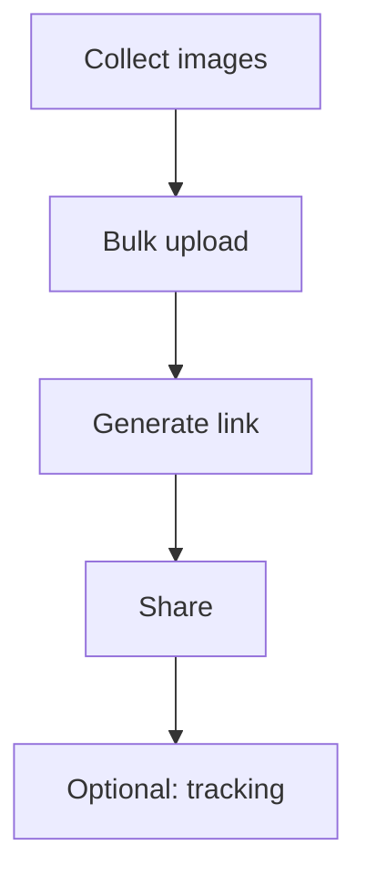

When you need to share **many images at once** (training screenshots, design variants, product photos), file attachments don’t scale.

Maiimg is built for **image sharing** (not PDF).

## Simple workflow

1. **Upload images in bulk**
2. **Generate one share link**
3. **Share with your team or clients**
4. **Optionally check results later**

