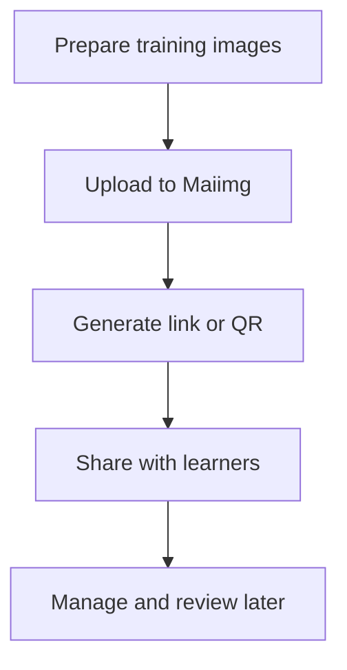

When you run training sessions, it’s common to share **many screenshots** (slides, step-by-step UI captures, lab results). Email threads and chat uploads get messy fast.

Maiimg is for **image sharing** (not PDF). Keep it simple: upload images, generate a link, share it.

## A clean workflow (3 steps)

1. **Upload training images**
2. **Generate a share link (or QR code)**
3. **Send one link to learners**

## Step 1 — Upload

## Step 2 — Configure sharing (optional)

Keep your sharing rules consistent for each cohort or class.

## Step 3 — Share one link (instead of many attachments)

## After sharing: keep it organized

- **Track results (when needed)**: confirm whether people opened the shared images.
- **Keep updates tidy**: avoid re-sending dozens of files when you refresh a training deck.

