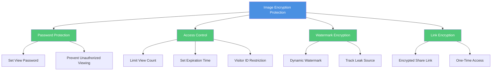
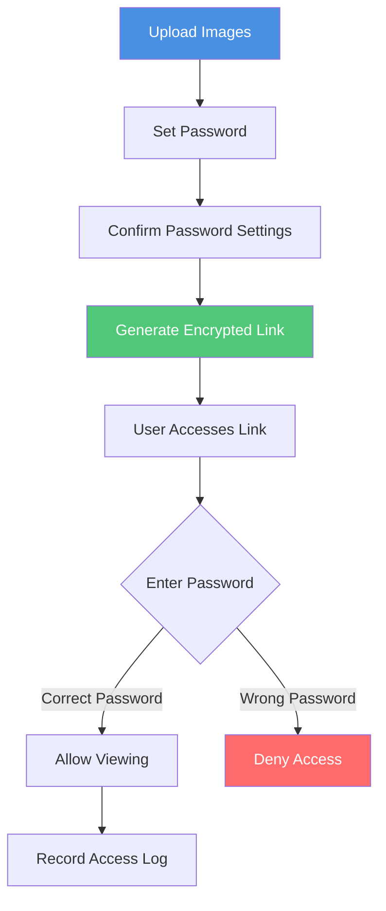
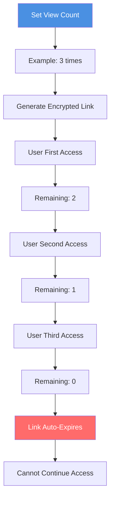
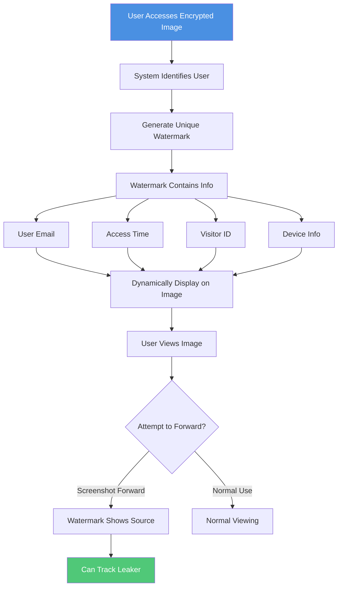
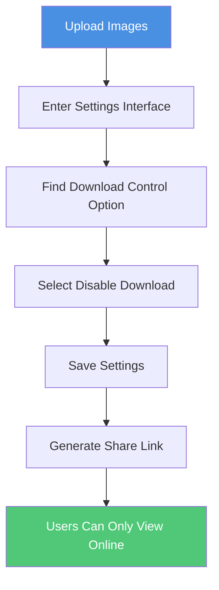
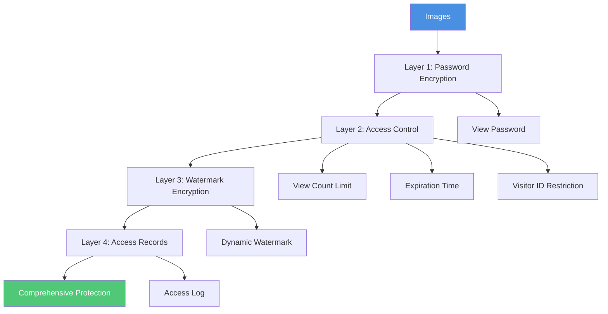

# Image Encryption to Prevent Forwarding: Complete Guide to Comprehensive Image Security

  
In the digital age, image security is crucial. <strong>Image encryption technology</strong> can effectively prevent images from being forwarded and accessed without authorization. This guide details how to protect your images through various encryption methods, ensuring only authorized personnel can access them and preventing unauthorized sharing.

## Why Encrypt Images to Prevent Forwarding?

### Importance of Encryption Protection

**1. Prevent Unauthorized Access**
- Only users with the password can view images
- Prevent access even if the link is forwarded
- Protect sensitive images from leakage

**2. Control Image Distribution**
- Even if the link is forwarded, content cannot be viewed without the password
- Limit image distribution scope
- Protect business secrets and intellectual property

**3. Legal Compliance Requirements**
- Meet data protection regulations
- Protect personal privacy information
- Comply with industry security standards

**4. Tracking and Auditing**
- Record access to encrypted images
- Track image distribution paths
- Provide legal evidence

### Core Value of Image Encryption to Prevent Forwarding

## Methods to Encrypt Images and Prevent Forwarding

### Method 1: Password Encryption Protection

**Principle:**
- Set a view password for image share link
- Only users with the correct password can view images
- Even if the link is forwarded, access is impossible without the password

**Encryption Flow:**

**Setup Steps:**

1. **Upload Images**
   - Select images to encrypt
   - Support single or batch upload
   - Wait for upload to complete

2. **Set Password**
   - Enter security settings interface
   - Select "Password Protection" option
   - Enter strong password (recommended 8+ characters, including letters, numbers, and special characters)
   - Confirm password

3. **Confirm Password Settings**
   - Confirm password is entered correctly
   - Check password strength indicator
   - Save password settings

4. **Generate Encrypted Link**
   - Save settings and generate share link
   - Send link and password separately to authorized users

**Advantages:**
- ✅ Dual protection: Link + Password
- ✅ Even if link is leaked, access is impossible without password
- ✅ Effectively prevents unauthorized access
- ✅ Simple and easy-to-use security protection

**Precautions:**
- ⚠️ Password must be securely stored and transmitted
- ⚠️ Recommend sending link and password through different channels
- ⚠️ Regularly change passwords

### Method 2: Access Control Encryption

**2.1 View Count Limit Encryption**

**How It Works:**
- Set maximum image view count
- Link automatically expires when limit is reached
- Prevent link from being shared multiple times

**Setup Flow:**

**Use Cases:**
- One-time viewing of confidential images
- Time-limited event images
- Prevent link abuse

**2.2 Expiration Time Encryption**

**How It Works:**
- Set automatic link expiration time
- Cannot access images after expiration
- Automatically locks when time expires

**Setup Method:**
- Select expiration time (1 hour, 1 day, 1 week, etc.)
- System automatically locks images when expired
- Re-authorization required after expiration

**2.3 Visitor ID Restriction Encryption**

**How It Works:**
- Restrict access to specific Visitor ID ranges
- Only specified visitor IDs can access
- Prevent remote unauthorized access

**Setup Steps:**
1. Obtain authorized user's Visitor ID
2. Add allowed Visitor IDs in settings
3. Save settings
4. Only specified visitor IDs can access images

### Method 3: Dynamic Watermark Encryption

**Principle:**
- Add dynamic watermark to images
- Watermark contains unique visitor information
- Can track source even if screenshot is forwarded

**Watermark Encryption Flow:**

**Watermark Content Options:**
- Visitor email address
- Access date and time
- Visitor ID
- Device information
- Custom text

**Advantages:**
- ✅ Strong deterrent effect
- ✅ Precise leak source tracking
- ✅ Provides legal evidence
- ✅ Does not affect normal viewing experience

### Method 4: Disable Download Protection

**Principle:**
- Images can only be viewed online
- Cannot download to local device
- Prevent image files from being forwarded

**Setup Steps:**

**Advantages:**
- ✅ Completely prevent image download
- ✅ Images always under server control
- ✅ Cannot forward through files

**Limitations:**
- ⚠️ Cannot completely prevent screenshots
- ⚠️ Cannot prevent screen recording

### Method 5: Combined Encryption Strategy

**Multi-Layer Encryption Protection:**

**Protection Level Comparison:**

| Protection Level | Password Protection | Access Control | Watermark Encryption | Disable Download | Access Records | Use Cases |
|-----------------|-------------------|----------------|---------------------|-----------------|---------------|-----------|
| Basic Protection | ✅ | - | - | - | ✅ | General Images |
| Standard Protection | ✅ | ✅ | - | ✅ | ✅ | Important Images |
| Advanced Protection | ✅ | ✅ | ✅ | ✅ | ✅ | Confidential Images |
| Maximum Protection | ✅ | ✅ | ✅ | ✅ | ✅ | Top Secret Images |

## Complete Setup Process for Image Encryption to Prevent Forwarding

### Step 1: Prepare Images

1. Ensure image format is correct (supports JPG, PNG, WEBP, etc.)
2. Check image content integrity
3. Determine information scope to protect

### Step 2: Choose Encryption Method

**Select Based on Image Importance:**

- **General Images**: Basic password protection
- **Important Images**: Password + Access control
- **Confidential Images**: Password + Access control + Watermark
- **Top Secret Images**: Full-featured protection

### Step 3: Set Encryption Parameters

**Password Settings:**
1. Enter security settings
2. Enable password protection
3. Set strong password (recommended 12+ characters, including letters, numbers, and special characters)
4. Confirm and save password settings

**Access Control Settings:**
1. Set view count (recommended 1-5 times)
2. Set expiration time
3. Add Visitor ID restrictions (if needed)

**Watermark Settings:**
1. Enable dynamic watermark
2. Select display content
3. Adjust watermark position and transparency

**Disable Download Settings:**
1. Enable disable download function
2. Save settings

### Step 4: Generate Encrypted Link

1. Save all settings
2. System generates encrypted share link
3. Obtain access password
4. Send link and password separately

### Step 5: Monitor Access

1. View access records
2. Monitor abnormal access
3. Track image distribution paths
4. Handle security issues promptly

## Best Practices

### Password Management

**Password Setting Principles:**
- Use strong passwords (at least 12 characters)
- Include uppercase, lowercase, numbers, and special characters
- Avoid using personal information
- Change passwords regularly

**Password Transmission Methods:**
- Send link and password separately
- Use encrypted communication channels
- Avoid sending both in same email
- Consider using password manager

### Access Control Strategy

**View Count Settings:**
- One-time images: 1 time
- Important images: 2-3 times
- Reference images: 5-10 times

**Expiration Time Settings:**
- Temporary images: 1-24 hours
- Short-term images: 1-7 days
- Long-term images: 30-90 days

### Security Monitoring

**Regular Checks:**
- View access logs
- Check for abnormal access
- Analyze access patterns
- Handle security issues promptly

## Frequently Asked Questions

### Q1: Does image encryption affect image quality?

**A:** No. Image encryption only controls access permissions and does not change image content or quality. Image clarity, colors, etc. are not affected.

### Q2: What if I forget the password?

**A:** If using an online image encryption service, you can usually:
- Contact image owner to reset password
- Use backup verification method
- Check password hint (if set)

### Q3: Can encrypted images be viewed on mobile phones?

**A:** Yes. As long as the image viewer supports password input, encrypted images can be viewed on mobile phones, tablets, and other devices.

### Q4: How to know if images have been forwarded?

**A:** You can track through:
- View access records and Visitor IDs
- Check watermark information
- Analyze access times and locations
- Monitor view counts

### Q5: Does encryption affect image loading speed?

**A:** Minimal impact. Password protection function is optimized, and the impact on image loading speed is almost negligible.

### Q6: Can I still take screenshots after disabling download?

**A:** Disable download function can only prevent saving image files, cannot completely prevent screenshots. Recommend combining with watermark function, so even screenshots can track sources.

## Summary

Image encryption is an effective method to prevent image forwarding. Through the combined use of password protection, access control, watermark encryption, disable download, and other technologies, you can comprehensively protect your image security. Remember:

- ✅ Choose appropriate protection level based on image importance
- ✅ Use strong passwords and transmit securely
- ✅ Regularly monitor access
- ✅ Handle security issues promptly

Through reasonable encryption strategies, you can effectively prevent images from being forwarded and protect important information security.

  <h2 class="solution-title">🚀 Ready to Start?</h2>
  
Experience the power of <strong>Maiimg</strong> - Upload, share, and track your images with complete control!

  <a href="https://maiimg.com" class="solution-button">Try Maiimg Now</a>

