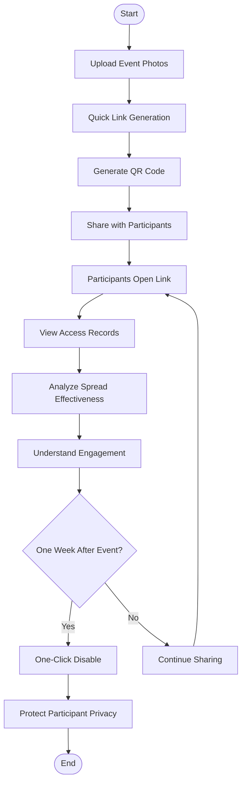
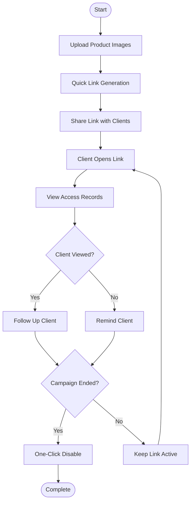
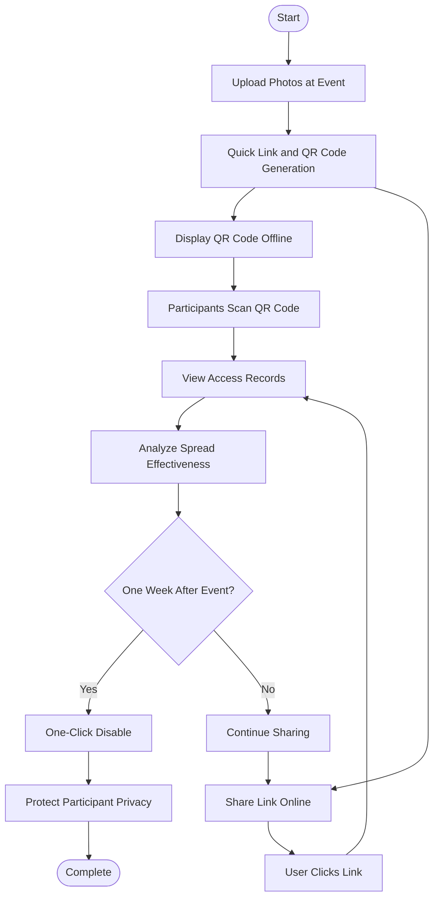

# Maiimg: Quick Link Generation, One-Click Disable, and Access Tracking

  
What do you need for image sharing? <strong>Quick link generation</strong>, <strong>one-click disable</strong>, and <strong>access tracking</strong>. Maiimg perfectly combines these three core features, making image sharing simple, secure, and controllable.

## Core Feature 1: Quick Link Generation

### Instant Generation, Share in Seconds

**No waiting, share immediately:**
- Links generated instantly after upload
- No registration required, no approval needed
- Support batch upload (up to 25 images)
- Automatic QR code generation

**Simple Steps:**
1. Visit Maiimg.com
2. Drag and drop or select images to upload
3. **Link generated automatically**, ready to use
4. Copy link or download QR code to share

### Why Quick Link Generation Matters

**Problems with traditional methods:**
- ❌ Requires account registration
- ❌ Needs approval waiting
- ❌ Slow link generation
- ❌ Complicated steps

**Maiimg advantages:**
- ✅ No registration, use immediately
- ✅ Links generated in seconds
- ✅ One-click copy and share
- ✅ Automatic QR code generation

**Real-world scenarios:**
- Event photos need immediate sharing
- Clients need quick product image access
- Team collaboration needs instant material sharing
- Marketing campaigns need rapid image distribution

## Core Feature 2: One-Click Disable

### Control Anytime, Immediate Effect

**One-click operation, link disabled instantly:**
- Click "Disable" button, link becomes unavailable immediately
- No need to delete images, just disable the link
- Shared links become invalid immediately
- Can re-enable anytime (if supported)

### Why One-Click Disable is Essential

**Common scenarios:**
- Wrong image shared, need to stop access immediately
- Event ended, need to close image access
- Privacy protection, need to temporarily disable link
- Content updated, need to disable old link

**Maiimg one-click disable advantages:**
- ✅ Simple operation, one-click complete
- ✅ Immediate effect, no waiting
- ✅ Doesn't affect uploaded images
- ✅ Can re-enable anytime

### How to Use One-Click Disable

**Operation steps:**
1. Access Maiimg management interface
2. Find the image link to disable
3. Click "Disable" button
4. Link becomes invalid immediately, cannot access

**Effects after disabling:**
- Shared links cannot be opened
- QR code scanning becomes invalid
- Visitors see "Link disabled" message
- Image data preserved, can re-enable

## Core Feature 3: Access Tracking

### Real-Time Tracking, Transparent Data

**Complete access records:**
- View total open count
- View each open time
- View opener's IP address (if supported)
- View device information (if supported)

### Why Access Tracking is Important

**Understand sharing effectiveness:**
- Know how many times images were viewed
- Understand which images are most popular
- Track marketing campaign effectiveness
- Analyze user behavior

**Real-world scenarios:**
- **Marketing campaigns:** Track campaign image spread
- **Customer service:** Confirm if clients viewed product images
- **Team collaboration:** Know if team members viewed shared materials
- **Content operations:** Analyze which content is most popular

### What Information Does Access Tracking Include?

**Basic data:**
- Total open count
- Open time records
- Open time distribution

**Advanced data (if supported):**
- Visitor IP address
- Device type
- Geographic location
- Traffic source

**How to use access tracking:**
1. Upload images and generate link
2. Share link with target users
3. View access records in management interface
4. Analyze data, optimize sharing strategy

## Three Features Perfectly Combined

### Complete Workflow

**Scenario: Event photo sharing**

**Process:**

1. **Quick link generation**
   - Event ends, upload photos immediately
   - Links generated in seconds
   - Share with participants

2. **Access tracking**
   - View who opened the link in real-time
   - Understand photo spread effectiveness
   - Analyze participant engagement

3. **One-click disable**
   - One week after event ends
   - One-click disable link
   - Protect participant privacy

### Feature Comparison

| Feature | Traditional Image Sharing | Maiimg |
|---------|--------------------------|--------|
| Link Generation Speed | Requires registration, approval waiting | Generated in seconds, no registration |
| Link Control | Cannot disable, only delete | One-click disable, control anytime |
| Access Records | No records or incomplete | Complete records, real-time viewing |
| Cost | May require payment | Completely free |
| Operation Complexity | Complicated steps | Simple and intuitive |

## Real-World Use Cases

### Case 1: E-commerce Product Image Sharing

**Need:** Quickly share product images with clients, understand viewing situation, close access after campaign

**Solution:**
1. Upload product images, **quick link generation**
2. Share link with clients
3. **View access records**, understand client viewing situation
4. After campaign ends, **one-click disable link**

### Case 2: Event Photo Instant Sharing

**Need:** Share event photos immediately, track spread effectiveness, protect privacy after event

**Solution:**
1. Upload photos at event, **quick link and QR code generation**
2. Participants scan QR code to view
3. **View access records**, understand photo spread effectiveness
4. One week after event, **one-click disable link**

### Case 3: Team Collaboration Material Sharing

**Need:** Quickly share design materials, understand team member viewing situation, close access after project

**Solution:**
1. Upload design materials, **quick link generation**
2. Share to team group
3. **View access records**, confirm team members viewed
4. After project ends, **one-click disable link**

## Usage Tips

### Tip 1: Best Practices for Quick Link Generation

- Prepare images in advance to reduce upload time
- Use batch upload feature, upload multiple at once
- Copy link immediately after generation to avoid loss
- Use QR code feature for offline sharing

### Tip 2: Best Timing for One-Click Disable

- 1-7 days after event ends
- Disable old link when content updates
- Disable immediately when sharing error found
- Disable timely when privacy protection needed

### Tip 3: Analysis Methods for Access Tracking

- Focus on total open count, understand overall effectiveness
- Analyze open time distribution, understand user active hours
- Compare open counts of different images, optimize content
- Combine with business goals, evaluate sharing effectiveness

## FAQ

### Q1: How long does link generation take?

**A:** Link generation is instant, generated immediately after upload, usually within 10 seconds.

### Q2: Can disabled links be restored?

**A:** Depends on platform settings. Some platforms support re-enabling, some require regenerating links. Recommend confirming before disabling.

### Q3: How long are access records saved?

**A:** Access records are saved permanently until you delete images or disable links. Can view historical records anytime.

### Q4: Can I use all three features simultaneously?

**A:** Absolutely! These three features work together. Quick link generation for sharing, access tracking for analysis, one-click disable for control.

### Q5: Do these features require payment?

**A:** Maiimg's core features are completely free, including quick link generation, one-click disable, and access tracking.

## Conclusion

Maiimg's three core features—**quick link generation**, **one-click disable**, and **access tracking**—make image sharing simple, secure, and controllable.

Whether you are:
- Marketing professional needing quick image sharing
- Content operator needing effectiveness tracking
- Individual user needing privacy protection
- Designer needing team collaboration

Maiimg provides professional, convenient image sharing solutions for you.

**Experience Maiimg now:**
- Visit Maiimg.com
- Upload images, generate links in seconds
- One-click disable, control anytime
- View records, transparent data

  <h2 class="solution-title">🚀 Ready to Start?</h2>
  
Experience the power of <strong>Maiimg</strong> - Upload, share, and track your images with complete control!

  <a href="https://maiimg.com" class="solution-button">Try Maiimg Now</a>

---

**Related Guides:**
- [Maiimg Bulk Image Sharing: Complete Guide](/blog/en/maiimg-bulk-image-sharing-complete-guide)
- [Maiimg QR Code Image Sharing Guide](/blog/en/maiimg-qr-code-image-sharing-guide)
- [Maiimg Secure Image Sharing Access Control](/blog/en/maiimg-secure-image-sharing-access-control)

