```mermaid
flowchart TD
    A[👤 Someone Opens Link] --> B[🌐 View Images]
    B --> C[📊 System Records Data]
    C --> D[Record IP Address]
    C --> E[Count Views]
    
    D --> F[📈 You See Dashboard]
    E --> F
    
    F --> G[📉 Check Analytics Anytime]
    F --> H[🗑️ One-Click Delete]
    
    style A fill:#e3f2fd,stroke:#1976d2,stroke-width:2px
    style B fill:#e8f5e9,stroke:#388e3c,stroke-width:2px
    style C fill:#fff3e0,stroke:#f57c00,stroke-width:2px
    style F fill:#f3e5f5,stroke:#7b1fa2,stroke-width:2px
    style G fill:#fce4ec,stroke:#c2185b,stroke-width:2px
    style H fill:#ffebee,stroke:#d32f2f,stroke-width:2px
```

# Maiimg: Share Images Smarter with Tracking and Control

  Sharing images online is usually simple—until you realize you've lost control. Traditional image hosts let anyone view, copy, or spread your content once it's out there.

**Maiimg offers a better approach: share with full control and visibility.**

## 🚀 What is Maiimg?

  <h3>🎯 Smart Image Sharing Platform</h3>
  
Maiimg is a new platform for fast, secure, and trackable image sharing. Upload up to 25 images at once, generate a unique link and QR code, and share instantly.

## 🔑 Key Features

### 📤 Upload & Share Instantly

  <h4>⚡ Lightning-Fast Uploads</h4>
  
Drag and drop your images (PNG, JPG, JPEG, GIF, WebP; up to 50MB each) and get a shareable link or QR code in seconds.

  <h4>📁 Supported Formats</h4>
  

    
📸 PNG

    
🖼️ JPG

    
🨠JPEG

    
🭠GIF

    
🌠WebP

  

  
<strong>File Size:</strong> Up to 50MB each | <strong>Batch Upload:</strong> 25 images at once

### 🎛️ Custom Controls

Take full control over how your images are accessed:

  

    <h4>👀 View Limit</h4>
    
Decide how many times your gallery can be opened

    

      <strong>Example:</strong> Set to 10 views for exclusive client previews
    

  

  

    <h4>⏱️ Time Control</h4>
    
Set how long each view lasts

    

      <strong>Example:</strong> 5-minute viewing windows for sensitive content
    

  

  

    <h4>📝 Description</h4>
    
Add context for your images

    

      <strong>Example:</strong> "Product catalog - Fall 2025 collection"
    

  

### 📊 Tracking & Analytics

  <h3>🔍 Complete Visibility</h3>
  
Every gallery comes with a tracking code, giving you insight into:

  

    
📈

    

      <h4>Total Views</h4>
      
See how many times your gallery has been opened

    

  

  

    
🌍

    

      <h4>Visitor Location</h4>
      
See IP addresses of people who viewed

    

  

  

    
🗑️

    

      <h4>One-Click Delete</h4>
      
Delete gallery instantly from tracking dashboard

    

  

### 🗑️ Delete Anytime

  <h3>🛡️ Ultimate Control</h3>
  
Shared something by mistake? You remain in control. Right from the tracking dashboard, you can delete galleries with one click—even after you've shared the link.

  

    <ul>
      <li><strong>One-Click Delete:</strong> Delete button right in the tracking dashboard</li>
      <li><strong>Instant Removal:</strong> Galleries disappear immediately</li>
      <li><strong>Link Deactivation:</strong> All shared links stop working</li>
      <li><strong>Complete Cleanup:</strong> Images permanently removed from servers</li>
      <li><strong>No Traces:</strong> QR codes and links become invalid instantly</li>
    </ul>
  

## 🎯 Perfect for

  

    <h3>🏢 Businesses</h3>
    
Sharing product photos with clients

    

      <strong>Scenario:</strong> E-commerce store sending catalog previews to wholesale buyers with view limits and tracking
    

  

  

    <h3>👨‍🏫 Teachers</h3>
    
Sending visual materials to students

    

      <strong>Scenario:</strong> Art instructor sharing reference images with time-controlled access for assignments
    

  

  

    <h3>🎉 Event Organizers</h3>
    
Distributing albums quickly

    

      <strong>Scenario:</strong> Wedding planner sharing ceremony photos with families using QR codes
    

  

  

    <h3>🎨 Creatives</h3>
    
Showcasing their work with full control

    

      <strong>Scenario:</strong> Photographer presenting portfolio to potential clients with analytics tracking
    

  

## ✅ What Makes Maiimg Different?

  

    
⚡

    

      <h4>Instant Upload</h4>
      
Upload up to 25 images at once, get shareable link immediately. No waiting.

    

  

  

    
🔒

    

      <h4>Access Control</h4>
      
Set view limits and time restrictions. You decide who sees what and for how long.

    

  

  

    
📊

    

      <h4>Detailed Analytics</h4>
      
Track total views, unique visitors, access times, and IP addresses.

    

  

  

    
🗑️

    

      <h4>Delete Anytime</h4>
      
Change your mind? Delete galleries instantly - links stop working immediately.

    

  

  

    
📱

    

      <h4>Automatic QR Codes</h4>
      
Get QR codes for easy mobile sharing. Perfect for events and print materials.

    

  

  

    
🆓

    

      <h4>Free to Use</h4>
      
No credit card, no hidden fees, no subscription. Just upload and share.

    

  

## 🚀 How It Works

The complete Maiimg workflow is straightforward and efficient:

```mermaid
flowchart LR
    A[📤 Upload Images] --> B[⚙️ Configure Settings]
    B --> C[🔗 Get Link & QR]
    C --> D[📊 Track Analytics]
    D --> E{Need Changes?}
    E -->|Update Settings| B
    E -->|Delete Gallery| F[🗑️ Remove Content]
    E -->|Keep Monitoring| D
    
    style A fill:#e3f2fd,stroke:#1976d2,stroke-width:2px
    style B fill:#f3e5f5,stroke:#7b1fa2,stroke-width:2px
    style C fill:#e8f5e9,stroke:#388e3c,stroke-width:2px
    style D fill:#fff3e0,stroke:#f57c00,stroke-width:2px
    style E fill:#fce4ec,stroke:#c2185b,stroke-width:2px
    style F fill:#ffebee,stroke:#d32f2f,stroke-width:2px
```

### Step-by-Step Process

  

    
1

    <h4>📤 Upload</h4>
    
Drag and drop up to 25 images (50MB each)

    <ul>
      <li>PNG, JPG, JPEG, GIF, WebP</li>
      <li>Instant preview</li>
    </ul>
  

  

    
2

    <h4>⚙️ Configure</h4>
    
Set view limits, time controls, descriptions

    <ul>
      <li>Optional: View count limits</li>
      <li>Optional: Time restrictions</li>
    </ul>
  

  

    
3

    <h4>🔗 Share</h4>
    
Get instant link and QR code

    <ul>
      <li>Copy link to clipboard</li>
      <li>Download QR code</li>
    </ul>
  

  

    
4

    <h4>📊 Track</h4>
    
Monitor views and analytics

    <ul>
      <li>Real-time view counts</li>
      <li>Visitor IP tracking</li>
    </ul>
  

## 🔐 Advanced Security Features

  

    <h4>🛡️ Encrypted Links</h4>
    
All gallery links are uniquely encrypted and secure

  

  

    <h4>🕐 Time-Based Access</h4>
    
Set automatic expiration for sensitive content

  

  

    <h4>🔍 Access Monitoring</h4>
    
Real-time tracking of all viewing activity

  

  

    <h4>🗑️ Instant Deletion</h4>
    
Remove content completely at any time

  

## 📈 Platform Specifications

  <h3>🎯 Key Capabilities</h3>
  

    

      
50MB

      
Maximum file size per image

    

    

      
25

      
Images per gallery

    

    

      
∞

      
Galleries you can create

    

    

      
Real-time

      
Analytics updates

    

  

---

**Note:** Maiimg works well for controlled image sharing with basic analytics. For advanced enterprise features or pixel-level tracking, you might need specialized solutions. This platform is ideal for photographers, teachers, small businesses, and anyone who wants more control than traditional image hosts offer.

