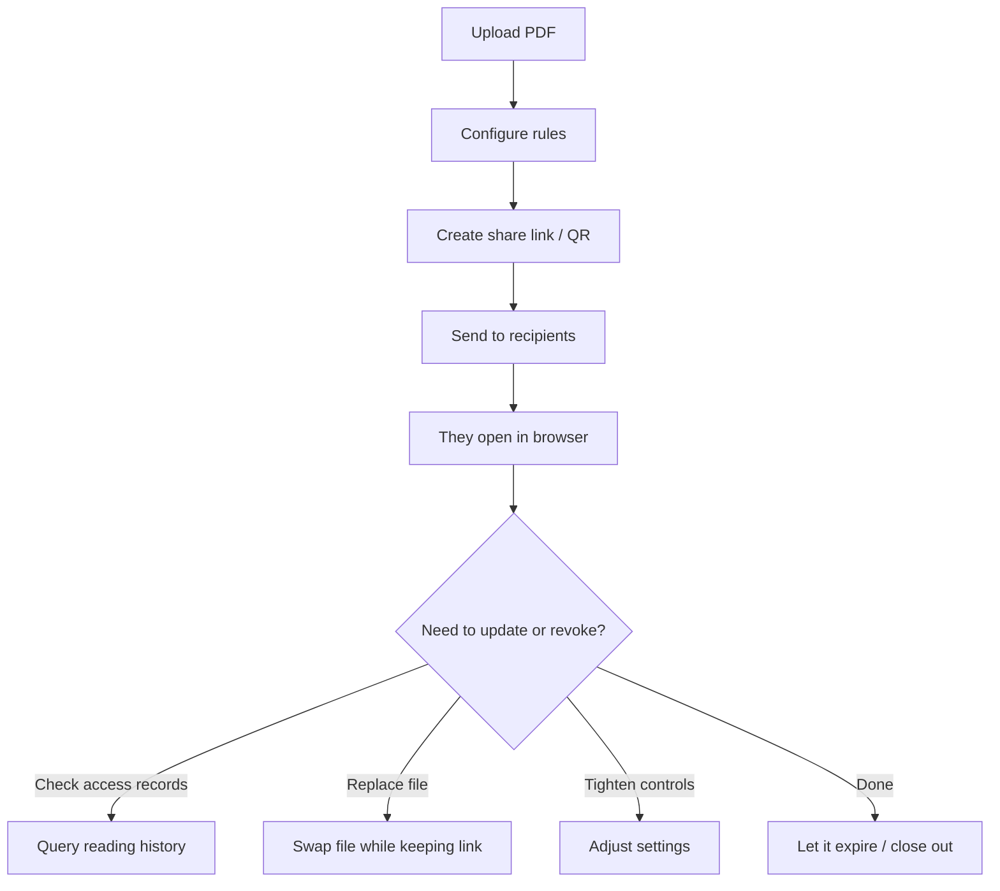
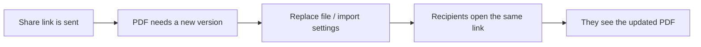

MaiPDF’s core idea is simple: **the file stays a file, but sharing becomes a controlled link**.

Instead of sending large attachments (or leaving a PDF in a public folder), you publish a link that honors rules like:

- **Expiration** (time-based)
- **Access limit** (view/open cap)
- **Each session** reading time (per-open time box)
- **Viewing mode**: **SecureView**, **FenceView**, or **Unrestricted**
- Optional **dynamic watermark**, **email verification**, and **Telegram read alerts**

The whole flow is **Upload → Configure → Share**.

## The full workflow (diagram)

## Step 1: Upload

Upload the PDF you want to share.

## Step 2: Configure (the controls that matter)

This is where “a URL” becomes “a controlled PDF link.”

### Core controls

- **Expiration**: end access automatically after a date / duration
- **Access limit**: cap total opens/reads
- **Each session**: limit reading time per open

### Viewing modes (how the PDF is displayed)

- **SecureView**: strongest protection, designed to reduce casual copying
- **FenceView**: adds a visible “fence” layer to deter screenshots/recording
- **Unrestricted**: easiest viewing for public/low-risk documents

If you need to show the “no print / no download” style viewer UI:

### Optional hardening (use when the audience is strict)

- **Dynamic watermark**: overlay viewer context so leaked screenshots are less useful
- **Email verification**: only specific recipients can open the PDF
- **Telegram read alerts**: get notified when people open/read

## Step 3: Share (link + QR)

When configuration is done, generate the link and (optionally) a QR code.

### Large access limits caveat

If **Access limit** is above **10,000**, the link can behave like it’s effectively public, and **access records may not be logged**. Use a limit that matches your real audience.

## Access records (reading history)

For audits and follow-ups, you can check when/where the PDF was opened by using the codes on the share page.

## Replace the file (without changing the share experience)

When you update a proposal deck, syllabus, or product sheet, you often want the **same “share channel”** to point to the newest version.

MaiPDF supports swapping/replacing the file via the control panel, so you don’t have to resend a brand-new link every time.

### Replace flow (diagram)

---

**Related:** [Secure PDF links](/en/secure-pdf-links) · [Host a PDF online for secure sharing](/en/host-pdf-online-secure-sharing-guide) · [PDF to QR](/en/pdf-to-qr)
