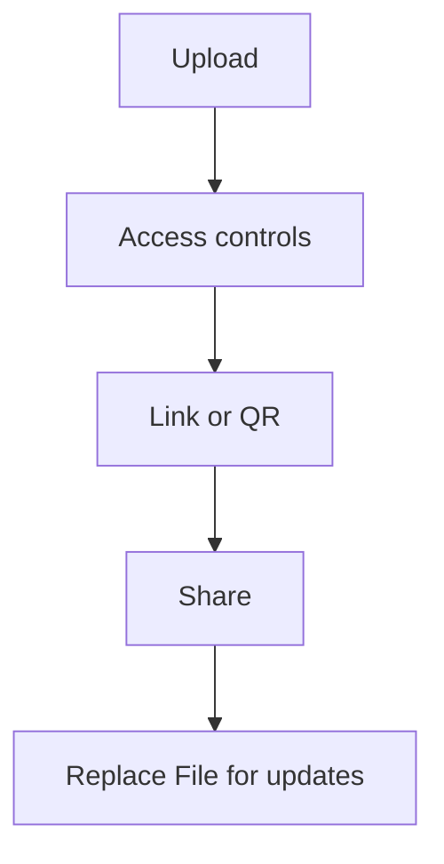

“Secure sharing” usually means being clear about the workflow: **share a link**, apply **only the controls you need**, and keep updates tidy.

MaiPDF focuses on link-based PDF sharing. (For images, use **Maiimg**.)

## Recommended workflow

1. **Upload**
2. **Set access controls** (optional)
3. **Generate link / QR**
4. **Share**
5. **Replace File to update** (keep the same link)

> Note: we don’t claim an “expiration date” setting.

Reference (Replace File): `https://sendpdfonline.com/article/replace-pdf-without-changing-link-zh`

