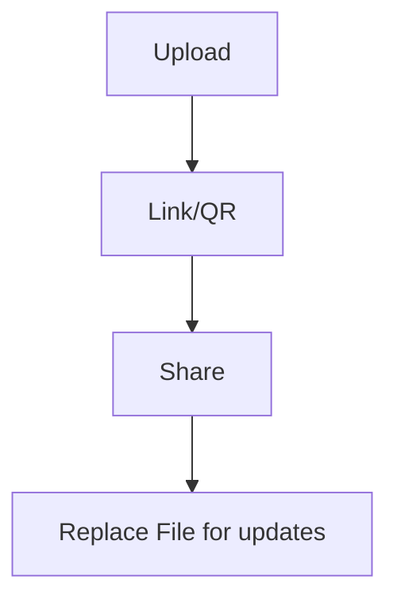

People often ask “Can I modify the link after I’ve already shared a PDF?”

In practice, a safer workflow is: **keep the link stable** and update the content via **Replace File** (so you don’t have to resend new URLs).

## Recommended workflow

1. **Upload the PDF**
2. **Set access controls** (optional)
3. **Generate a link / QR**
4. **Share**
5. **Replace File when you update the PDF** (link stays the same)

> Note: we don’t assume an “expiration date” feature.

Related: `/blog/en/modify-pdf-links`  
Reference (Replace File): `https://sendpdfonline.com/article/replace-pdf-without-changing-link-zh`

