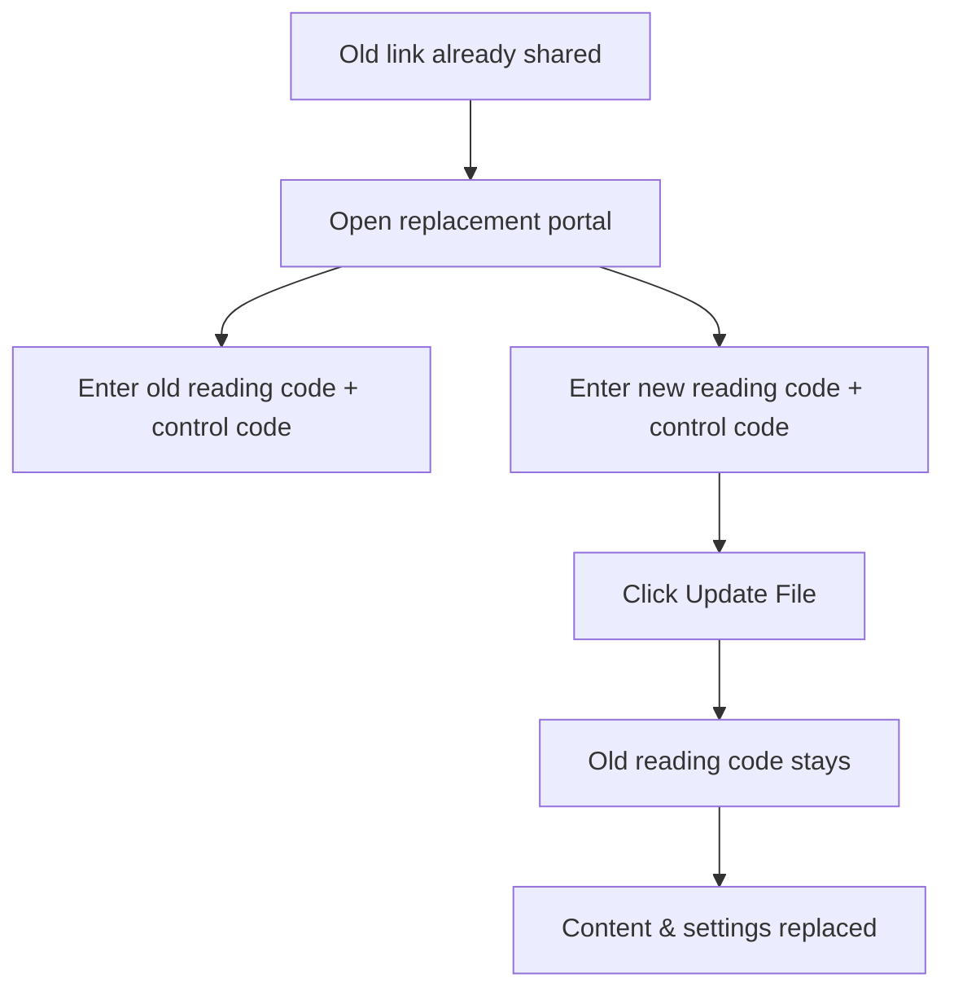

# Replace a PDF Without Changing the Link

  
<strong>The reading code stays the same.</strong> The content and access settings are replaced by the new link’s version.

## Why people replace links

- Fix mistakes after sharing
- Update pricing or versions
- Change access settings (views, time, verification, download, watermark, alert email)
- Retract content by replacing with a blank PDF

## How MaiPDF helps

MaiPDF replaces everything in one go:

- **Link stays the same**
- **Content updates**
- **Settings follow the new link** (no manual rework)

## Quick steps

1. Open the replacement portal: https://maipdf.com/pdf/hahachange.php
2. Enter old reading code + control code
3. Enter new reading code + control code
4. Click **Update File**

## Use cases

- Contract revisions
- Price list updates
- Training materials
- Emergency revoke (upload a blank PDF, then replace)
  
  code {
    background: #e2e8f0;
    padding: 0.2rem 0.4rem;
    border-radius: 0.25rem;
    font-family: monospace;
  }
  
  .portal-card {
    background: white;
    border-radius: 0.5rem;
    padding: 1.5rem;
    margin: 2rem 0;
    box-shadow: 0 4px 6px rgba(0, 0, 0, 0.05);
  }
  
  .portal-header {
    font-size: 1.2rem;
    font-weight: bold;
    margin-bottom: 1rem;
    color: #3b82f6;
    display: flex;
    align-items: center;
  }
  
  .portal-link {
    margin-bottom: 1.5rem;
  }
  
  .portal-url {
    display: inline-block;
    background: #f1f5f9;
    padding: 0.75rem 1rem;
    border-radius: 0.25rem;
    font-family: monospace;
    font-size: 1rem;
    color: #3b82f6;
    word-break: break-all;
  }
  
  .portal-image img {
    width: 100%;
    border-radius: 0.5rem;
    box-shadow: 0 4px 8px rgba(0, 0, 0, 0.1);
  }
  
  .steps-container {
    margin: 2rem 0;
  }
  
  .step {
    display: flex;
    margin-bottom: 1.5rem;
    background: white;
    border-radius: 0.5rem;
    padding: 1.5rem;
    box-shadow: 0 4px 6px rgba(0, 0, 0, 0.05);
  }
  
  .step-number {
    background: #3b82f6;
    color: white;
    width: 2rem;
    height: 2rem;
    border-radius: 50%;
    display: flex;
    align-items: center;
    justify-content: center;
    font-weight: bold;
    margin-right: 1rem;
    flex-shrink: 0;
  }
  
  .step-content {
    flex: 1;
  }
  
  .step-content h3 {
    margin-top: 0;
    margin-bottom: 0.75rem;
    color: #3b82f6;
  }
  
  .benefits-grid {
    display: grid;
    grid-template-columns: repeat(auto-fit, minmax(250px, 1fr));
    gap: 1.5rem;
    margin: 2rem 0;
  }
  
  .benefit-card {
    background: white;
    border-radius: 0.5rem;
    padding: 1.5rem;
    box-shadow: 0 4px 6px rgba(0, 0, 0, 0.05);
    display: flex;
    transition: transform 0.3s ease;
  }
  
  .benefit-card:hover {
    transform: translateY(-5px);
  }
  
  .benefit-icon {
    font-size: 1.5rem;
    margin-right: 1rem;
    margin-top: 0.25rem;
  }
  
  .benefit-content h3 {
    margin-top: 0;
    margin-bottom: 0.5rem;
    color: #3b82f6;
    font-size: 1.1rem;
  }
  
  .conclusion-box {
    background: linear-gradient(135deg, #3b82f6, #2563eb);
    color: white;
    padding: 2rem;
    border-radius: 0.5rem;
    margin: 2rem 0;
    text-align: center;
  }
  
  .conclusion-box p {
    font-size: 1.2rem;
    margin-bottom: 1.5rem;
  }
  
  .cta-button a {
    display: inline-block;
    background: white;
    color: #3b82f6;
    padding: 0.75rem 1.5rem;
    border-radius: 0.25rem;
    font-weight: bold;
    text-decoration: none;
    transition: transform 0.2s;
  }
  
  .cta-button a:hover {
    transform: scale(1.05);
  }
  
  @media (max-width: 768px) {
    .feature-highlight {
      grid-template-columns: 1fr;
    }
    
    .benefits-grid {
      grid-template-columns: 1fr;
    }
  }
</style>

