# Replace a PDF Without Changing the Link

  
Imagine this: You've already shared a PDF link with a client, then you discover an error that needs fixing. The traditional way is to upload a new file, get a new link, and send it again—which confuses the client: "Which link should I use?"

  
<strong>MaiPDF's replacement feature:</strong> The link stays the same. You just swap the file in the background. The client continues using the original link, and when they open it, they automatically see the updated version. No need to resend links, no confusion.

  
Note: This feature is available in <strong>MaiPDF</strong> only (Maiimg does not support file replacement).

## 🔄 How It Works

**The reading code stays the same. The content and settings are replaced by the new version.**

```mermaid
flowchart TD
    A[📤 Original PDF Shared] --> B[🔗 Link Already in Use]
    B --> C[📄 Need to Update Content/Settings]
    C --> D[🔄 Use Replacement Portal]
    D --> E[📝 Enter Old Codes]
    D --> F[📝 Enter New Codes]
    E --> G[✅ Click Update File]
    F --> G
    G --> H[🔗 Same Link, New Content]
    H --> I[👥 Recipients See Update Automatically]
    
    style A fill:#e3f2fd,stroke:#1976d2,stroke-width:2px
    style B fill:#f3e5f5,stroke:#7b1fa2,stroke-width:2px
    style C fill:#fff3e0,stroke:#f57c00,stroke-width:2px
    style D fill:#e8f5e9,stroke:#388e3c,stroke-width:2px
    style G fill:#c8e6c9,stroke:#2e7d32,stroke-width:2px
    style H fill:#e1f5fe,stroke:#0277bd,stroke-width:2px
    style I fill:#f1f8e9,stroke:#558b2f,stroke-width:2px
```

## 🎯 Why Replace Instead of Resending?

  

    
🔗

    

      <h4>Link Stays the Same</h4>
      
No need to resend URLs or QR codes. Recipients continue using the original link.

    

  

  

    
⚙️

    

      <h4>Settings Sync Automatically</h4>
      
Access controls (view limits, verification, watermarks) follow the new file. No manual reconfiguration.

    

  

  

    
📊

    

      <h4>Access Records Preserved</h4>
      
View history and analytics remain intact. You can track who accessed both old and new versions.

    

  

  

    
⏱️

    

      <h4>Instant Updates</h4>
      
Changes take effect immediately. Next time someone opens the link, they see the new content.

    

  

## 📋 Common Use Cases

  

    <h4>📝 Fix Mistakes After Sharing</h4>
    
Found a typo or error in a contract? Replace the file without notifying everyone about a new link.

  

  

    <h4>💰 Update Pricing or Versions</h4>
    
Price lists, product catalogs, or versioned documents can be updated seamlessly.

  

  

    <h4>⚙️ Change Access Settings</h4>
    
Need to adjust view limits, add email verification, enable watermarks, or modify download permissions? Replace with a new file that has updated settings.

  

  

    <h4>🚫 Retract Content</h4>
    
Need to temporarily remove access? Upload a blank PDF, then replace the original link with it. Recipients see a blank page instead of the content.

  

## 🛠️ How to Replace a PDF (Simple Steps)

On the [replacement portal](https://maipdf.com/pdf/hahachange.php):

1. Enter **old reading code + old control code**
2. Enter **new reading code + new control code**
3. Click **Update File**: The old reading code stays the same, but content and settings are replaced by the new link's version.

**What gets replaced:**
- ✅ PDF file content
- ✅ All access settings (view limits, time limits, verification, download permissions, watermarks, alert emails)

**What stays the same:**
- ✅ Reading code (the shareable link)
- ✅ QR code (if already generated)
- ✅ Access history and analytics (preserved for tracking)

## 📋 Common Use Cases

- **Contract revisions:** Update terms without sending new links
- **Price list updates:** Keep the same link, update pricing
- **Training materials:** Iterate on content without confusion
- **Change settings:** Update verification, watermarks, alert emails, etc.
- **Retract content:** Upload a blank PDF first, then replace the original link with it

## 🔍 Example Scenario

  
<strong>Situation:</strong> You shared a contract PDF with a client. After sending, you notice a pricing error that needs immediate correction.

  

    

      
❌

      <h3>Without Replacement</h3>
    

    

      

        
1

        

          <strong>Upload new PDF</strong>
          
Get a completely new link

        

      

      

        
2

        

          <strong>Reconfigure settings</strong>
          
Manually set view limits, verification, watermarks, etc.

        

      

      

        
3

        

          <strong>Send new link</strong>
          
Notify client about the update

        

      

      

        
4

        

          <strong>Client confusion</strong>
          
"Which link should I use?"

        

      

      

        
5

        

          <strong>Risk of error</strong>
          
Client might use old link with wrong pricing

        

      

    

    

      
⚠️ Time-consuming, error-prone, and confusing

    

  

  

    

      
✅

      <h3>With MaiPDF Replacement</h3>
    

    

      

        
1

        

          <strong>Upload corrected PDF</strong>
          
With same settings as original

        

      

      

        
2

        

          <strong>Use replacement portal</strong>
          
Swap files in seconds

        

      

      

        
3

        

          <strong>Original link updated</strong>
          
Same URL now shows corrected version

        

      

      

        
4

        

          <strong>Client continues normally</strong>
          
Uses the same link they already have

        

      

      

        
5

        

          <strong>Zero confusion</strong>
          
No risk of using wrong version

        

      

    

    

      
✨ Fast, seamless, and error-free

    

  

## 💡 Tips for Effective Replacement

  

    
📋

    <h4>Plan Ahead</h4>
    
If you know you'll need updates, keep your control codes handy. Store them in a secure note or password manager.

  

  

    
🧪

    <h4>Test First</h4>
    
Upload the new PDF separately first. Verify all settings work correctly before replacing the shared link.

  

  

    
📝

    <h4>Version Notes</h4>
    
For important documents, add a version number or date in the PDF itself so recipients know it's been updated.

  

  

    
🔒

    <h4>Security</h4>
    
Control codes are sensitive. Don't share them publicly. Only use them in the replacement portal.

  

## ❓ Frequently Asked Questions

  

    <h4>Q: Will recipients know the file was replaced?</h4>
    
A: Not automatically. They'll see the new content when they open the link, but won't get a notification. If it's important, you may want to inform them separately.

  

  
  

    <h4>Q: Can I revert to the old file?</h4>
    
A: Yes, if you still have the old control code. Simply use the replacement portal again to swap back.

  

  
  

    <h4>Q: What if I lose my control codes?</h4>
    
A: Control codes are shown only once after upload. If lost, you cannot replace the file. Always save them securely.

  

  
  

    <h4>Q: Does this work for Maiimg (image sharing)?</h4>
    
A: No. File replacement is a MaiPDF-only feature. Maiimg does not support replacing images while keeping the same link.

  

  
  

    <h4>Q: Is there a limit on how many times I can replace?</h4>
    
A: No. You can replace files as many times as needed, as long as you have the correct codes.

  

