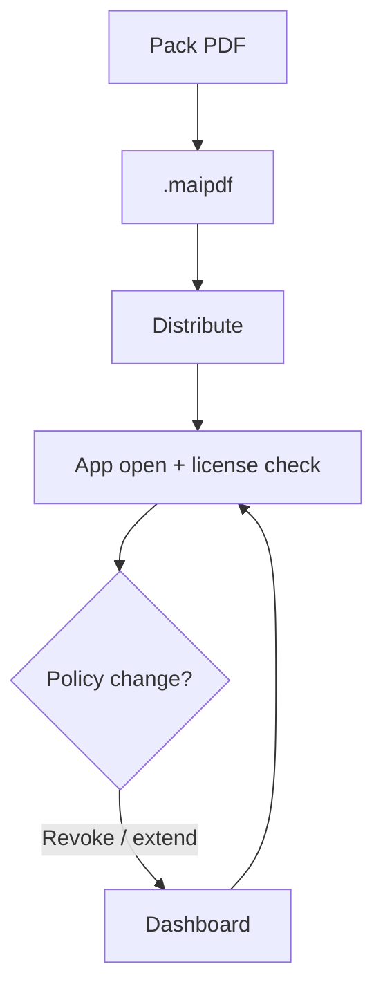

  
Send a protected file (USB, email, portal) and keep revoke power. <strong>MaiPDF Secure</strong> uses <code>.maipdf</code> + a managed app — <strong>free for anyone</strong>, not only companies with an IT budget. One person with one contract PDF uses the same tool as a 50-person team.

  
When legal/procurement requires a paid enterprise vendor packet, see [vs LockLizard](/blog/en/maipdf-secure-vs-locklizard-pdf-drm).

## Workflow

## What teams get

- Encrypted package, not a shareable raw PDF
- Per-user / per-device gates
- Expiry and open limits enforced server-side
- **Prevent screenshot** in app (varies by OS)
- Revoke without chasing every copy

## When to buy paid enterprise DRM instead

Choose **LockLizard** (paid) only if procurement **requires** a long-established vendor with compliance packets — not because MaiPDF is "too small" for your use case. Functionally, many sends work fine on the **free** MaiPDF Secure app.

## Downloads

[drm.maipdf.com](https://drm.maipdf.com/) — Android, Windows, macOS direct; iOS / stores when listed.

---

**Related:** [Distribution best practices](/blog/en/offline-pdf-package-distribution-best-practices) · [Pack guide](/blog/en/how-to-create-offline-pdf-package-complete-guide)
