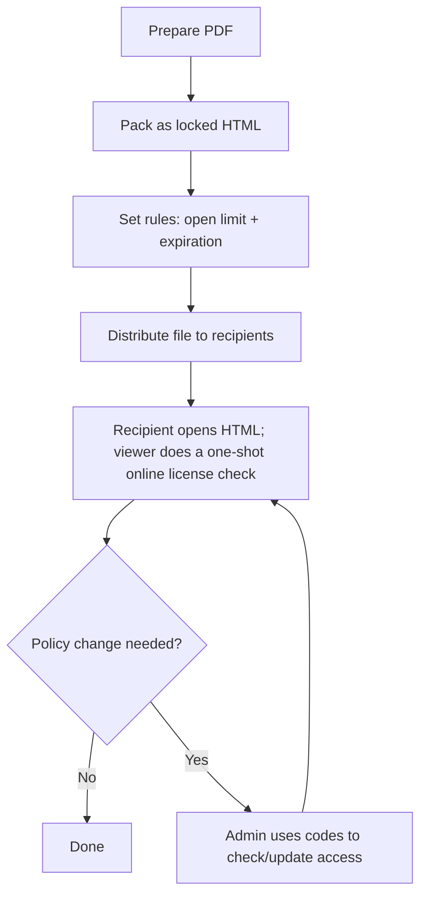

Enterprises talk about "offline PDF DRM" when they want to put the document file itself in the recipient's hands — instead of behind a link — while keeping sender-side control over access. The artifact still needs internet at open time to enforce the rules; "offline" means "portable file you can hand over," not "works air-gapped."

In practice, a deployable pattern is:

- generate a **locked HTML file** (a single self-contained HTML, delivered as a thin ZIP wrapper)
- set **open limits** and **expiration**
- keep a **code-based update path** so you can extend access when needed

## Distribution model

## What admins do (once)

### Upload and pack the PDF

### Configure rules

### Download the locked HTML

## What recipients do (every time)

Double-click the HTML file. The viewer reaches out to the licensing endpoint, atomically checks the open count and expiry, and renders the PDF if the license is still valid.

## Updates and policy changes

Common examples:

- a contractor needs 3 more opens for a review cycle
- an audit requires checking whether the file is still valid

Use the generated License ID + Modification Code to check status or update access — no recipient action required, the next open enforces the new rules.

## Offline packaging vs online links

A locked HTML file is the right shape when the artifact needs to live with the recipient. If the audience can reliably reach a hosted link, online sharing usually gives:

- smoother UX (no file to save and open)
- richer per-open analytics
- the ability to swap the underlying file without re-sending

---

**Related:** [MaiPDF H5 (offline HTML) generation guide](/en/maipdf-h5-generation-guide) · [Offline vs online PDF sharing (comparison)](/en/offline-vs-online-pdf-sharing-comparison) · [PDF online DRM (complete guide)](/en/pdf-online-drm-complete-guide)

Please visit the blog index for available content.

[Go to Blog Index](/blog)
