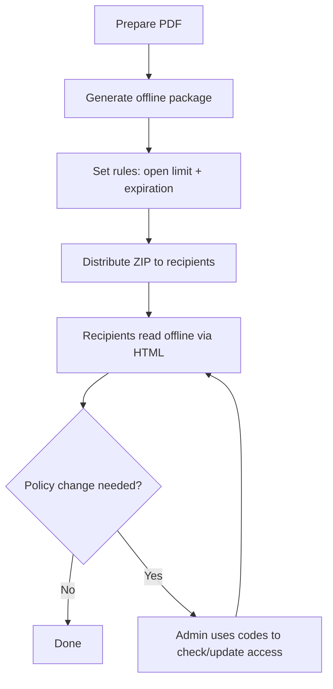

Enterprises talk about “offline PDF DRM” when they need to deliver documents to environments where online viewing is unreliable or not allowed—but they still want controlled access.

In practice, a deployable pattern is:

- generate an **offline package** (ZIP with an HTML viewer)
- set **open limits** and **expiration**
- keep a **code-based update path** so you can extend access when needed

## Distribution model

## What admins do (once)

### Upload and generate the offline package

### Configure rules

### Download the ZIP

## What recipients do (every time)

## Updates and policy changes

Common examples:

- a contractor needs 3 more opens for a review cycle
- an audit requires checking whether the package is still valid

Use the generated codes to check status or update access.

## Offline vs online

Offline packages are great for constrained environments. If your audience can access the web, online links usually give:

- smoother UX (no ZIP)
- richer access records
- easier replacement of file versions

---

**Related:** [MaiPDF H5 (offline HTML) generation guide](/en/maipdf-h5-generation-guide) · [Offline vs online PDF sharing (comparison)](/en/offline-vs-online-pdf-sharing-comparison) · [PDF online DRM (complete guide)](/en/pdf-online-drm-complete-guide)

Please visit the blog index for available content.

[Go to Blog Index](/blog)
