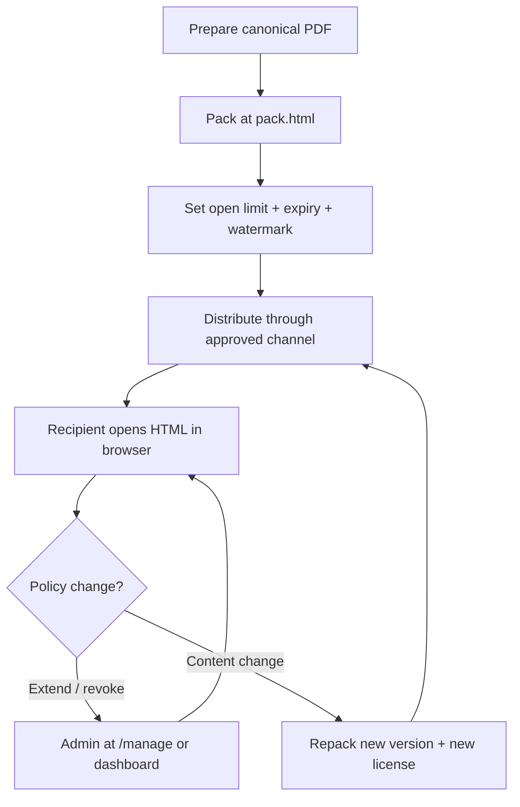

Enterprise and team leads ask for **offline PDF DRM** when the document **file** must sit on the recipient's laptop, USB, or internal share — while the sender keeps **revoke, expiry, and open limits** after delivery.

On MaiPDF, that usually means **web packing** at [pack.html](https://drm.maipdf.com/pack.html): PDF → AES encrypt → webpack HTML bundle → **ZIP**. Recipients open in a browser; each unlock phones home once.

**Important:** this article is **pack.html only**. `.maipdf` packing in the MaiPDF Secure **desktop app** is a separate, higher-security path for [prevent screenshot](/blog/en/prevent-screenshot-pdf-drm-native-app). Same license backend, different pipeline.

"Offline" means **portable file**, not **air-gapped**. Plan for internet at unlock.

---

## The deployable pattern

Three properties every team rollout needs:

1. **Pack as locked HTML** — one self-contained artifact per release (HTML inside ZIP).
2. **Bake rules at pack time** — open count and expiry enforced server-side on every unlock.
3. **Keep an update path** — License ID + Modification Code (or signed-in dashboard) for extend / revoke **without recalling files from every inbox**.

---

## Admin workflow (once per release)

### Upload

Drop the PDF on [pack.html](https://drm.maipdf.com/pack.html). Max 65 MB. Sign in with Google if you want dashboard management without storing Modification Codes in a spreadsheet.

### Configure rules

Align opens and expiry with the **review window**, not calendar defaults:

- Board pack for 8 people, 2 reads each → at least `16` opens, buffer to `24`
- External auditor, 5-day window → expiry = audit end + 1 day

### Pack and download

Save **License ID** and **Modification Code** from the result page. Store them in your release ticket.

---

## Recipient workflow (every time)

1. Save the ZIP or HTML from the approved channel.
2. **Extract** the HTML if delivered as ZIP.
3. Double-click → **Open · Unlock** in browser (network required).
4. Read in the same tab to avoid spending extra opens.

---

## Policy changes without file recall

| Team scenario | What admins do |
|---|---|
| Contractor needs 3 more opens | Add opens via `/manage` or dashboard |
| Bid deadline extended | Push expiry |
| Employee offboarded mid-review | Revoke license — all copies die on next unlock |
| Leak suspected | Revoke immediately; issue new pack only to cleared list |
| PDF content updated | **Repack** — you cannot patch a locked HTML file in place |

---

## Locked HTML vs online link vs `.maipdf`

| | pack.html (this article) | maipdf.com link | `.maipdf` desktop app |
|---|---|---|---|
| Delivers | File | URL | File |
| Reader | Browser | Browser | Native app |
| Install | No | No | Yes |
| Prevent screenshot | No | No | Yes |
| Per-open analytics | Limited | Rich | License-focused |
| Best for | File must travel, no install | Fast share, swap behind link | Capture-sensitive PDFs |

**Escalation rule:** if legal or infosec asks for screenshot control, stop distributing via pack.html and move to the desktop app — do not argue that watermarks are "enough."

---

## Rollout checklist for IT / ops

- [ ] Standard recipient instruction block in the wiki (see [distribution best practices](/blog/en/offline-pdf-package-distribution-best-practices))
- [ ] Named owner per License ID
- [ ] Version naming convention for source PDFs
- [ ] Process for revoking when people leave
- [ ] Decision tree: pack.html vs `.maipdf` vs maipdf.com link
- [ ] Test pack on target browser before mass send

---

## Related

- [Complete pack guide](/blog/en/how-to-create-offline-pdf-package-complete-guide)
- [Distribution best practices](/blog/en/offline-pdf-package-distribution-best-practices)
- [Prevent screenshot (.maipdf)](/blog/en/prevent-screenshot-pdf-drm-native-app)

  
<strong>Pack one now:</strong> <a href="https://drm.maipdf.com/pack.html">pack.html</a> — drop a PDF, click <em>Pack &amp; Download</em>. Anonymous packs work; sign in for dashboard management.

