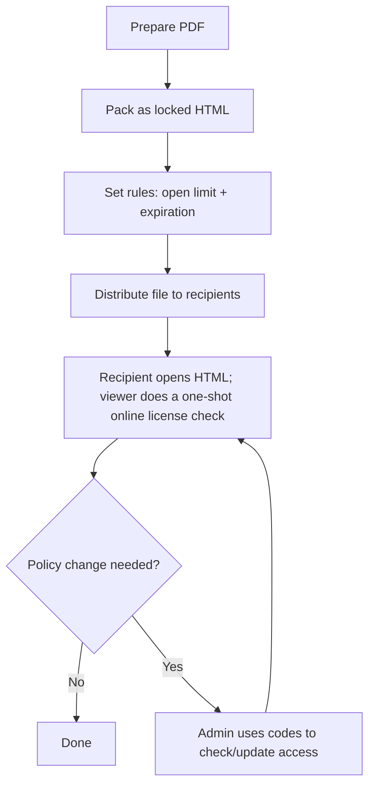

  
Enterprises talk about "offline PDF DRM" when they want to put the document <em>file itself</em> in the recipient's hands — instead of behind a link — while keeping sender-side control. The artifact still needs internet at open time to enforce the rules; "offline" here means <em>portable file you can hand over</em>, not <em>works air-gapped</em>.

## The deployable pattern

  

    <h4>1. Pack as locked HTML</h4>
    
A single self-contained HTML file (delivered as a thin ZIP wrapper) — recipients save and double-click it.

  

  

    <h4>2. Bake in the rules</h4>
    
Open count and expiration are set at pack time and enforced server-side at every open.

  

  

    <h4>3. Keep an update path</h4>
    
License ID + Modification Code let admins extend, pause, or revoke after distribution — without recalling the file.

  

## Distribution model

## What admins do (once)

  

    
1

    <h3>Upload the PDF</h3>
    
Drop the file onto the upload zone at <a href="https://drm.maipdf.com/">drm.maipdf.com</a>.

    
  

  

    
2

    <h3>Configure rules</h3>
    
Set the open-count limit and the expiry timestamp. Optionally turn on per-page watermarks.

    
  

  

    
3

    <h3>Pack &amp; download</h3>
    
Receive a single self-contained HTML file. Save the License ID + Modification Code shown on the result page — they unlock all future management.

    
  

## What recipients do (every time)

  

    
→

    <h3>Save, open, unlock</h3>
    
Double-click the HTML. The viewer reaches the licensing endpoint, atomically checks the open count and expiry, and renders the PDF if the license is still valid. Internet is required at open time.

    
  

## Updates and policy changes

  

    <h4>Extend opens for a contractor</h4>
    
A reviewer needs 3 more opens to finish their cycle — add them from <code>/manage</code> using your codes. Next open enforces the new cap.

  

  

    <h4>Check audit status</h4>
    
Confirm whether a packed file is still active, paused, or revoked — no recipient action required.

  

  

    <h4>Revoke after delivery</h4>
    
If a recipient leaves or a leak is suspected, set the license to <code>revoked</code>. Every copy of the HTML stops opening on the next attempt.

  

## Locked HTML vs. online links

  

    <h4>Pick locked HTML when</h4>
    
The artifact must live with the recipient — USB, internal share, email attachment — and sender-side control needs to travel with it.

  

  

    <h4>Pick an online link when</h4>
    
Recipients can reach the web reliably, and you want smoother UX, richer per-open analytics, or the ability to swap the underlying file without re-sending.

  

  
<strong>Pack one now:</strong> open <a href="https://drm.maipdf.com/">drm.maipdf.com</a>, drop a PDF, click <em>Pack &amp; Download</em>. No signup required.

---

**Related:** [MaiPDF H5 (offline HTML) generation guide](/en/maipdf-h5-generation-guide) · [Offline vs online PDF sharing (comparison)](/en/offline-vs-online-pdf-sharing-comparison) · [PDF online DRM (complete guide)](/en/pdf-online-drm-complete-guide)

Please visit the blog index for available content.

[Go to Blog Index](/blog)
