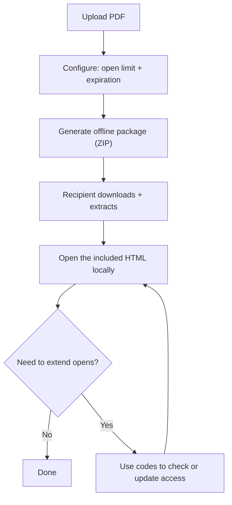

“Offline PDF DRM mode” usually means you want recipients to read **without a network connection**, but you still want some level of control—like **open limits** and **expiration**.

One practical way to do this is an **HTML-in-ZIP package** (often called “H5 package”): the recipient downloads a ZIP, extracts it, and opens the included HTML locally.

## When offline DRM makes sense

- Field teams with unstable connectivity
- Training material distributed via USB / local sharing
- Offline review environments where you still want access to end after X opens or Y days

## Offline workflow (Upload → Configure → Download)

## Step 1: Upload the PDF

## Step 2: Configure protections

## Step 3: Download the ZIP package

## Step 4: How recipients open it

## Step 5: Check status / update access

## Offline vs online (quick choice)

- **Offline package**: works without network, but the recipient must download/extract ZIP.
- **Online link**: easiest experience, more auditing options, and simpler updates.

If your recipients can reliably access the web, an online secure link is usually the smoother choice.

---

**Related:** [MaiPDF H5 (offline HTML) generation guide](/en/maipdf-h5-generation-guide) · [Online vs offline PDF security: how to choose](/en/online-vs-offline-pdf-security) · [Host a PDF online for secure sharing](/en/host-pdf-online-secure-sharing-guide)

[Go to Blog Index](/blog)
