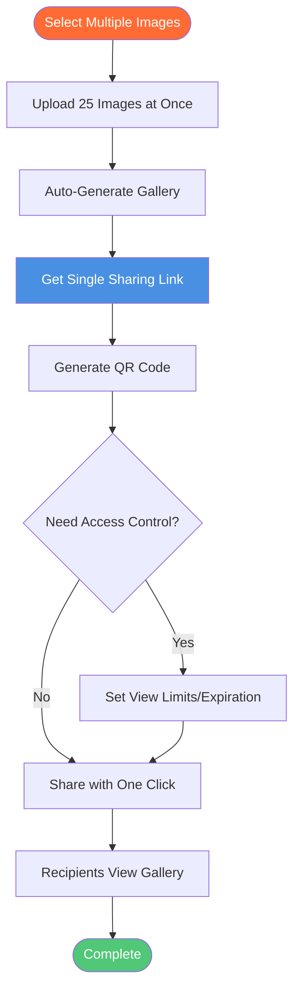

# One-Click Share Multiple Images: Gallery Sharing Made Simple

  
Need to <strong>share multiple images</strong> quickly? Maiimg lets you upload up to 25 images at once, generate one sharing link, create QR codes, and share entire galleries with one click. Perfect for event photos, portfolios, product galleries, and bulk image sharing. No registration required.

## What is One-Click Share Multiple Images?

**One-click share multiple images** allows you to upload multiple images at once and share them all with a single link. Instead of sharing images one by one, you create a gallery and share everything with one click.

**Benefits:**
- ✅ **Time Saving** - Share 25 images instantly
- ✅ **Single Link** - One link for all images
- ✅ **Professional** - Beautiful gallery view
- ✅ **Easy Sharing** - Share via link or QR code
- ✅ **Access Control** - Control who sees images

## How One-Click Share Works

### Complete Sharing Process

### Step 1: Upload Multiple Images

**Upload Process:**
1. Visit [Maiimg.com](https://maiimg.com)
2. Select up to 25 images
3. Upload all at once
4. Gallery created automatically

**Supported Formats:**
- 📸 PNG
- 🖼️ JPG/JPEG
- 🎭 GIF
- 🌐 WebP

**File Size:**
- ✅ Up to 50MB per image
- ✅ Fast batch upload

### Step 2: Get Sharing Link

**What You Get:**
- ✅ **Single Gallery Link** - One link for all images
- ✅ **QR Code** - Auto-generated QR code
- ✅ **Gallery View** - Professional presentation
- ✅ **Direct Links** - Individual image links

**Link Features:**
- Clean, professional URL
- Mobile-responsive
- Fast loading
- Easy to share

### Step 3: Share with One Click

**Sharing Methods:**
- 📧 **Email** - Copy and paste link
- 💬 **Messages** - WhatsApp, Slack, Teams
- 🌐 **Social Media** - Post link
- 📱 **QR Code** - Print or display

## Use Cases

### 1. Event Photo Sharing

**Scenario:** Share event photos with attendees

**Process:**
1. Upload 20-25 event photos
2. Get single gallery link
3. Generate QR code
4. Share at event or online

**Benefits:**
- One link for all photos
- Professional gallery
- Easy access
- Track views

### 2. Portfolio Showcase

**Scenario:** Share design portfolio

**Process:**
1. Upload portfolio images
2. Create gallery
3. Share single link
4. Clients view all work

**Benefits:**
- Professional presentation
- Easy sharing
- Access control
- Track engagement

### 3. Product Gallery

**Scenario:** Share product images

**Process:**
1. Upload product photos
2. Create gallery
3. Share with customers
4. Track views

**Benefits:**
- Multiple products, one link
- Professional display
- Easy sharing
- Analytics

### 4. Wedding Photo Delivery

**Scenario:** Deliver wedding photos

**Process:**
1. Upload wedding photos
2. Create gallery
3. Share with couple
4. Set access controls

**Benefits:**
- All photos in one place
- Professional gallery
- Privacy control
- Easy sharing

## Advanced Features

### Access Control

**Control Options:**
- 🔢 **View Limits** - Set maximum opens
- ⏰ **Expiration** - Auto-expire after date
- ⬇️ **Download Control** - Enable/disable
- ⏱️ **Time Control** - Set accessible periods

**Benefits:**
- Privacy protection
- Controlled sharing
- Security
- Compliance

### QR Code Generation

**QR Code Features:**
- Auto-generated for each gallery
- Mobile-friendly
- Easy to print
- Perfect for offline sharing

**Use Cases:**
- Event materials
- Business cards
- Marketing materials
- Physical displays

### Tracking & Analytics

**What You Can Track:**
- 📊 Total gallery views
- ⏰ View times
- 📱 Device information
- 📈 Access trends

**Benefits:**
- Understand engagement
- Track distribution
- Monitor usage
- Measure effectiveness

## Comparison: One-Click vs Traditional Sharing

### One-Click Share (Maiimg)

**Advantages:**
- ✅ Upload 25 images at once
- ✅ Single link for all
- ✅ Professional gallery
- ✅ QR code included
- ✅ Access control
- ✅ Real-time tracking

### Traditional Sharing

**Disadvantages:**
- ❌ Share one image at a time
- ❌ Multiple links to manage
- ❌ No gallery view
- ❌ No QR codes
- ❌ Limited control
- ❌ No tracking

## Best Practices

### 1. Organize Before Upload

**Tips:**
- Group related images
- Use descriptive names
- Check file sizes
- Verify formats

### 2. Set Appropriate Controls

**For Public Galleries:**
- Minimal restrictions
- Easy access
- Long expiration

**For Private Galleries:**
- View limits
- Short expiration
- Download disabled

### 3. Use QR Codes

**Best Practice:**
- Generate QR codes
- Print for events
- Display prominently
- Easy mobile access

### 4. Monitor Usage

**Regular Checks:**
- Review access records
- Check view counts
- Monitor trends
- Update settings

## Common Questions

### How Many Images Can I Share?

**Up to 25 images:**
- Upload 25 at once
- Create single gallery
- Share one link
- Professional presentation

### Is It Really One Click?

**Yes!** Simple process:
1. Upload images
2. Get link automatically
3. Copy and share
4. Done!

### Can I Control Access?

**Yes!** Full control:
- View limits
- Expiration dates
- Download control
- Time restrictions

### Are QR Codes Included?

**Yes!** Auto-generated:
- QR code for each gallery
- Mobile-friendly
- Easy to print
- Perfect for offline

## Conclusion: One-Click Share Multiple Images

Maiimg makes it easy to **share multiple images with one click**:
- ✅ Upload up to 25 images
- ✅ Single gallery link
- ✅ QR code included
- ✅ Access control
- ✅ Real-time tracking
- ✅ No registration required
- ✅ Completely free

**Ready to share multiple images?**

Visit [Maiimg.com](https://maiimg.com) to upload images and share galleries with one click. No registration required, completely free.

---

**Related Articles:**
- [Social Media Image Gallery Sharing: Complete Guide](/blog/en/social-media-image-gallery-sharing-guide)
- [Secure Private Image Sharing: Client Image Delivery](/blog/en/secure-private-image-sharing-client-delivery)
- [Free Image Hosting: Complete Guide](/blog/en/free-image-hosting-maiimg-complete-guide)
