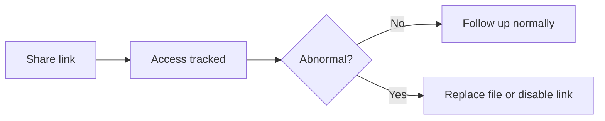

# PDF Access Tracking & Analytics (Quick Start)

  
If you share important PDFs, tracking helps you follow up at the right time and spot unusual access early.

## The 3 signals to check first

- **First open time**
- **Repeat opens**
- **Basic device / IP signals (approx.)**

## If something looks off

- **Replace the file**: keep the same reading code, swap in new content/settings
- **Disable the link**: stop access immediately when needed

## A simple use case

Share a proposal, wait for the first open, then follow up with context while the document is top-of-mind.

