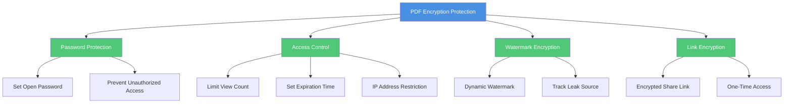
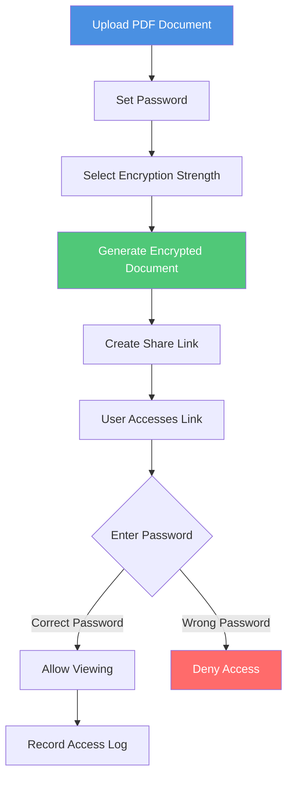
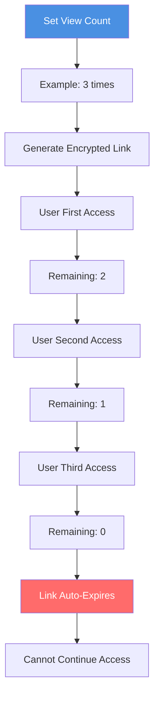
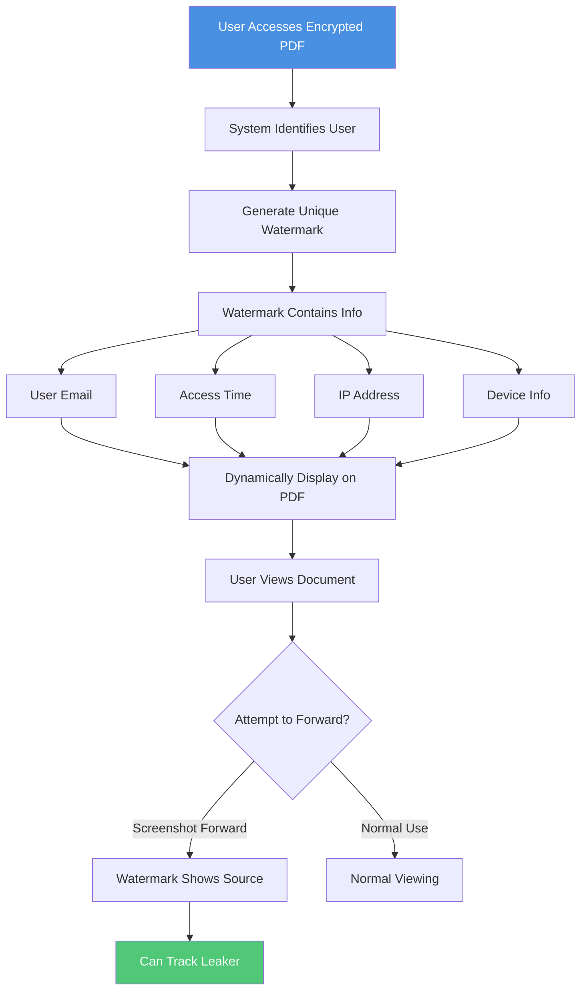
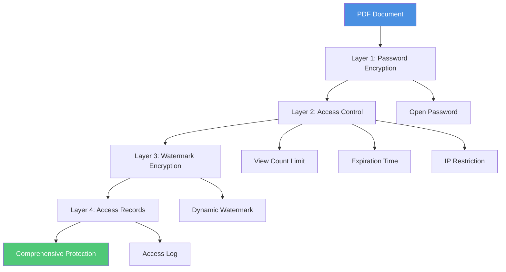

# PDF Encryption to Prevent Forwarding: Complete Guide to Comprehensive Document Security

  
In the digital age, PDF document security is crucial. <strong>PDF encryption technology</strong> can effectively prevent documents from being forwarded and accessed without authorization. This guide details how to protect your PDF documents through various encryption methods, ensuring only authorized personnel can access them and preventing unauthorized sharing.

## Why Encrypt PDFs to Prevent Forwarding?

### Importance of Encryption Protection

**1. Prevent Unauthorized Access**
- Only users with the password can open the document
- Prevent access even if the link is forwarded
- Protect sensitive information from leakage

**2. Control Document Distribution**
- Even if the link is forwarded, content cannot be viewed without the password
- Limit document distribution scope
- Protect business secrets and intellectual property

**3. Legal Compliance Requirements**
- Meet data protection regulations
- Protect personal privacy information
- Comply with industry security standards

**4. Tracking and Auditing**
- Record access to encrypted documents
- Track document distribution paths
- Provide legal evidence

### Core Value of PDF Encryption to Prevent Forwarding

## Methods to Encrypt PDFs and Prevent Forwarding

### Method 1: Password Encryption Protection

**Principle:**
- Set an open password for the PDF document
- Only users with the correct password can view content
- Even if the link is forwarded, access is impossible without the password

**Encryption Flow:**

**Setup Steps:**

1. **Upload PDF File**
   - Select the PDF document to encrypt
   - Wait for upload to complete

2. **Set Password**
   - Enter security settings interface
   - Select "Password Protection" option
   - Enter strong password (recommended 8+ characters, including letters, numbers, and special characters)
   - Confirm password

3. **Confirm Password Settings**
   - Confirm password is entered correctly
   - Check password strength indicator
   - Save password settings

4. **Generate Encrypted Link**
   - Save settings and generate share link
   - Send link and password separately to authorized users

**Advantages:**
- ✅ Dual protection: Link + Password
- ✅ Even if link is leaked, access is impossible without password
- ✅ Effectively prevents unauthorized access
- ✅ Simple and easy-to-use security protection

**Precautions:**
- ⚠️ Password must be securely stored and transmitted
- ⚠️ Recommend sending link and password through different channels
- ⚠️ Regularly change passwords

### Method 2: Access Control Encryption

**2.1 View Count Limit Encryption**

**How It Works:**
- Set maximum document view count
- Link automatically expires when limit is reached
- Prevent link from being shared multiple times

**Setup Flow:**

**Use Cases:**
- One-time viewing of confidential documents
- Time-limited event documents
- Prevent link abuse

**2.2 Expiration Time Encryption**

**How It Works:**
- Set automatic link expiration time
- Cannot access document after expiration
- Automatically locks when time expires

**Setup Method:**
- Select expiration time (1 hour, 1 day, 1 week, etc.)
- System automatically locks document when expired
- Re-authorization required after expiration

**2.3 IP Address Restriction Encryption**

**How It Works:**
- Restrict access to specific IP address ranges
- Only specified IPs can access
- Prevent remote unauthorized access

**Setup Steps:**
1. Obtain authorized user's IP address
2. Add allowed IP addresses in settings
3. Save settings
4. Only specified IPs can access document

### Method 3: Dynamic Watermark Encryption

**Principle:**
- Add dynamic watermark to PDF pages
- Watermark contains unique visitor information
- Can track source even if screenshot is forwarded

**Watermark Encryption Flow:**

**Watermark Content Options:**
- Visitor email address
- Access date and time
- IP address
- Device information
- Custom text

**Advantages:**
- ✅ Strong deterrent effect
- ✅ Precise leak source tracking
- ✅ Provides legal evidence
- ✅ Does not affect normal reading experience

### Method 4: Combined Encryption Strategy

**Multi-Layer Encryption Protection:**

**Protection Level Comparison:**

| Protection Level | Password Protection | Access Control | Watermark Encryption | Access Records | Use Cases |
|-----------------|-------------------|----------------|---------------------|---------------|-----------|
| Basic Protection | ✅ | - | - | ✅ | General Documents |
| Standard Protection | ✅ | ✅ | - | ✅ | Important Documents |
| Advanced Protection | ✅ | ✅ | ✅ | ✅ | Confidential Documents |
| Maximum Protection | ✅ | ✅ | ✅ | ✅ | Top Secret Documents |

## Complete Setup Process for PDF Encryption to Prevent Forwarding

### Step 1: Prepare PDF Document

1. Ensure PDF document format is correct
2. Check document content integrity
3. Determine information scope to protect

### Step 2: Choose Encryption Method

**Select Based on Document Importance:**

- **General Documents**: Basic password protection
- **Important Documents**: Password + Access control
- **Confidential Documents**: Password + Access control + Watermark
- **Top Secret Documents**: Full-featured protection

### Step 3: Set Encryption Parameters

**Password Settings:**
1. Enter security settings
2. Enable password protection
3. Set strong password (recommended 12+ characters, including letters, numbers, and special characters)
4. Confirm and save password settings

**Access Control Settings:**
1. Set view count (recommended 1-5 times)
2. Set expiration time
3. Add IP address restrictions (if needed)

**Watermark Settings:**
1. Enable dynamic watermark
2. Select display content
3. Adjust watermark position and transparency

### Step 4: Generate Encrypted Link

1. Save all settings
2. System generates encrypted share link
3. Obtain access password
4. Send link and password separately

### Step 5: Monitor Access

1. View access records
2. Monitor abnormal access
3. Track document distribution paths
4. Handle security issues promptly

## Best Practices

### Password Management

**Password Setting Principles:**
- Use strong passwords (at least 12 characters)
- Include uppercase, lowercase, numbers, and special characters
- Avoid using personal information
- Change passwords regularly

**Password Transmission Methods:**
- Send link and password separately
- Use encrypted communication channels
- Avoid sending both in same email
- Consider using password manager

### Access Control Strategy

**View Count Settings:**
- One-time documents: 1 time
- Important documents: 2-3 times
- Reference documents: 5-10 times

**Expiration Time Settings:**
- Temporary documents: 1-24 hours
- Short-term documents: 1-7 days
- Long-term documents: 30-90 days

### Security Monitoring

**Regular Checks:**
- View access logs
- Check for abnormal access
- Analyze access patterns
- Handle security issues promptly

## Frequently Asked Questions

### Q1: Does PDF encryption affect document quality?

**A:** No. PDF encryption only controls access permissions and does not change document content or quality. Document clarity, format, etc. are not affected.

### Q2: What if I forget the password?

**A:** If using an online PDF encryption service, you can usually:
- Contact document owner to reset password
- Use backup verification method
- Check password hint (if set)

### Q3: Can encrypted PDFs be viewed on mobile phones?

**A:** Yes. As long as the PDF reader supports password input, encrypted PDF documents can be viewed on mobile phones, tablets, and other devices.

### Q4: How to know if document has been forwarded?

**A:** You can track through:
- View access records and IP addresses
- Check watermark information
- Analyze access times and locations
- Monitor view counts

### Q5: Does encryption affect document opening speed?

**A:** Minimal impact. Modern encryption algorithms are highly efficient, and the impact on document opening speed is almost negligible.

## Summary

PDF encryption is an effective method to prevent document forwarding. Through the combined use of password protection, access control, watermark encryption, and other technologies, you can comprehensively protect your PDF document security. Remember:

- ✅ Choose appropriate protection level based on document importance
- ✅ Use strong passwords and transmit securely
- ✅ Regularly monitor access
- ✅ Handle security issues promptly

Through reasonable encryption strategies, you can effectively prevent PDF documents from being forwarded and protect important information security.

