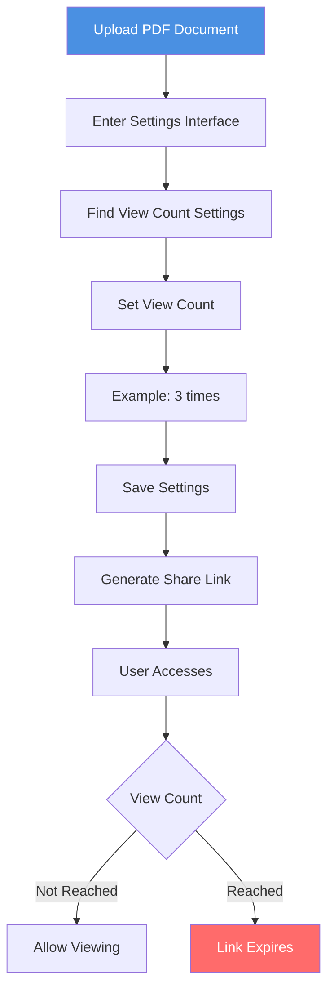
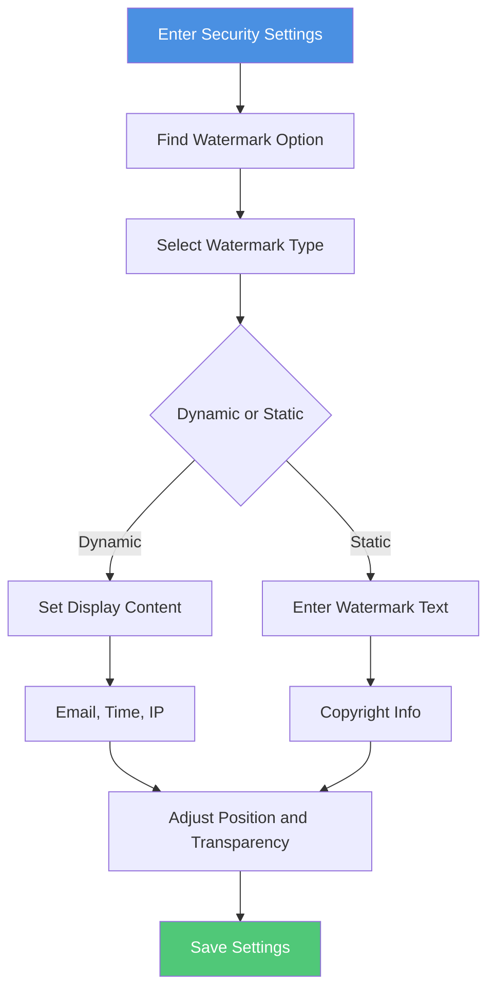
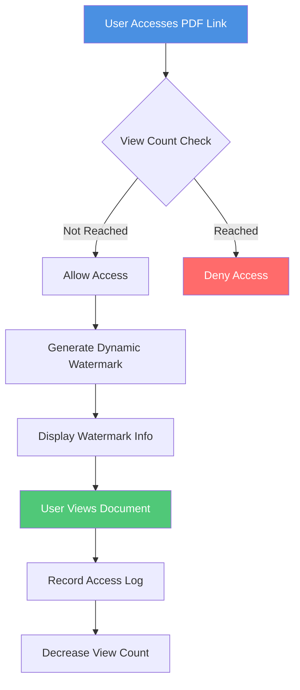

# PDF Link View Limit and Watermark: Dual Protection for Document Security

  
When sharing PDF documents, how can you both limit access times and track leak sources? <strong>View count limits</strong> and <strong>watermark protection</strong> are two effective document protection methods. This guide explains how to use both features together to provide dual protection for your PDF documents.

## Why Need View Limits and Watermarks?

### Role of View Limits

**1. Control Access Times**
- Limit document view count (e.g., 1-5 times)
- Link automatically expires when limit is reached
- Prevent link from being shared multiple times

**2. Protect One-Time Documents**
- Suitable for confidential documents and temporary sharing
- Ensure documents are only viewed specified times
- Reduce document leak risk

### Role of Watermark Protection

**1. Track Leak Sources**
- Watermark contains unique visitor information
- Can identify source even from screenshots
- Provide legal evidence

**2. Deterrent Effect**
- Clearly display visitor identity
- Reduce forwarding willingness
- Protect document security

## How to Set View Limits

### Setup Steps

**Detailed Steps:**

1. **Enter Settings Interface**
   - After uploading PDF, click "Settings"
   - Find "Access Control" or "View Limits"

2. **Set View Count**
   - Enter allowed view count (1-100 times)
   - Recommended: 1-3 times for confidential documents, 5-10 times for general documents

3. **Save Settings**
   - Confirm view count settings
   - Generate share link after saving

4. **Monitor Viewing**
   - Check access records
   - Understand remaining view count
   - Handle abnormal access promptly

## How to Set Watermarks

### Watermark Types

**1. Dynamic Watermark**
- Automatically displays visitor information
- Includes email, access time, IP address
- Shows different content for each visit

**2. Static Watermark**
- Fixed text or image
- Displays copyright information or warnings
- Applies to all visitors

### Setup Steps

**Detailed Steps:**

1. **Enable Watermark Feature**
   - Find "Watermark" option in settings
   - Select "Enable Watermark"

2. **Choose Watermark Content**
   - Dynamic watermark: Select information to display (email, time, IP, etc.)
   - Static watermark: Enter text to display

3. **Adjust Watermark Style**
   - Set watermark position (center, corners, etc.)
   - Adjust transparency (recommended 30-50%)
   - Choose font size and color

4. **Save and Apply**
   - Preview watermark effect
   - Save settings
   - Watermark will automatically apply to document

## Combined Use of View Limits and Watermarks

### Dual Protection Flow

### Use Cases

**1. Confidential Documents**
- View limit: 1-3 times
- Watermark: Dynamic watermark showing visitor email and time
- Purpose: Strictly control access, track leak sources

**2. Business Proposals**
- View limit: 3-5 times
- Watermark: Dynamic watermark showing company name and access time
- Purpose: Limit view times, protect business secrets

**3. Design Works**
- View limit: 5-10 times
- Watermark: Static watermark showing copyright information
- Purpose: Protect intellectual property, prevent unauthorized use

## Best Practices

### View Count Setting Recommendations

**Based on Document Importance:**
- Top secret documents: 1 time
- Confidential documents: 2-3 times
- Important documents: 5 times
- General documents: 10-20 times

**Based on Use Cases:**
- One-time viewing: 1 time
- Temporary sharing: 3-5 times
- Long-term sharing: 10-50 times

### Watermark Setting Recommendations

**Dynamic Watermark Content:**
- Required: Access time
- Recommended: Visitor email
- Optional: IP address, device information

**Watermark Style:**
- Position: Recommended center or corners
- Transparency: 30-50%, does not affect reading
- Font: Clear and readable, moderate size

## Frequently Asked Questions

### Q1: Is view count limit cumulative?

**A:** Yes. View count is cumulative for all visitors. The link expires when the set value is reached.

### Q2: Does watermark affect document reading?

**A:** No. Watermarks are usually set to semi-transparent and do not affect normal reading, but clearly display information.

### Q3: Can I set both view limit and expiration time?

**A:** Yes. Both limits can be used together. The link expires when either condition is met.

### Q4: What information does dynamic watermark display?

**A:** You can choose to display: visitor email, access time, IP address, device information, etc.

### Q5: How to know who viewed the document?

**A:** You can check all access information through access records, including visitor, time, IP address, etc.

## Summary

View limits and watermark features for PDF links are effective tools for protecting document security:

- ✅ **View Limits**: Control access times, prevent link abuse
- ✅ **Watermark Protection**: Track leak sources, provide legal evidence
- ✅ **Combined Use**: Dual protection, comprehensive document security

It's recommended to reasonably set view count and watermark content based on document importance and use cases to build a complete document protection system.

