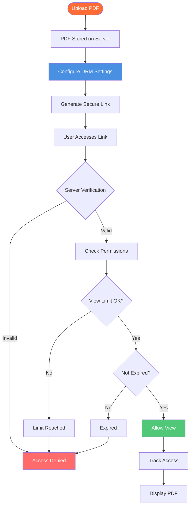

# PDF Online DRM: Complete Guide to Online PDF Digital Rights Management

  
Need to protect your PDF documents online? <strong>PDF online DRM</strong> (Digital Rights Management) allows you to control access, prevent downloads, limit views, and track usage of your PDFs. This complete guide explains how online DRM works, its features, and how to implement PDF online DRM protection for your documents.

## What is PDF Online DRM?

**PDF Online DRM** (Digital Rights Management) is a technology that protects PDF documents by controlling how they can be accessed, viewed, and distributed online. Unlike traditional PDF protection that relies on passwords or encryption, online DRM provides server-based control and real-time management.

**Key Characteristics:**
- ✅ **Server-Based Control** - Permissions managed on server
- ✅ **Real-Time Management** - Change settings instantly
- ✅ **Access Tracking** - Monitor who views documents
- ✅ **No Software Required** - Works in any browser
- ✅ **Revocable Access** - Disable links anytime

## How PDF Online DRM Works

### Online DRM Architecture

### Step 1: Upload and Configure

**Process:**
1. Upload PDF to online platform
2. Configure DRM settings
3. Set access controls
4. Generate secure link

**DRM Settings Available:**
- View limits
- Expiration dates
- Download prevention
- Print prevention
- Access control

### Step 2: Server Verification

**How It Works:**
- User accesses link
- Server verifies permissions
- Checks view limits
- Validates expiration
- Enforces restrictions

**Benefits:**
- Real-time control
- Cannot be bypassed
- Centralized management
- Audit trail

### Step 3: Access Control

**Control Mechanisms:**
- View-only mode
- Download blocking
- Print prevention
- Copy prevention
- Screen capture detection

## PDF Online DRM Features

### 1. Access Control

**Email Verification:**
- Require email before access
- Restrict to specific emails
- Domain restrictions
- Email-based authentication

**Password Protection:**
- Set access password
- Share password separately
- Additional security layer
- Access control

**Phone Verification:**
- SMS verification
- Two-factor authentication
- Enhanced security
- Mobile verification

### 2. View Limits

**How It Works:**
- Set maximum views (e.g., 10)
- Server tracks each view
- Link stops working after limit
- Prevents unlimited access

**Use Cases:**
- Confidential documents: 1-3 views
- Client previews: 5-10 views
- Training materials: 20-50 views

### 3. Expiration Control

**Time-Based Expiration:**
- Set expiration date
- Auto-disable after date
- Time-limited access
- Automatic cleanup

**Benefits:**
- Temporary sharing
- Privacy protection
- Compliance support
- Automatic management

### 4. Download Prevention

**Download Control:**
- Disable download button
- Block right-click save
- Prevent file saving
- View-only mode

**Why Important:**
- Protect copyright
- Prevent distribution
- Control access
- Maintain security

### 5. Print Prevention

**Print Control:**
- Block print functionality
- Prevent physical copies
- Protect documents
- Enhanced security

### 6. Dynamic Watermarks

**Watermark Features:**
- Viewer's email address
- IP address
- Timestamp
- Custom text

**Benefits:**
- Track who accessed
- Deter unauthorized sharing
- Provide accountability
- Support compliance

### 7. Access Tracking

**Tracking Capabilities:**
- 📊 Total views
- ⏰ View times
- 📱 Device information
- 🌍 IP addresses
- 📧 Email addresses
- 📈 Access patterns

**Benefits:**
- Monitor usage
- Detect unauthorized access
- Track engagement
- Audit compliance

## PDF Online DRM vs Traditional Protection

### Online DRM Advantages

**Real-Time Control:**
- ✅ Change settings instantly
- ✅ Revoke access immediately
- ✅ Update permissions anytime
- ✅ No file redistribution needed

**Server-Based Security:**
- ✅ Cannot be bypassed
- ✅ Centralized management
- ✅ Audit trail
- ✅ Scalable

**No Software Required:**
- ✅ Works in any browser
- ✅ No installation needed
- ✅ Cross-platform
- ✅ Easy access

### Traditional Protection Limitations

**Password Protection:**
- ❌ Can be shared
- ❌ No view limits
- ❌ No expiration
- ❌ No tracking

**Encryption:**
- ❌ Once decrypted, no control
- ❌ No access limits
- ❌ No tracking
- ❌ Complex setup

## Use Cases for PDF Online DRM

### 1. Confidential Document Sharing

**Scenario:** Share sensitive business documents

**DRM Settings:**
- View limit: 3 views
- Expiration: 7 days
- Download: Disabled
- Print: Disabled
- Watermark: Enabled

**Benefits:**
- Maximum security
- Controlled access
- Access tracking
- Compliance

### 2. Client Document Delivery

**Scenario:** Deliver documents to clients

**DRM Settings:**
- View limit: 10 views
- Expiration: 30 days
- Download: Disabled
- Email verification: Required

**Benefits:**
- Professional delivery
- Access control
- Track engagement
- Protect content

### 3. Training Material Distribution

**Scenario:** Share training materials

**DRM Settings:**
- View limit: 20 views
- Expiration: 90 days
- Download: Enabled
- Tracking: Enabled

**Benefits:**
- Controlled distribution
- Track completion
- Time-limited access
- Analytics

### 4. E-Book Distribution

**Scenario:** Distribute e-books

**DRM Settings:**
- View limit: Unlimited
- Expiration: None
- Download: Disabled
- Print: Disabled

**Benefits:**
- Protect copyright
- Prevent piracy
- Track readership
- Control distribution

## Implementation Guide

### Step 1: Choose Online DRM Platform

**Key Features to Look For:**
- ✅ View limits
- ✅ Expiration control
- ✅ Download prevention
- ✅ Access tracking
- ✅ Easy management
- ✅ No software required

### Step 2: Upload PDF

**Upload Process:**
1. Select PDF file
2. Upload to platform
3. Wait for processing
4. Ready for configuration

### Step 3: Configure DRM Settings

**Essential Settings:**
1. **Set View Limits**
   - Choose maximum views
   - Consider document sensitivity
   - Set appropriate limit

2. **Set Expiration**
   - Choose expiration date
   - Consider use case
   - Set time limit

3. **Disable Downloads**
   - Toggle download off
   - Protect content
   - Maintain control

4. **Enable Tracking**
   - Enable access logs
   - Monitor usage
   - Track engagement

### Step 4: Generate Secure Link

**Link Generation:**
1. Review settings
2. Generate link
3. Copy link
4. Share securely

### Step 5: Monitor and Manage

**Ongoing Management:**
- Review access logs
- Check view counts
- Monitor trends
- Update settings as needed

## Best Practices

### 1. Set Appropriate Limits

**For Confidential Documents:**
- View limit: 1-3 views
- Expiration: 1-7 days
- Download: Disabled
- Print: Disabled

**For Client Deliveries:**
- View limit: 5-10 views
- Expiration: 14-30 days
- Download: Disabled
- Tracking: Enabled

### 2. Use Access Control

**Best Practice:**
- Enable email verification
- Set passwords for sensitive docs
- Use domain restrictions
- Require authentication

### 3. Enable Watermarks

**For Sensitive Documents:**
- Full watermarking
- Email + IP + timestamp
- High visibility
- Deter unauthorized sharing

### 4. Monitor Regularly

**Regular Checks:**
- Daily access log review
- Check for unauthorized access
- Monitor view counts
- Update settings

### 5. Revoke When Needed

**Immediate Action:**
- One-click disable
- Instant revocation
- Protect documents
- Maintain security

## Common Questions

### What is PDF Online DRM?

**Answer:** PDF Online DRM is a technology that protects PDF documents by controlling access, preventing downloads, limiting views, and tracking usage through server-based management.

### How Does Online DRM Work?

**Answer:** PDFs are stored on a server with DRM settings. When users access the link, the server verifies permissions, enforces restrictions, and tracks access in real-time.

### Is Online DRM Secure?

**Answer:** Yes, online DRM is very secure because:
- Server-based control cannot be bypassed
- Real-time verification
- Centralized management
- Audit trail

### Can Users Download Protected PDFs?

**Answer:** You control this. Online DRM allows you to disable downloads, ensuring users can only view PDFs online, not save them.

### Do I Need Special Software?

**Answer:** No. PDF online DRM works in any web browser. No software installation required for viewers.

### Can I Change Settings After Sharing?

**Answer:** Yes! One of the key advantages of online DRM is that you can change settings, revoke access, or update permissions anytime, even after sharing.

## Comparison: Online vs Offline DRM

### Online DRM

**Advantages:**
- ✅ Real-time control
- ✅ Instant revocation
- ✅ No file distribution
- ✅ Centralized management
- ✅ Easy updates

**Best For:**
- Frequent updates
- Real-time control needs
- Access tracking
- Cloud-based workflows

### Offline DRM

**Advantages:**
- ✅ Works offline
- ✅ No internet required
- ✅ Local control
- ✅ Portable

**Best For:**
- Offline environments
- Air-gapped systems
- Portable distribution
- Limited connectivity

## Conclusion: PDF Online DRM

PDF Online DRM provides powerful document protection with:
- ✅ Real-time access control
- ✅ View limits and expiration
- ✅ Download and print prevention
- ✅ Dynamic watermarks
- ✅ Comprehensive tracking
- ✅ Instant revocation
- ✅ No software required
- ✅ Easy management

**Ready to protect your PDFs with online DRM?**

MaiPDF offers free PDF online DRM with all these features. Upload your PDF, configure DRM settings, generate secure links, and protect your documents. No registration required.

---

**Related Articles:**
- [Offline PDF DRM: Enterprise Solution](/blog/en/offline-pdf-drm-enterprise-solution)
- [PDF Access Control: Complete Guide](/blog/en/pdf-access-control-complete-guide)
- [PDF Encryption Online Sharing: Complete Guide](/blog/en/pdf-encryption-online-sharing-complete-guide)
