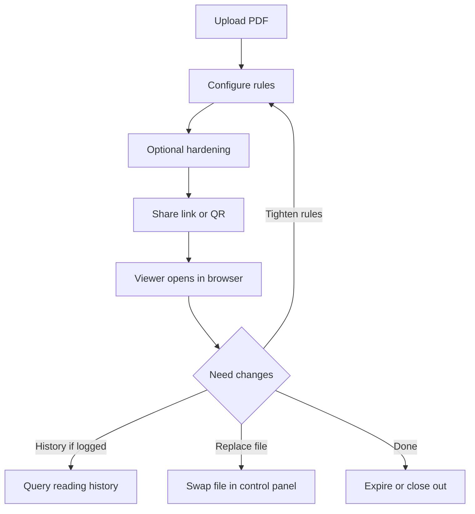

  
Picture a <strong>pricing sheet</strong> or <strong>contract draft</strong>: email it once and it lives in inboxes forever. <strong>Browser-first sharing</strong> means one link where you set <strong>expiry</strong>, <strong>open caps</strong>, and optional <strong>verification</strong>—then adjust or replace the file without resending a new attachment chain.

  
“DRM” here means <strong>those rules at the viewer</strong>, not a glossary of vendor acronyms. Below is the control set teams actually use.

## What you can control online

  

    <h4 data-icon="🔢">Access limit</h4>
    
Cap total opens.

  

  

    <h4 data-icon="⏱️">Each session</h4>
    
Limit reading time per open.

  

  

    <h4 data-icon="⏳">Expiration</h4>
    
End access automatically.

  

  

    <h4 data-icon="🛡️">Viewer mode</h4>
    
SecureView / FenceView / Unrestricted.

  

  

    <h4 data-icon="💧">Deterrence</h4>
    
Watermark + protected viewer.

  

  

    <h4 data-icon="🔐">Audience</h4>
    
Email verification when needed.

  

  

    <h4 data-icon="📒">Follow-up</h4>
    
Optional reading history (when logged).

  

  

    <h4 data-icon="🔄">Maintenance</h4>
    
Replace the file without resending a new link.

  

## End-to-end workflow

```mermaid
flowchart TB
  A[Upload PDF] --> B["Configure rules"]
  B --> C["Optional hardening"]
  C --> D["Share link or QR"]
  D --> E[Viewer opens in browser]
  E --> F{Need changes}
  F -->|"History if logged"| G[Query reading history]
  F -->|Replace file| H[Swap file in control panel]
  F -->|Tighten rules| B
  F -->|Done| I["Expire or close out"]
```

## Upload

## Configure (rules)

### Protected viewer and deterrence

### Optional: email verification

## Share (link + QR)

## Reading history (optional)

## Replace the file (keep the sharing channel)

## Large access limits caveat

If **Access limit** is above **10,000**, behavior can trend toward an effectively public link and **access records may not be logged**.

---

**Related:** [MaiPDF complete workflow guide (with diagrams)](/en/maipdf-complete-workflow-guide-with-diagrams) · [Secure PDF links](/en/secure-pdf-links) · [Prevent PDF downloads (view-only)](/en/prevent-pdf-downloads-view-only)

[Go to Blog Index](/blog)
